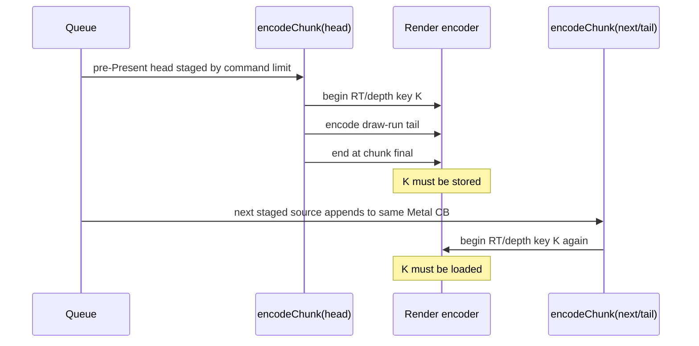
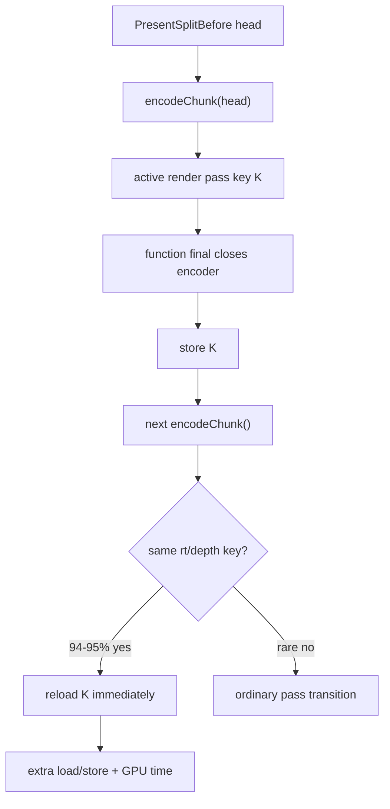

# Present Pacing / Open-CB Final Same-Key Reopen Attribution 115

**Question.** Are H108/H185 chunk-final render encoder closes merely extra final
markers, or are they cutting a render pass that immediately resumes with the
same color/depth attachments?

**Answer.** They are same-key reopens. Reanalyzing the existing
`3dmark05-perf-encoders.csv` rows shows that almost every `end_reason=final`
row in the open-CB command-limit path is followed immediately by another render
encoder using the same `rt`/`depth` key. The next row then reloads the same
attachments, so the failure is not an abstract pass-count increase. It is
store/load amplification caused by making a chunk boundary into a render-pass
boundary.

## Evidence

H115 extends `compare_3dmark05_perf_counters.py` with adjacent sidecar-pair
metrics:

- `encoder_sidecar_final_same_key_reopen_per_present`;
- `encoder_sidecar_final_same_key_reopen_share_pct`;
- same-key reopen color/depth load MiB per present;
- same-key reopen final color/depth store MiB per present.

Existing H108/H185 artifacts now report:

| Metric | H108 open-CB limit128 | H185 tail-shape rerun | Meaning |
|---|---:|---:|---|
| `end_reason=final` rows | `3,469` | `3,449` | chunk-final render encoder closes |
| immediate same `rt`/`depth` next row | `3,285` | `3,252` | same-key reopen count |
| same-key reopen share | `94.696%` | `94.288%` | not a rare edge case |
| `encoder_sidecar_final_same_key_reopen_per_present` | `1.955` | `1.936` | almost two forced reopens per present |
| same-key reopen color load | `13.086MiB/present` | `13.037MiB/present` | next row reload cost |
| same-key reopen depth load | `13.302MiB/present` | `13.236MiB/present` | next row reload cost |
| same-key final color store | `13.258MiB/present` | `13.182MiB/present` | final row store cost |
| same-key final depth store | `12.942MiB/present` | `12.914MiB/present` | final row store cost |

The sidecar gate also fails as intended:

```sh
python3 scripts/tools/compare_3dmark05_perf_counters.py \
  experiments/output/app-d3d9-3dmark05-h108-control-r1 \
  experiments/output/app-d3d9-3dmark05-h108-open-cb-limit128-r1 \
  --require-encoder-final-same-key-reopen-not-increase
```

Failure:

```text
encoder_sidecar_final_same_key_reopen_per_present increased (0.000 -> 1.955)
```

## Mechanism





## Implication

This tightens H110/H111. The current open-CB carrier does not only need a shared
`WMT::CommandBuffer`; it needs one of these:

1. carry the active render encoder/pass state across staged sources;
2. split only at boundaries that prove no active same-key continuation exists;
3. abandon this carrier and reduce producer/replay cadence directly.

Do not spend `.gputrace` on H108/H185 threshold sweeps. A future open-CB or
streaming-encode candidate must pass
`--require-encoder-final-same-key-reopen-not-increase` together with the
existing final/color-load/depth-load, P4 overlap, ready-depth, locality, and
`v0.0.3` visual gates before any Xcode counter spend is promoted.
