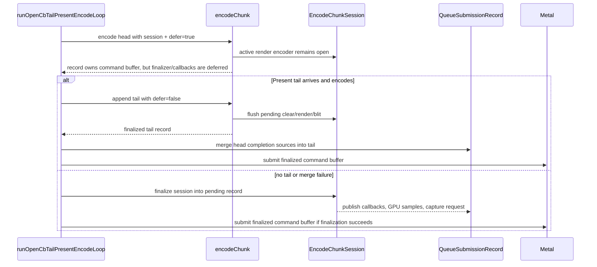
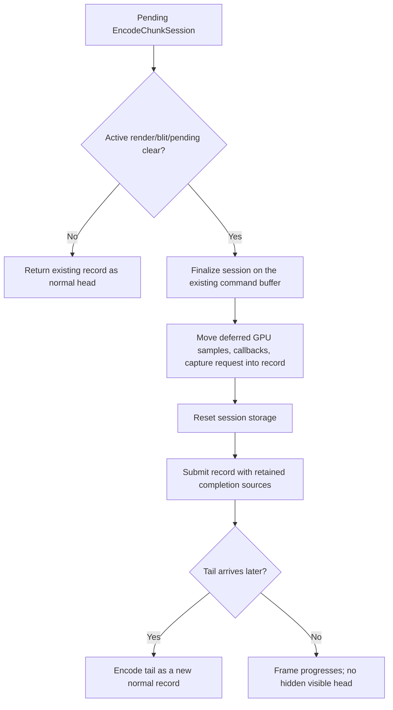

# Present-Pacing H143 - Open-CB Finalizer Extraction Gate

## Question

After H141 proved that GT1 does not make the open-CB head and Present tail ready
together, can the current render-session carry implementation still be promoted
by adding a small queue-side fail-open fallback?

## Verdict

No. The next open-CB/P4 carrier first needs an encoder-side finalizer API that
can close a deferred `EncodeChunkSession` into the already-owned command buffer
and return a normal `QueueSubmissionRecord` completion chain. Without that API,
the queue loop cannot safely publish a visible pre-Present head when no tail is
available or when a tail merge fails.

This is a design gate, not a runtime promotion. H144 implements the missing
finalizer API, but H142 remains the current wall baseline until an opt-in
no-gputrace run proves P4/locality/visual movement.

## Follow-Up Implementation

The first follow-up exposed a conservative probe:

- `encodeChunkSessionHasDeferredSubmissionPayload()`

It treats an active render/blit encoder, `pendingClear`, deferred
post-commit/completion callbacks, Metal capture request, and render-encoder GPU
sample state as payload that still has to be finalized or moved into a
`QueueSubmissionRecord`.

`runOpenCbTailPresentEncodeLoop()` uses that probe in the no-ready fallback:
only a pending record whose session has no deferred payload may be submitted
directly. If the probe reports payload, the old safe-abandon path remains. This
was not the finalizer API; it prevented a future retry from mistaking "no tail"
for "safe to submit an unfinalized session."

H144 then added the actual source-independent finalizer:

- `finalizeEncodeChunkSessionIntoSubmission()`

That function closes pending clear/render/blit state into the existing
`QueueSubmissionRecord::commandBuffer`, moves deferred GPU samples, callbacks,
and capture request into the record, then resets the session.

## Source Audit

`encodeChunk()` already has the required default finalization sequence, but it
is still a file-local lambda:

```text
flushPendingClear() -> flushRender(Final) -> flushBlit()
```

That lambda captures the active render/blit encoders, pending clear, render-pass
sidecars, visibility samples, GPU sample rows, callbacks, Metal capture state,
active argbuf/cbuf shadows, stream/IB staging, and the command buffer. The
public session surface currently exposes only:

- `makeEncodeChunkSession()`
- `resetEncodeChunkSession()`
- `encodeChunkSessionHasActiveRender()`
- `encodeChunkSessionHasDeferredSubmissionPayload()`
- `finalizeEncodeChunkSessionIntoSubmission()`
- `EncodeChunkOptions::session`
- `EncodeChunkOptions::deferSessionFinalization`

So `runOpenCbTailPresentEncodeLoop()` can defer finalization while a tail is
expected, and can now tell the encoder to "finish this pending head normally"
without replaying another source. That changes the implementation blocker into
a runtime-validation blocker: the API exists, but the open-CB candidate still
has to prove it does not reintroduce visible-head stalls, render-pass churn, or
visual regressions.



## Unsafe Fallbacks

The queue-side fallback space is intentionally narrow:

| Fallback | Why it is unsafe today |
|---|---|
| Submit the pending head record directly | Safe only after `finalizeEncodeChunkSessionIntoSubmission()` succeeds, or when `encodeChunkSessionHasDeferredSubmissionPayload()` is false. |
| Inline-complete retained head sources | Marks visible draw work complete without proving it was submitted to Metal. |
| Drop the session and wait for a later tail | Recreates the H134/H135 black-screen shape: visible work can be withheld indefinitely. |
| Commit a new empty source to force finalization | No longer necessary; H144 provides the source-independent finalizer. Dummy records would still perturb completion ordering. |

The H140/H141 guard avoids the known bad path by not starting a deferred head
unless a complete tail-ready prefix is selected. H141 then proves that prefix
does not exist in the current GT1 cadence:

```text
open_cb_tail_present_pending_started = 0
open_cb_tail_present_pending_suppressed_no_tail = 3517
encode_dequeue_ready_depth_max = 1
```

## Required API Shape

A promotable follow-up should make the finalizer callable without replaying a
new command source. The minimum contract is:



The implementation must also preserve the existing render-pass locality gates:

- no command-buffer-per-present increase;
- no render-pass-per-present increase;
- no tile-preservation increase;
- no final same-key reopen increase;
- no color/depth load increase;
- no skipped pipelines or Metal command-buffer errors;
- `v0.0.3` visual-safe gate before any `.gputrace`/Xcode counter spend.

## Implication

H143 did not close the performance problem. It identified the missing API and
prevented another misaligned open-CB retry.

The current actionable branches are:

1. Use H144's source-independent `EncodeChunkSession` finalizer to build and
   rerun a no-gputrace open-CB candidate through the P4/locality gates.
2. Continue serial CPU cleanup in replay/snapshot/encode materialization, where
   H142 still exposes roughly `8.3ms/present` replay and `11.0ms/present`
   encode work under the no-enqueue wall.

Do not spend `.gputrace` on open-CB carry until one of those branches first
moves the 120s no-gputrace P4/locality gates and passes the visual gate.
