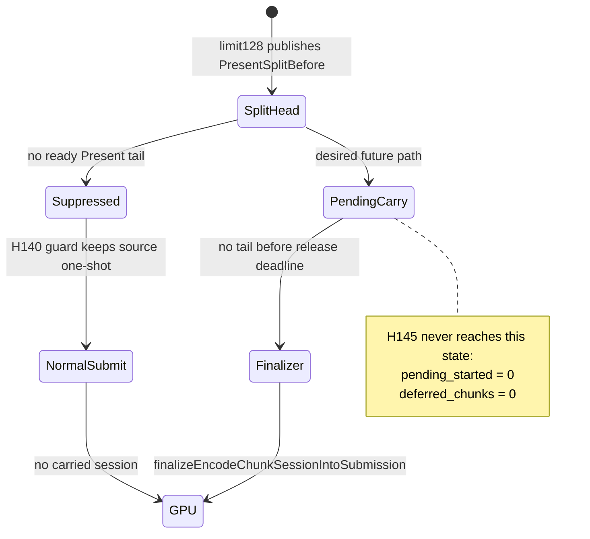

# Present-Pacing H145 - Open-CB Finalizer Limit128 Runtime Scout

## Question

After H144 added `finalizeEncodeChunkSessionIntoSubmission()`, does the old
open-CB limit128 candidate now exercise the carry/finalizer path and recover P4
without black-screening?

## Runs

The first run omitted the required pre-Present split trigger:

```text
bash scripts/tools/run_3dmark05_perf_probe.sh \
  --suffix h144-open-cb-finalizer-r1 \
  --frame 60 --no-gputrace --timeout 120 --keep-frontmost \
  --frame-sampling \
  --open-cb-preencode-tail-present \
  --open-cb-carry-render-session
```

It is an inert control for this question: `chunk_publish_reason_present_split_before=0`
and every `open_cb_tail_present_*` row stays `0`.

The meaningful scout included the split trigger:

```text
bash scripts/tools/run_3dmark05_perf_probe.sh \
  --suffix h144-open-cb-finalizer-limit128-r1 \
  --frame 60 --no-gputrace --timeout 120 --keep-frontmost \
  --frame-sampling \
  --open-cb-preencode-tail-present \
  --open-cb-carry-render-session \
  --stage-pre-present-command-limit 128
```

## Verdict

Rejected as a runtime candidate. It is visual-safe enough for a no-gputrace
scout, but it does not exercise the new finalizer/carry path and it regresses
the performance/locality shape.

Key rows:

| Metric | Value | Meaning |
|---|---:|---|
| `chunk_publish_reason_present_split_before` | `3,525` | limit128 trigger reached the split-head path |
| `chunk_publish_present_split_before_tail_draw_run` | `3,525` | every split head ends in draw-run work |
| `open_cb_tail_present_pending_started` | `0` | no deferred pending head was started |
| `open_cb_tail_present_pending_suppressed_no_tail` | `3,525` | H140 guard suppressed every split head |
| `encode_session_carry_deferred_chunks` | `0` | session carry did not execute |
| `draw_skipped_no_pipeline` | `0` | no obvious skipped-pipeline failure |
| `gpu_command_buffer_errors` | `0` | no Metal command-buffer errors |
| `sampled_avg_fps` | `15.770` | worse than the H142 current wall baseline |
| `completion_wait_ms_per_present` | `35.270` | total wait worsens |
| `completion_wait_with_enqueue_ms_per_present` | `25.360` | overlap appears, but in the bad split-head shape |
| `completion_wait_without_enqueue_ms_per_present` | `9.910` | no-enqueue decreases, but not enough |
| `encode_dequeue_ready_depth_gt1` | `1` | ready backlog barely moves |
| `render_pass_begin` | `22,999` | pass count increases |
| `render_pass_tile_preservation_bytes` | `297,111,666,688` | tile preservation traffic remains high |
| `gpu_command_buffer_time_ms` | `24,901.631` | GPU command-buffer time regresses heavily |

The captured `actual.png` is not the H134 black-screen class: bloom, sparks,
particles, characters, and scenery are visible. That confirms the H140 guard is
still preventing the old visible-head-withheld failure. It also means the run is
not proof that H144 fixed the carry path, because no pending session was started
and no deferred session was finalized.

## State Machine



## Implication

H144 removed the source-level finalizer blocker, but H145 shows the runtime
carrier is still blocked one level higher: a tail-less `PresentSplitBefore` head
is either suppressed immediately or, if suppression is removed without another
release policy, risks the old H135 indefinite-withheld-head shape.

The next open-CB design needs an explicit release policy for a pending head:

- wait a short bounded interval for a Present tail, then finalize and submit the
  head if none arrives;
- or stage earlier CPU-ready work in an encoder-invisible lane until a complete
  head+tail batch exists;
- or abandon open-CB and return to serial replay/encode materialization cleanup.

Do not spend `.gputrace` on H145. It fails no-gputrace promotion.

Update: [present-pacing-open-cb-bounded-tail-wait.146](present-pacing-open-cb-bounded-tail-wait.146.md) tested the first
bounded-wait option and rejected it visually. The branch can start a pending
head, but the run black-screens before any coherent tail submission, so this
specific open-CB carrier should not be treated as the default P4 path.
