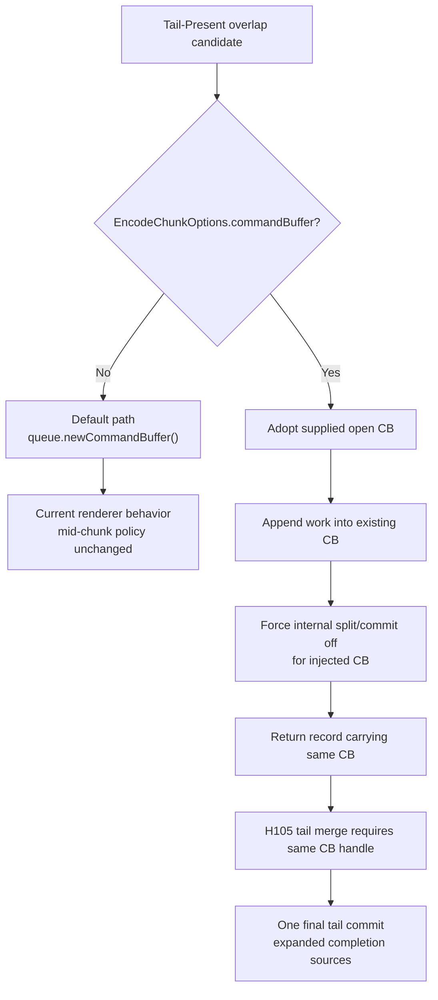

# Present Pacing / Open-CB Injected Command Buffer 107

> **Outdated — every artifact this leaf cites in `source:` is gone from disk.** The numbers below cannot be re-derived or re-checked. Kept as history; do not cite it as current evidence.

**Question.** What is the next minimal encoder-side gate after H106's split
guards?

**Answer.** `encodeChunk()` now accepts an optional owned
`WMT::CommandBuffer` through `EncodeChunkOptions::commandBuffer`. When absent,
the current behavior is unchanged: the encoder asks `CommandQueue` for a fresh
command buffer. When present, the encoder appends the chunk into the supplied
command buffer and transfers that same handle into the returned
`QueueSubmissionRecord`.

This is still only an implementation primitive. No runtime P4/FPS claim follows
until a queue/backend path actually pre-encodes a pre-Present head, retains its
sources through H104, merges the final tail record through H105, and passes the
no-gputrace locality plus `v0.0.3` visual gates.

## Contract

## Safety Notes

| Area | Meaning |
|---|---|
| Default callers | unchanged; `EncodeChunkOptions{}` has no injected command buffer |
| Mid-chunk commits | automatically disabled for an injected command buffer |
| Present acquire split | automatically disabled for an injected command buffer |
| Capture semantics | the supplied command buffer may have been created before chunk-begin capture, so a future runtime caller must audit capture start timing before relying on `.gputrace` output |
| Test coverage | native contract test locks the default fresh-CB option shape; non-null fake `WMT::Reference` handles are deliberately not used |

The key policy is conservative: an injected command buffer must remain open
inside `encodeChunk()`. If the caller wants the old split behavior, it should
use the default fresh-CB path instead of the open-CB carrier.
