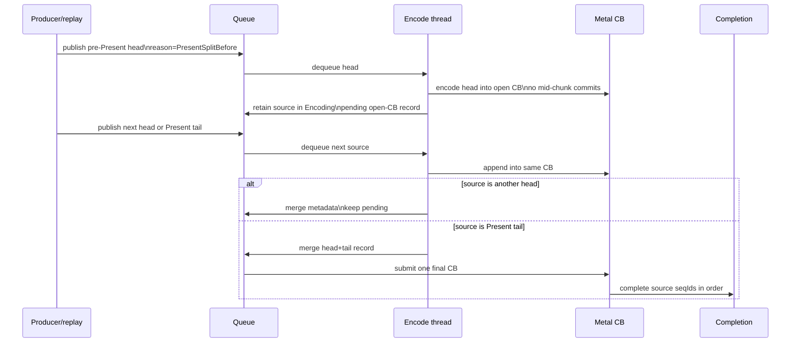
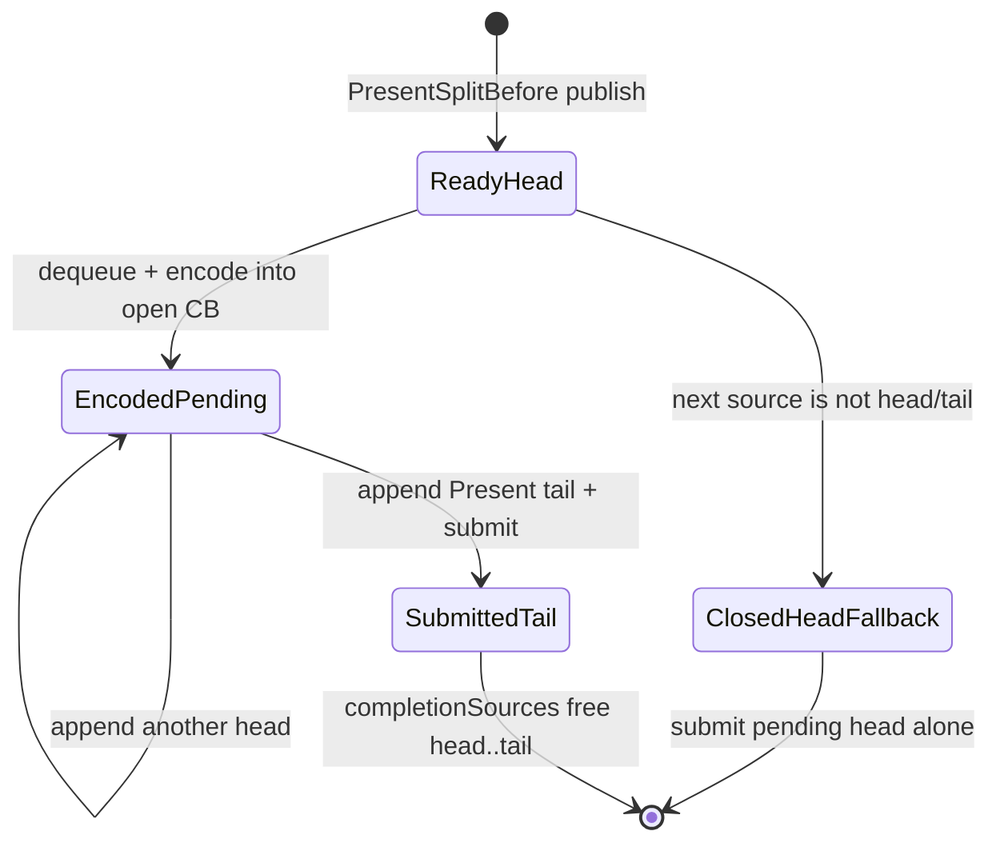

# Present Pacing / Open-CB Pre-Encode Tail-Present Runtime Candidate 108

**Question.** Can the encoder consume the large pre-Present head during the
completion-wait gap without committing a closed head command buffer before the
Present tail exists?

**Answer.** H108 adds a default-off runtime carrier:
`DXMT9_OPEN_CB_PREENCODE_TAIL_PRESENT=1` plus
`DXMT9_STAGE_PRE_PRESENT_COMMAND_LIMIT=N`. A pre-Present split head remains
encode-visible, but it is encoded into an uncommitted Metal command buffer. The
queue retains that source in `Encoding`, appends later split heads and the
Present tail into the same command buffer through `EncodeChunkOptions`, and
submits only the final tail record with strict `completionSources`.

This is still a candidate, not a performance result. It must pass the
`v0.0.3` visual-safe gate before any FPS or counter delta is promoted.

## Runtime Shape



## State Model



## Guardrails

| Guardrail | Reason |
|---|---|
| The env is default-off | It changes queue/encoder scheduling, so current default rendering stays unchanged. |
| `PresentSplitBefore` is stamped into `ChunkSlot::publishReason` | The open-CB path only consumes heads created for a future Present tail, not arbitrary draw-limit splits. |
| Source identity is retained before appending into a pending command buffer | Avoids writing into the open CB when the queue can no longer prove the source seqId/slot identity. |
| `disableMidChunkCommits` and `disablePresentAcquireSplit` are forced on the injected-CB path | Prevents the candidate from degenerating into the rejected closed-head CB-chain class. |
| Final tail uses H105 `mergeEncodedPendingTailSubmission()` | The tail submission owns the public seqId while completion drains head sources before the tail. |

## Promotion Gate

Run only as a supervised no-gputrace scout first:

```bash
DXMT9_OPEN_CB_PREENCODE_TAIL_PRESENT=1 \
DXMT9_STAGE_PRE_PRESENT_COMMAND_LIMIT=128 \
scripts/tools/run_3dmark05_perf_probe.sh --timeout 120 --keep-frontmost
```

Promotion requires:

- P4 movement: wait-with-enqueue increases or no-enqueue wait decreases.
- Locality preservation: command buffers, render passes, and tile preservation
  do not regress against the current low-overhead baseline.
- Broad effects-heavy visual smoke passes against the `v0.0.3` visual-safe
  anchor; older `v0.0.1` captures are historical triage only.
- No `.gputrace` spend until the no-gputrace gate passes.

## Current Verdict

Implemented as a default-off candidate and rejected by the H109 runtime gate in
its current shape. The carrier reaches the split path and collapses Metal
command-buffer count, but it fails ready-depth, P4/no-enqueue, render-pass, tile
preservation, and GPU-time gates. Keep the code default-off as a prototype only;
do not sweep this design or spend `.gputrace` budget without a new pass-safe
carrier policy. See [present-pacing-open-cb-preencode-runtime.109](present-pacing-open-cb-preencode-runtime.109.md).
