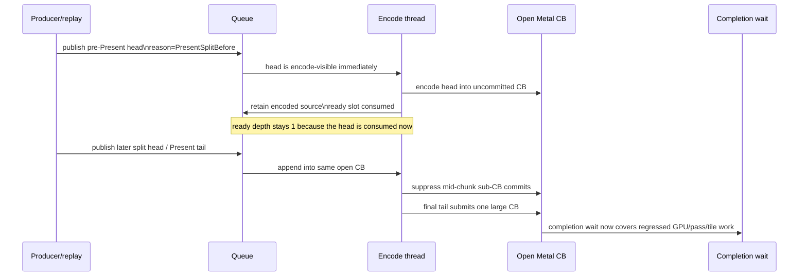
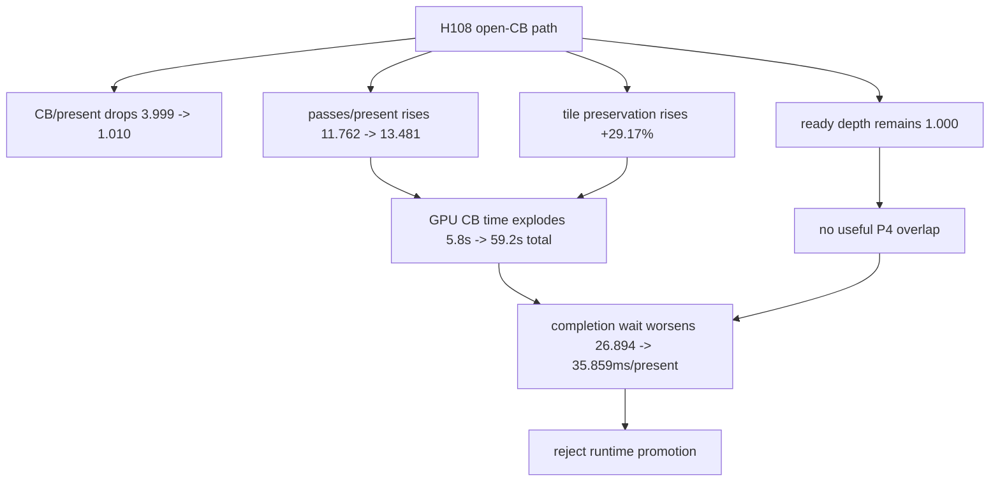

# Present Pacing / Open-CB Pre-Encode Tail-Present Runtime Gate 109

> **Outdated — the knob or code path this experiment measured no longer exists in `src/`.** It cannot be re-run. Kept as history; do not cite it as current evidence.

**Question.** Does the H108 open-command-buffer carrier turn the pre-Present
prefix into useful producer/encode overlap while preserving the normal
command-buffer, render-pass, and tile-preservation shape?

**Answer.** No. The mechanism is active and it collapses Metal command-buffer
count, but it fails the promotion gate. It does not create encode-ready backlog
(`encode_ready_depth_gt1_per_present` remains zero), completion wait worsens,
and GPU/pass/tile locality regresses badly. Treat H108 as a retained default-off
prototype and do not promote or sweep it without a different pass-safe carrier
design.

Both app runs returned `pass`, and the effects-heavy screenshots are in the
normal `v0.0.3` visual-safe class: muzzle flash, sparks, bloom, geometry, and
HUD are present. The candidate is rejected by counters before visual promotion
becomes the deciding gate.

## Runs

Control:

```sh
bash scripts/tools/run_3dmark05_perf_probe.sh \
  --suffix h108-control-r1 \
  --frame 60 \
  --no-gputrace \
  --timeout 120 \
  --keep-frontmost
```

Candidate:

```sh
DXMT9_OPEN_CB_PREENCODE_TAIL_PRESENT=1 \
DXMT9_STAGE_PRE_PRESENT_COMMAND_LIMIT=128 \
bash scripts/tools/run_3dmark05_perf_probe.sh \
  --suffix h108-open-cb-limit128-r1 \
  --frame 60 \
  --no-gputrace \
  --timeout 120 \
  --keep-frontmost \
  --compare-baseline-output experiments/output/app-d3d9-3dmark05-h108-control-r1 \
  --require-encode-ready-depth-gt1-increase \
  --require-completion-wait-with-enqueue-increase \
  --require-completion-wait-without-enqueue-decrease \
  --require-command-buffers-per-present-not-increase \
  --require-render-passes-per-present-not-increase \
  --require-tile-preservation-not-increase
```

The candidate command exits with a failed comparison gate, not an app crash:

```text
requirement failed: tile_preservation_mib increased (216,896.805 -> 280,174.887)
requirement failed: passes_per_present increased (11.762 -> 13.481)
requirement failed: completion_wait_without_enqueue_ms did not decrease (48,178.955 -> 59,868.932)
requirement failed: encode_dequeue_ready_depth_gt1 did not increase (0 -> 0)
```

The runs have different present counts (`1,800` control, `1,680` candidate), so
read normalized per-present rows first and use totals only as direction checks.

## Result

| Metric | Control | H108 open-CB limit128 | Direction |
|---|---:|---:|---|
| `chunk_publish_reason_present_split_before` | `0` | `3,433` | carrier reached split path |
| `command_buffers_per_present` | `3.999` | `1.010` | command-buffer count collapses |
| `sub_command_buffers_per_present` | `2.998` | `0.009` | mid-chunk sub-CBs mostly removed |
| `encode_ready_depth_avg` | `1.000` | `1.000` | no backlog |
| `encode_ready_depth_gt1_per_present` | `0.000` | `0.000` | P4 ready-depth gate failed |
| `passes_per_present` | `11.762` | `13.481` | locality gate failed |
| `tile_preservation_mib` | `216,896.805` | `280,174.887` | locality gate failed |
| `gpu_command_buffer_time_ms` | `5,775.166` | `59,178.478` | hard GPU regression |
| `completion_wait_ms_per_present` | `26.894` | `35.859` | total wait worse |
| `completion_wait_with_enqueue_ms_per_present` | `0.128` | `0.223` | tiny overlap movement only |
| `completion_wait_without_enqueue_ms_per_present` | `26.766` | `35.636` | P4 no-enqueue gate failed |
| `commit_chunk_replay_cpu_ms_per_present` | `8.129` | `12.256` | replay cost worse |
| `encode_chunk_cpu_ms_per_present` | `12.731` | `13.362` | encode cost worse |
| `argbuf_cbuf_update_cpu_ms_per_present` | `1.035` | `1.904` | cbuf update worse |
| `no_enqueue_stage_commit_entry_to_publish_ms_per_present` | `14.981` | `6.167` | local stage improves |
| `no_enqueue_stage_encode_dequeue_to_command_buffer_commit_ms_per_present` | `14.130` | `16.143` | later stage worsens |

The useful negative signal is that the open-CB carrier improves some local
before-publish timing and almost eliminates intermediate command-buffer commits,
but the final command buffer becomes far more expensive and the wait owner does
not move in the needed direction.

## Failure Shape





The implementation removed the rejected closed-head CB-chain shape, but it also
removed the old mid-chunk commit relief and did not create a producer backlog.
The open command buffer accumulates a larger pass/locality problem before the
tail commit, so the average wall-clock path gets worse instead of hiding work
under the completion wait.

## Implication

H108 proves that the queue can hold encoded sources until a tail Present and
submit them through one strict completion chain. It does not prove that
streaming pre-encode is a valid GT1 overlap fix. The next P4 attempt needs a
stricter pass-safe policy, for example:

1. only keep an open CB across spans that preserve render-pass/key locality;
2. pre-encode only when the carrier can prove it will not increase
   render-pass/store traffic;
3. otherwise return to direct replay/producer cadence reduction and P2/P3 copy
   shrinkage.

Do not spend `.gputrace` or Xcode counter budget on H108 limit sweeps. A future
variant must first pass the no-gputrace ready-depth, no-enqueue, locality, and
`v0.0.3` visual gates.

H110 narrows the immediate failure mechanism: the command-limit split creates
new chunk-final render encoder closures (`end_reason=final`), so the shared
Metal command buffer still pays attachment store/load between chunks.
