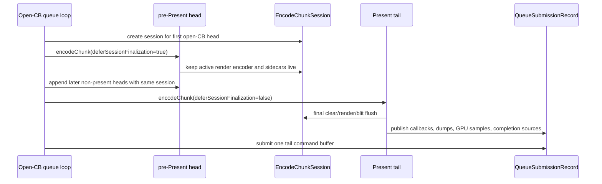

# Present Pacing / Open-CB Render Session Carry 134

> **Outdated — the knob or code path this experiment measured no longer exists in `src/`.** It cannot be re-run. Kept as history; do not cite it as current evidence.

**Question.** Can the rejected H108 open-CB carrier be repaired by carrying the
active render session, rather than only carrying the Metal command buffer?

**Implementation.** A new default-off companion knob,
`DXMT9_OPEN_CB_CARRY_RENDER_SESSION=1`, keeps one explicit
`EncodeChunkSession` alive while the open-CB pending-tail path encodes
pre-Present heads. Deferred heads call `encodeChunk()` with
`deferSessionFinalization=true`, so they append commands into the shared
command buffer without publishing session-owned callbacks / GPU samples or
ending the active render encoder. The Present tail calls the normal finalizer
and publishes the accumulated session payload into the tail
`QueueSubmissionRecord`.



## Runtime Gate

The no-gputrace candidate uses the existing open-CB carrier plus
the new session carry:

```sh
DXMT9_OPEN_CB_PREENCODE_TAIL_PRESENT=1 \
DXMT9_OPEN_CB_CARRY_RENDER_SESSION=1 \
DXMT9_STAGE_PRE_PRESENT_COMMAND_LIMIT=<N>
```

Promotion would require the H128/H115 gates before Xcode or `.gputrace`:

- no increase in final same-key reopen rows;
- command buffers per present not worse than H108's repair target;
- render pass count, color/depth load/store MiB, and tile-preservation traffic
  not worse than baseline;
- `completion_wait_with_enqueue_ms` / ready-depth / no-enqueue closure show
  real overlap movement;
- `v0.0.3` visual-safe gate passes.

## Result

H134 is not promotable.

- `h134-open-cb-carry-128-r1` failed the no-gputrace visual gate with a fully
  black screenshot. The run also exposed a Metal lifecycle assertion:
  `encodeWaitForEvent:value: with uncommitted encoder`. The cause was a carried
  active render encoder followed by the next chunk's resource-initializer
  `encodeWaitForEvent`.
- The resource initializer now distinguishes a newly committed initializer
  flush from a stale already-signaled value. `encodeChunk()` only inserts the
  Metal wait, and therefore only closes a carried active render encoder, when
  `didFlush=true`. Native queue/render-backend tests pass after that lifecycle
  fix.
- `h134-open-cb-carry-128-r2` no longer reports the Metal assertion, but still
  fails the no-gputrace visual gate with a fully black screenshot. It records
  only two frame samples, with the first non-empty frame at `5209.145ms`
  (`0.192fps`), `command_buffers=2`, `render_pass_begin=11`, and
  `gpu_command_buffer_errors=0`.
- `h134-carry-frame-counters-r1` adds frame-sampling counters because the
  black-screen timeout can kill the process before the cumulative
  `[dxmt9-perf]` report is emitted. The first non-empty frame again fails the
  visual gate (`5123.497ms`, `0.195fps`, `command_buffers=2`,
  `render_pass_begin=11`, `gpu_command_buffer_errors=0`) and records
  `encode_session_carry_deferred_chunks=1`,
  `encode_session_carry_deferred_active_render_chunks=1`,
  `encode_session_carry_final_chunks=0`,
  `encode_session_carry_forced_finalize_initializer_waits=1`, and
  `encode_session_carry_forced_finalize_initializer_wait_active_render=1`.
- `h134-didflush-r1` reruns the same 120s no-gputrace gate after the stale-wait
  fix. It still fails with a fully black screenshot, but the initializer
  forced-finalize counters drop to `0`:
  `encode_session_carry_forced_finalize_initializer_waits=0` and
  `encode_session_carry_forced_finalize_initializer_wait_active_render=0`. The
  first non-empty frame remains structurally similar (`5235.210ms`, `0.191fps`,
  `command_buffers=2`, `render_pass_begin=11`, `render_pass_end=11`,
  `draw_calls=329`, `gpu_command_buffer_errors=0`) and still records one
  deferred active-render chunk with no final carry chunk
  (`encode_session_carry_deferred_active_render_chunks=1`,
  `encode_session_carry_final_chunks=0`).

Therefore this path should not be promoted to `.gputrace`. The result lowers
the confidence that open-CB render-session carry is the right P4 repair path:
the stale initializer wait was a real lifecycle bug, but it was not the visual
failure owner. The active render encoder is carried once, yet the staged session
does not reach a coherent final tail before the black-screen timeout. The
remaining issue is not just command-buffer lifetime, but correctness of
cross-chunk render-state/resource ordering and publish/finalize sequencing
under deferred submission.

Follow-up H135 adds explicit open-CB carry state counters and narrows this
further: the failing run starts one pending active-render head but records no
tail append, no tail submit, and no abandon reason before termination. The
current carrier is therefore holding visible frame work while waiting for a tail
that does not arrive in time.

## Non-Claims

- This is not an FPS proof.
- This does not replace the no-gputrace gate with Xcode evidence.
- This does not make H108 safe by itself; it provides the missing active
  render-session carrier that H115/H116 named as the H108 blocker.

## Verification

Focused native validation should cover the default option shape and queue
completion-source merge behavior:

```sh
meson test -C build-arm64-nowine dxmt9-render-backend-batch-contract-spec
meson test -C build-arm64-nowine dxmt9-queue-completion-sources-spec
```

The required 120s no-gputrace GT1 run has failed the visual gate. Do not spend
Xcode/gputrace time on H134 unless a later implementation changes the
cross-chunk ordering/publish contract and first passes the no-gputrace
visual/locality gates.
