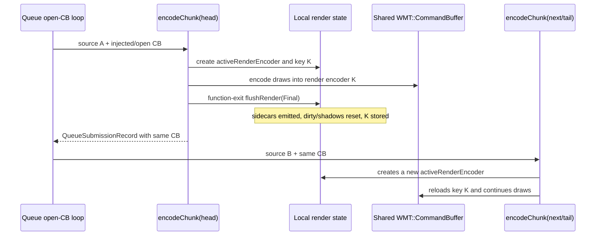
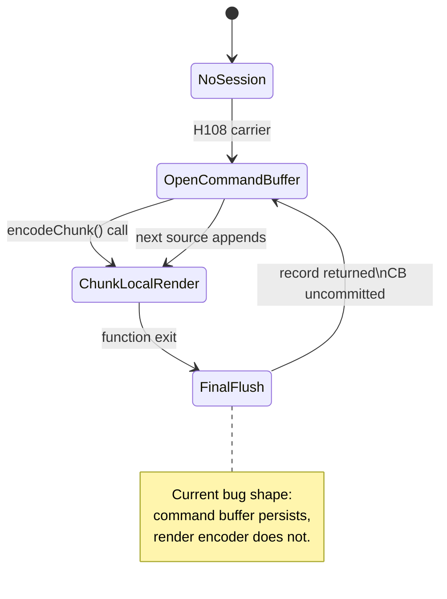

# Present Pacing / Open-CB Render-State Carry Audit 116

**Question.** Can the H108/H185 open-CB regression be fixed by a small
`EncodeChunkOptions` flag, or does it require carrying render-pass state across
`encodeChunk()` calls?

**Answer.** It requires a real encode-session contract. The existing open-CB
path carries only the `WMT::CommandBuffer` across staged sources. The active
Metal render encoder, attachment key, dirty-state, argument-buffer state,
sidecar collectors, and final callbacks are still owned as `encodeChunk()` local
state. Therefore each staged source finishes with the unconditional
`flushRender(Final)` at function exit, even when the next staged source resumes
the same `rt`/`depth` key.

## Hazard audit

H115 showed that most chunk-final rows immediately reopen the same `rt`/`depth`
key. H116 checks whether those same-key reopens are forced by an exact
render-target read hazard.

They are not:

| Run | Same-key next rows | Other next rows | Same-key active RT alias rows | Same-key shader-read-view rows |
|---|---:|---:|---:|---:|
| H108 open-CB limit128 | `3,285` | `184` | `0` | `0` |
| H185 tail-shape rerun | `3,252` | `197` | `0` | `0` |

The sidecar sums are consistent with that:

| Run | Same-key active RT alias samples | Same-key shader-read-view samples | Same-key draw calls | Same-key primitives |
|---|---:|---:|---:|---:|
| H108 open-CB limit128 | `0` | `0` | `356,470` | `484,298,325` |
| H185 tail-shape rerun | `0` | `0` | `353,277` | `479,041,109` |

The runtime hazard counters also reject exact-hazard splits as the owner:

| Run | `render_split_final` | `render_split_rt_change` | `render_split_hazard` | `hazard_exact` |
|---|---:|---:|---:|---:|
| H108 control | `0` | `14,118` | `0` | `0` |
| H108 open-CB limit128 | `3,433` | `12,939` | `0` | `0` |
| H185 tail-shape rerun | `3,429` | `12,934` | `0` | `0` |

So the same-key reopen shape is not "we had to split because the next draw
samples the active render target." It is "the `encodeChunk()` call ended while a
continuing render pass was still active."

## Source audit

`EncodeChunkOptions` currently has three carryable knobs:

- optional injected `WMT::CommandBuffer`;
- `disableMidChunkCommits`;
- `disablePresentAcquireSplit`.

That is enough to keep one command buffer uncommitted, but not enough to keep a
Metal render encoder live. The load-bearing state is inside `encodeChunk()`:

- `activeRenderEncoder` / `activeBlitEncoder`;
- `activeKey` and `activeWriteHazard`;
- `activePassUsesTileFfp`, `activePassUsesArgbufHybrid`,
  `activePassUsesArgbufResourceArray`, and `activePassUsesArgbufDirectCbuf`;
- `activeArgbufStorage` / `activeArgbufOffset`;
- `activeDrawStateKey` and `activeDrawStateUsesPrefetchedPsoLayout`;
- `pendingClear` and `pendingClearCommandIndex`;
- `activeColorHandles`;
- active color/depth/draw-texture dump sidecars;
- active encoder sequence/index and encoder breakdown row;
- `uniformDirty`;
- argbuf payload delta caches and `textureSamplerShadow`;
- active stream/IB staging, visibility scout, GPU sample buffer/cursor, and
  post-commit/completion callbacks.

`flushRender()` then emits sidecars and samples, marks active color handles as
touched, ends the encoder, resets the per-encoder shadows, and records the end
reason. The final path always calls:

```text
flushPendingClear()
flushRender(Final)
flushBlit()
```

The queue-side H108 carrier appends sources by passing
`pendingRecord->commandBuffer` back into `encodeChunk()`, then merges submission
records through `mergeEncodedPendingTailSubmission()`. That path preserves
command-buffer lifetime and completion-source lifetime, but the render-pass
lifetime has already been closed before the record is returned.

## Interaction model





## Required next contract

The next implementation should not be another threshold search or another
`EncodeChunkOptions` boolean. It needs one of these designs:

1. **EncodeSession / RenderPassCarry**
   - Owns the command buffer plus active render encoder state outside
     `encodeChunk()`.
   - Finalizes only at a real pass split, Present, fallback failure, or
     session close.
   - Hard part: sidecar emit timing, active color touched-set publication,
     pending clear lookahead, visibility/sample lifetime, callbacks, dirty
     state, and argument-buffer table lifetime all cross source boundaries.

2. **Logical command tape merge before Metal encode**
   - Merge staged heads and tail into one logical encode input, then call the
     existing whole-slot encoder once.
   - This preserves render-pass locality with less encoder-state surgery.
   - Hard part: it does not create overlap unless replay/tape construction
     itself runs early enough to hide completion wait.

3. **Return to producer/replay cadence reduction**
   - Avoid the open-CB carrier until a safe session contract exists.
   - Continue reducing commit/replay/snapshot/encode CPU and prove P4 movement
     with no-gputrace gates.

## Verdict

H116 upgrades "carry active render-pass state" from a loose next idea to an
implementation gate. The existing H108/H185 carrier is structurally unable to
avoid final same-key reopens because it carries command-buffer lifetime only.

Promotion rules:

- require `--require-encoder-final-end-reason-not-increase`;
- require `--require-encoder-final-same-key-reopen-not-increase`;
- require `--require-encoder-color-load-not-increase` and
  `--require-encoder-depth-load-not-increase`;
- require P4 overlap/no-enqueue movement and encode-ready-depth movement;
- require command-buffer/pass/tile-preservation locality gates;
- require the `v0.0.3` GT1 visual-safe gate before FPS or Xcode-counter deltas
  are treated as promotable.

Do not spend `.gputrace` on H108/H185 threshold sweeps. Spend it only after a
no-gputrace candidate preserves render-pass locality or after a separate
GPU-hot-frame/backend-storage experiment needs Xcode counters.
