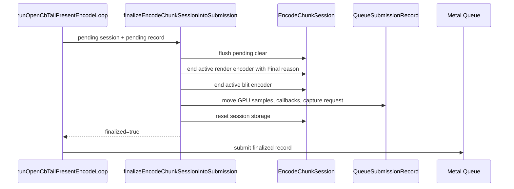

# Present-Pacing H144 - Open-CB Encode Session Finalizer API

## Question

Can the H143 source-independent finalizer contract be implemented without
replaying another source through `encodeChunk()`?

## Verdict

Yes, as an implementation prerequisite. The encoder now exposes:

```text
finalizeEncodeChunkSessionIntoSubmission(ctx, session, record)
```

It closes a deferred `EncodeChunkSession` into the already-owned
`QueueSubmissionRecord::commandBuffer`, moves deferred sidecars into the record,
and resets the session. This is not yet a promoted FPS candidate; it removes the
API blocker so the next no-gputrace open-CB run can test P4/locality/visual
gates.

## Implementation Shape



The helper mirrors the default encode return finalizer:

```text
flushPendingClear() -> flushRender(Final) -> flushBlit()
```

The queue now routes direct pending-record submission through this finalizer.
If finalization fails, the existing conservative abandon path remains.

## What This Does Not Prove

The H135 black-screen class also depended on the encode loop sleeping with a
visible head retained and no tail ready. H144 does not by itself add a timed
pending-head release or prove that consuming tail-less heads is safe. Runtime
promotion still requires a no-gputrace run showing:

- `open_cb_tail_present_pending_started` becomes nonzero only in a safe shape;
- no fully black or stale final-frame output;
- `draw_skipped_no_pipeline=0`;
- `gpu_command_buffer_errors=0`;
- no command-buffer/render-pass/tile-preservation regression;
- P4 movement through lower no-enqueue wait or higher enqueue-during-wait;
- `v0.0.3` visual-safe output.

## Verification

Native build/test coverage:

```text
meson test -C build-arm64-nowine dxmt9-queue-completion-sources-spec --print-errorlogs
```

Result: passed.

The next validation is a 120s foreground no-gputrace opt-in run with
`DXMT9_OPEN_CB_PREENCODE_TAIL_PRESENT=1`,
`DXMT9_OPEN_CB_CARRY_RENDER_SESSION=1`, and a real split trigger such as
`DXMT9_STAGE_PRE_PRESENT_COMMAND_LIMIT=128`, followed by the existing
P4/locality/visual gates. H145 runs that scout and rejects runtime promotion:
the split trigger fires, but the H140 no-tail guard suppresses every pending
head, so the finalizer is not exercised by the carry path. Do not spend
`.gputrace` until a follow-up moves the no-gputrace gates.
