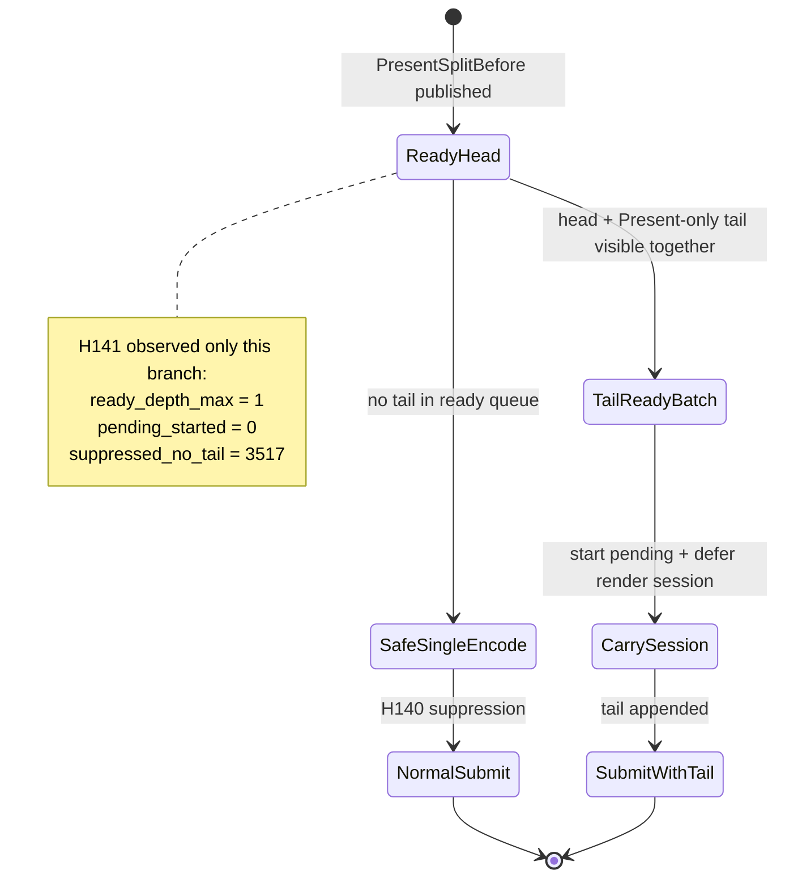

# Present-Pacing H141 — Open-CB Tail-Ready Prefix Probe

## Question

Can the H140 safety guard become useful by starting render-session carry only
when a `PresentSplitBefore` head and its Present-only tail are already
simultaneously visible in the ready queue?

## Change

Implemented a strict open-CB prefix selector:

- `render::selectOpenCbTailPresentBatchPrefix()` accepts only
  `[PresentSplitBefore non-present head..., Present-only tail]`.
- `runOpenCbTailPresentEncodeLoop()` now uses ring-sized ready-slot scratch
  under `DXMT9_OPEN_CB_CARRY_RENDER_SESSION=1`.
- If a complete prefix is unavailable, the H140 fail-safe remains unchanged:
  the head is encoded normally and `open_cb_tail_present_pending_suppressed_no_tail`
  is counted.

This keeps tail-less visible heads from being retained before a Present tail
exists.

## Runtime Evidence

Source:
`experiments/output/app-d3d9-3dmark05-h141-open-cb-tail-ready-prefix-r1`

Command shape:

```sh
DXMT9_OPEN_CB_PREENCODE_TAIL_PRESENT=1 \
DXMT9_OPEN_CB_CARRY_RENDER_SESSION=1 \
DXMT9_STAGE_PRE_PRESENT_COMMAND_LIMIT=128 \
bash scripts/tools/run_3dmark05_perf_probe.sh \
  --suffix h141-open-cb-tail-ready-prefix-r1 \
  --frame 60 \
  --no-gputrace \
  --no-encoder-breakdown \
  --frame-sampling \
  --timeout 120 \
  --keep-frontmost
```

Key counters:

| Counter | Value |
|---|---:|
| `present_encoded` | `1,680` |
| `open_cb_tail_present_pending_started` | `0` |
| `open_cb_tail_present_pending_suppressed_no_tail` | `3,517` |
| `open_cb_tail_present_head_appended` | `0` |
| `open_cb_tail_present_tail_appended` | `0` |
| `open_cb_tail_present_tail_submitted` | `0` |
| `encode_session_carry_deferred_chunks` | `0` |
| `encode_dequeue_ready_depth_max` | `1` |
| `encode_dequeue_ready_depth_gt1` | `0` |
| `draw_skipped_no_pipeline` | `0` |
| `gpu_command_buffer_errors` | `0` |
| `sampled_avg_fps` | `15.785` |
| `completion_wait_with_enqueue_ms_per_present` | `25.791` |
| `completion_wait_without_enqueue_ms_per_present` | `9.833` |
| `commit_chunk_replay_cpu_ms_per_present` | `10.221` |
| `encode_chunk_cpu_ms_per_present` | `13.235` |

The screenshot is a normal effects-heavy GT1 frame with bloom, sparks, bullets,
geometry, and HUD visible. It is not a same-frame `v0.0.3` visual proof, but it
rejects the old black-screen failure mode for this run.

## Verdict

Rejected as a P4 carrier.

The strict tail-ready path never activates. Every `PresentSplitBefore` head is
still seen as tail-less when the encode loop wakes:

```text
pending_started = 0
pending_suppressed_no_tail = 3517
ready_depth_max = 1
```

So the problem is not merely that H140 lacked a stricter prefix selector. The
head and tail are not ready together in the current GT1 cadence. A tail-ready
dequeue policy cannot create overlap from this shape.

## Next Gate

Do not spend `.gputrace` on this candidate.

The next open-CB/P4 design must either:

- add an explicit fail-open session finalizer/submit path that can publish a
  pre-encoded head safely if no tail arrives, or
- create earlier encoder-invisible CPU-ready staging that makes the head and
  tail ready together without increasing command buffers, render passes, tile
  preservation, final same-key reopens, or load/store traffic.

Any follow-up must keep the H140 safety invariant and pass the 120s
no-gputrace P4/locality gates plus the `v0.0.3` visual-safe gate before Xcode
or `.gputrace`.


