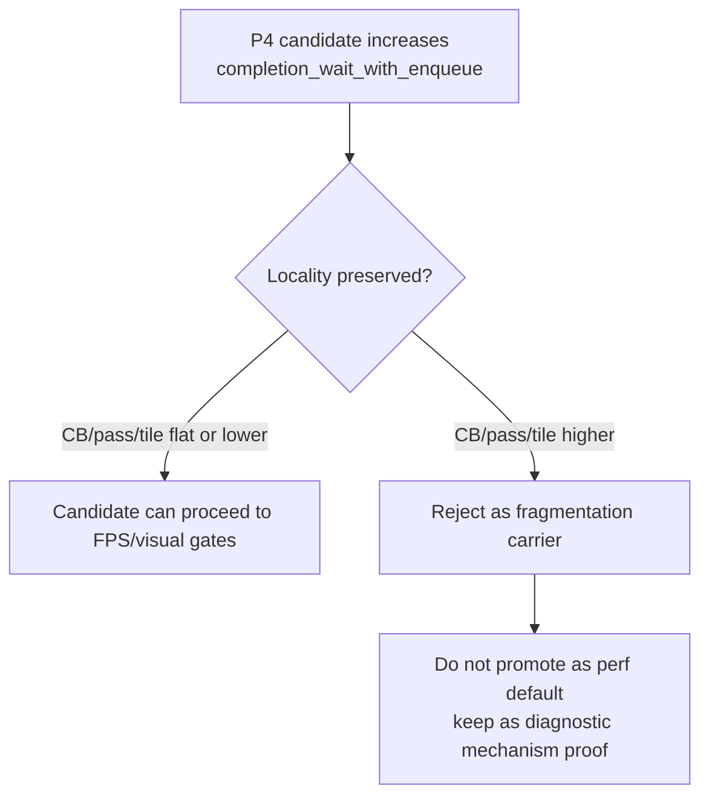

# Present Pacing 51 - P4 Overlap Locality Gates

## Question

[present-pacing-drawchunk-limit.48](present-pacing-drawchunk-limit.48.md) and
[present-pacing-drawchunk-limit-sweep.50](present-pacing-drawchunk-limit-sweep.50.md) proved that earlier publication can
recover `completion_wait_with_enqueue_ms`, but the tested draw-count carrier
also split Metal command buffers and render passes. Make that lesson executable
so a future P4 candidate cannot pass by creating overlap through worse Metal
locality.

## Tooling

`scripts/tools/compare_3dmark05_perf_counters.py` now reports:

| Metric | Meaning |
|---|---|
| `command_buffers_per_present` | Metal command-buffer count normalized by presents |
| `sub_command_buffers_per_present` | dxmt9 sub-command-buffer count normalized by presents |

It also adds locality-preservation gates:

```sh
python3 scripts/tools/compare_3dmark05_perf_counters.py \
  <baseline-output> <candidate-output> \
  --require-completion-wait-with-enqueue-increase \
  --require-command-buffers-per-present-not-increase \
  --require-render-passes-per-present-not-increase \
  --require-tile-preservation-not-increase
```

The same flags pass through both wrapper paths:

- `run_3dmark05_perf_probe.sh --compare-baseline-output ...`
- `finalize_3dmark05_perf_probe.sh --baseline-output ...`

## Known-Bad Carrier

The new gates intentionally reject `DXMT9_DRAW_CHUNK_COMMAND_LIMIT=256` against
`current-lowoverhead-post-capture-r2`:

| Metric | Baseline | Limit 256 | Direction |
|---|---:|---:|---|
| `completion_wait_with_enqueue_ms_per_present` | `0.199` | `14.569` | overlap recovered |
| `command_buffers` | `7,247` | `11,153` | worse |
| `render_pass_begin` | `21,367` | `22,686` | worse |
| `render_pass_tile_preservation_bytes` | `229.818GB` | `242.500GB` | worse |
| sampled FPS | `16.557` | `16.586` | flat |

This is the target shape: the overlap mechanism is real, but the carrier is not
acceptable because it trades exposed no-enqueue wait for extra Metal submission
and tile-store/load work.



## Decision

Future P4 overlap experiments should pair overlap gates with locality gates.
The useful target is not simply "producer runs while completion waits"; it is
"producer/replay/encode progress overlaps while normal Metal command-buffer and
render-pass locality remains intact."

This keeps draw-count publish limits in the diagnostic bucket and narrows the
next architecture work to designs that prepare or stage CPU work earlier
without forcing extra Metal command-buffer/render-pass commits.

## Verification

- `python3 -m pytest tests/scripts/test_compare_3dmark05_perf_counters.py -q`
- `python3 -m pytest tests/scripts/test_3dmark05_probe_scripts.py -q -k 'pacing_compare_gates'`
- `bash -n scripts/tools/run_3dmark05_perf_probe.sh scripts/tools/finalize_3dmark05_perf_probe.sh`
- Expected failure check against the known-bad limit256 run:
  `--require-command-buffers-per-present-not-increase`,
  `--require-render-passes-per-present-not-increase`, and
  `--require-tile-preservation-not-increase`.
