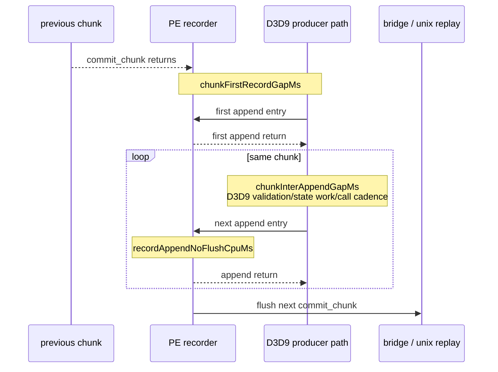

# Present Pacing 58 - Active PE Chunk Fill Is Mostly Inter-Append Producer Gap

## Question

[present-pacing-pe-chunk-fill-split.57](present-pacing-pe-chunk-fill-split.57.md) showed that PE all-chunk fill time is
split into first-record gap and active chunk fill. The remaining question was
whether the active-fill half is mostly the recorder append operation itself or
wall time between appendable records.

This run adds:

```text
chunkInterAppendGapSamples
chunkInterAppendGapMs
chunkInterAppendGapMaxMs
recordAppendCalls
recordAppendCpuMs
recordAppendCpuMaxMs
recordAppendNoFlushCalls
recordAppendNoFlushCpuMs
recordAppendNoFlushCpuMaxMs
```

`chunkInterAppendGapMs` measures the wall gap from one successful append return
to the next append entry inside the same non-empty chunk. `recordAppendNoFlush*`
counts only append calls that do not trigger a pre/post capacity flush, so it is
the clean recorder append CPU bucket. `recordAppendCpuMs` includes capacity
flush append calls and therefore also includes bridge/replay time; do not use it
as the active-fill closure term.

## Verdict

Accepted. Active PE chunk fill is mostly inter-append producer wall time, not
recorder append CPU.

The scout records `chunkActiveFillMs=30.127ms/present`. Of that,
`chunkInterAppendGapMs=27.405ms/present` explains `90.97%`, while
no-flush append CPU is only `2.577ms/present` (`8.56%`). Together they close
`99.52%` of active fill.

This lowers the priority of append-copy micro-optimizations as the primary
average-FPS lever. They can still help the serialized path, but they cannot
remove the dominant active-fill wall gap unless they also change the producer
cadence or publish/overlap structure.

## Run

```sh
DXMT9_PE_RECORDER_STATS=1 DXMT_LOG_LEVEL=info \
bash scripts/tools/run_3dmark05_perf_probe.sh \
  --suffix noenqueue-pe-active-fill-split-r1-20260616 \
  --no-gputrace \
  --no-encoder-breakdown \
  --frame-sampling \
  --timeout 120 \
  --capture-delay-sec 45 \
  --wait-unlocked-sec 1 \
  --wait-unlocked-interval-sec 1 \
  --min-free-mb 256
```

The run is a valid no-gputrace attribution scout: `status=pass`,
`timed_out=True`, `capture_error=None`, and it encoded `1,680` presents. Use it
for CPU/producer cadence attribution only; it is not an Xcode GPU-counter
sample.

## Results

| Metric | Value |
|---|---:|
| `present_encoded` | `1,680` |
| `completion_wait_ms_per_present` | `27.791` |
| `completion_wait_with_enqueue_ms_per_present` | `1.497` |
| `completion_wait_without_enqueue_ms_per_present` | `26.294` |
| `commit_chunk_replay_cpu_ms_per_present` | `8.034` |
| `commit_chunk_queue_draw_submission_cpu_ms_per_present` | `3.779` |
| `encode_chunk_cpu_ms_per_present` | `12.119` |

PE all-chunk split:

| Metric | Value |
|---|---:|
| `commitCount` | `41,969` |
| `chunkFillGapMs` | `93,276.621` |
| chunk fill gap | `55.522ms/present` |
| `chunkFirstRecordGapMs` | `42,664.719` |
| first-record gap | `25.396ms/present` |
| first-record share of fill | `45.740%` |
| `chunkActiveFillMs` | `50,612.798` |
| active fill | `30.127ms/present` |
| active-fill share of fill | `54.261%` |
| first + active closure | `100.001%` |
| `chunkBridgeMs` | `16,062.196` |
| bridge/replay duration | `9.561ms/present` |

Active-fill split:

| Metric | Value |
|---|---:|
| `chunkInterAppendGapSamples` | `2,304,616` |
| `chunkInterAppendGapMs` | `46,040.416` |
| inter-append gap | `27.405ms/present` |
| inter-append share of active fill | `90.966%` |
| `recordAppendNoFlushCalls` | `2,310,234` |
| `recordAppendNoFlushCpuMs` | `4,330.072` |
| no-flush append CPU | `2.577ms/present` |
| no-flush append share of active fill | `8.555%` |
| inter-append + no-flush append closure | `99.521%` |
| `recordAppendCpuMs` | `21,341.144` |
| all append CPU including flushes | `12.703ms/present` |

## Interpretation



The active-fill span is therefore not primarily the low-level append copy. It is
mostly the time between appendable record materializations. That time can include
D3D9 validation, state normalization, dirty constant merging, app command
dispatch cadence, and other PE-side producer work before the next record is
ready.

`recordAppendCpuMs` is larger than no-flush append CPU because capacity-triggered
append calls synchronously invoke the chunk flush path. Its per-present value
tracks `chunkBridgeMs` plus append overhead, so it is useful for sanity checking
but not for active-fill ownership.

## Decision

| Direction | Updated implication |
|---|---|
| append-copy microfix | useful only for the `2.6ms/present` clean append bucket unless it also changes materialization cadence |
| record materialization/state-copy elision | higher priority than raw append copy because it can reduce inter-append producer gaps |
| producer run-ahead / async publish formation | still the strongest P4-facing design if it converts no-enqueue wait into overlap without H57 locality regressions |
| smaller chunks / early flush carriers | still rejected unless they preserve command-buffer, render-pass, and tile-preservation shape |

Next no-gputrace work should target the producer work between appendable records
or a larger run-ahead design. Do not spend `.gputrace` on this CPU attribution
alone.
