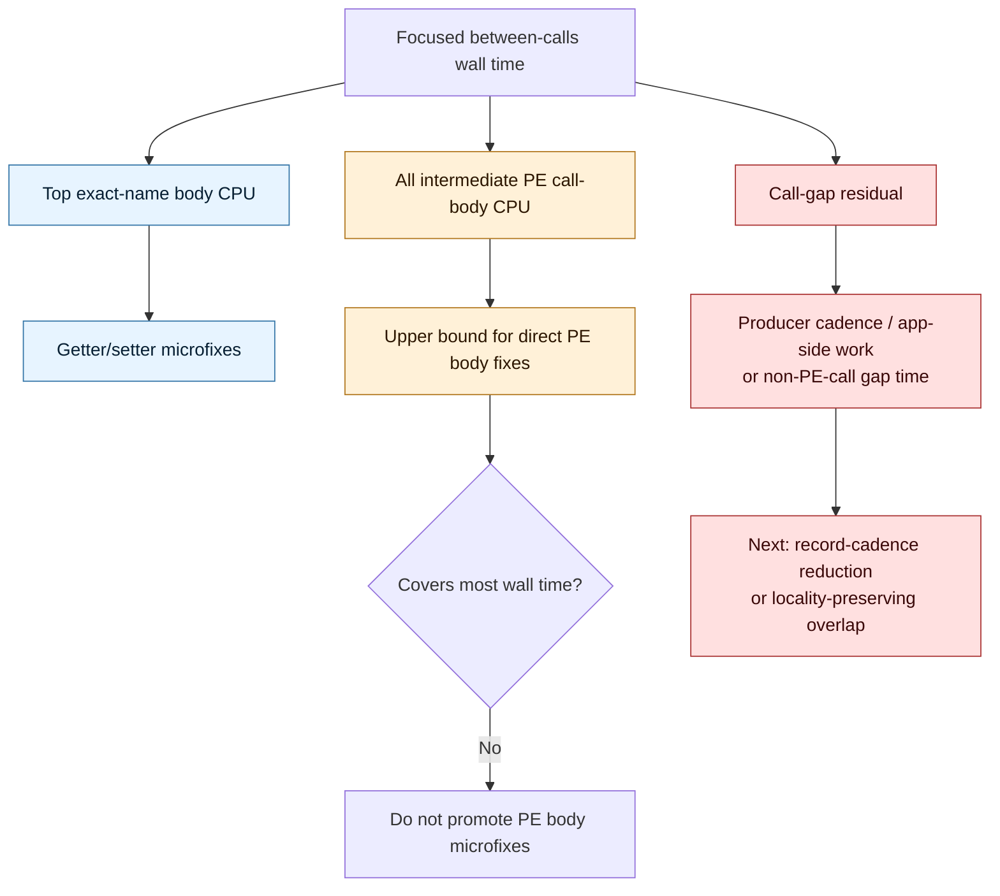

# Present Pacing / PE Between-Call Body Coverage Residual 121

**Question.** H119 showed exact call-name body CPU, but top exact-name rows
were still only a partial sample. If every intermediate PE call body inside the
focused between-calls windows is accumulated, does direct PE call-body CPU
explain the current wall gap?

**Answer.** No. Aggregate intermediate PE call-body CPU is measurable and now
exported correctly, but most focused wall time is still outside PE call bodies.
The largest window, `draw_indexed -> set_vs_const_f`, spends
`17.870ms/present` between calls; all intermediate PE call bodies together
cover `3.168ms/present` (`17.73%`). The remaining `14.701ms/present`
(`82.27%`) is call-gap residual. `draw_indexed -> apply_state` is even more
decisive: only `0.066ms/present` body CPU covers a `6.895ms/present` window.

This demotes direct PE setter/getter body micro-optimization as the next
average-FPS lever. The useful targets remain record/producer cadence, replay /
snapshot / encode serialization, or a locality-preserving overlap carrier that
actually moves the no-enqueue/P4 rows.

## Implementation Note

The first aggregate run (`pe-body-current-r1`) proved the summary parser knew
about the new fields, but the main `pe_recorder_stats` log line was truncated
at roughly `4KiB` before the `BetweenCallBody*` fields. The fix emits a separate
short line:

```text
pe_recorder_gap_body_stats ...
```

`scripts/run_apps/run_experiment.py` now parses that line and merges it into
`dxmt9_pe_recorder_counters`. The summary and comparison tools then report both
top exact-body CPU and all-body CPU.



## Run

```sh
bash scripts/tools/run_3dmark05_perf_probe.sh \
  --suffix pe-body-current-r2 \
  --no-gputrace \
  --no-encoder-breakdown \
  --timeout 120 \
  --keep-frontmost \
  --wait-unlocked-sec 1 \
  --wait-unlocked-interval-sec 1 \
  --min-free-mb 256 \
  --pe-recorder-stats
```

The run completed with `status=pass`, `present_encoded=1,380`,
`draw_skipped_no_pipeline=0`, and `gpu_command_buffer_errors=0`. It remains a
CPU-side no-gputrace attribution run, not an Xcode counter proof.

## Coverage Result

| Pair | between-calls ms/present | top exact-body CPU ms/present | all body calls | all body CPU ms/present | all body coverage | call-gap residual ms/present | residual share |
|---|---:|---:|---:|---:|---:|---:|---:|
| `draw_indexed -> set_vs_const_f` | `17.870` | `2.330` | `8,660,418` | `3.168` | `17.73%` | `14.701` | `82.27%` |
| `draw_indexed -> apply_state` | `6.895` | `0.012` | `14,678` | `0.066` | `0.96%` | `6.829` | `99.04%` |
| `draw_indexed -> draw_indexed` | `4.148` | `0.264` | `1,548,984` | `0.451` | `10.86%` | `3.698` | `89.14%` |
| `draw_indexed -> set_ps_const_f` | `3.425` | `0.410` | `1,599,933` | `0.600` | `17.52%` | `2.825` | `82.48%` |

The P4 shape remains unchanged:

| Metric | Value / present |
|---|---:|
| `completion_wait_ms` | `27.462` |
| `completion_wait_with_enqueue_ms` | `0.000` |
| `completion_wait_without_enqueue_ms` | `27.462` |
| `commit_chunk_replay_cpu_ms` | `7.980` |
| `encode_chunk_cpu_ms` | `10.742` |

## Decision

Do not rank direct PE call-body optimization as the next average-FPS target.
Even a perfect direct body elimination would leave the dominant residual in the
same current no-enqueue shape.

| Candidate | Status after aggregate body coverage |
|---|---|
| PE desc getter fast paths | rejected as current FPS lever |
| raw setter/getter body microfixes | bounded cleanup only |
| constant record cadence / deferred const compression | plausible only if it moves P4 or serial replay/encode rows |
| replay/snapshot/encode structural cleanup | still useful if it reduces exposed serial work |
| locality-preserving overlap carrier | still the larger FPS lever |

Any mutating candidate still requires no-gputrace P4/locality proof and the
`v0.0.3` visual-safe gate before FPS promotion or `.gputrace` spend.
