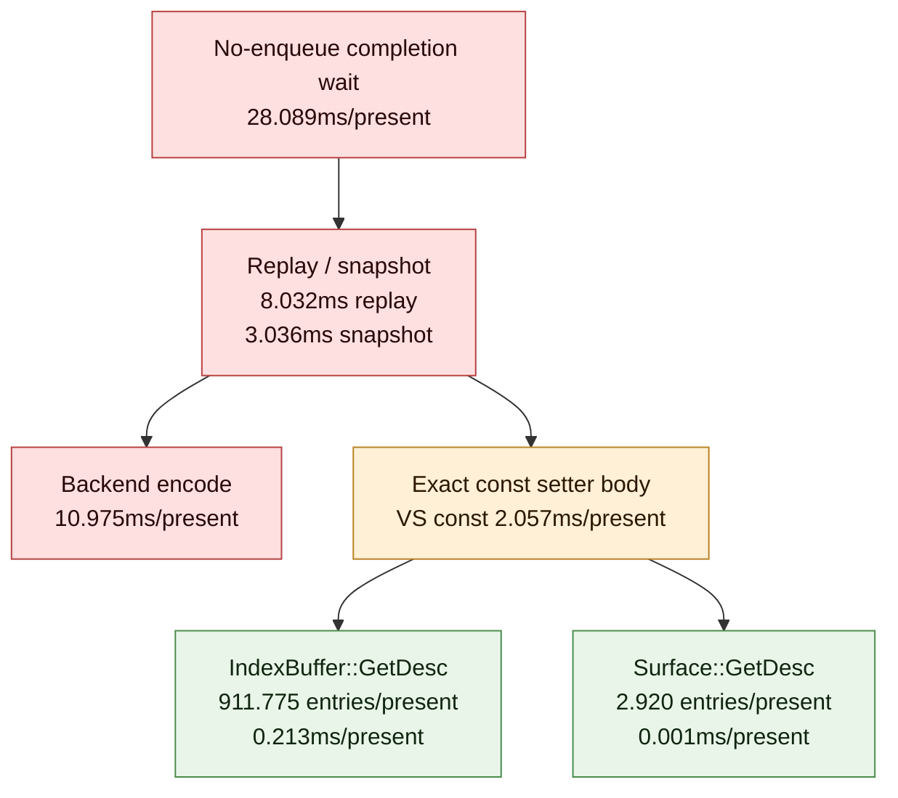

# Present Pacing / Current PE Between-Call Exact Body-Time Scout 119

**Question.** After H118 adds body-time attribution for focused exact call names,
does the current H117 cadence owner point at PE child getter bodies, constant
setter bodies, or broader record/producer cadence?

**Answer.** Child getter bodies stay demoted. `IndexBuffer::GetDesc` and
`Surface::GetDesc` remain frequent markers inside the focused windows, but their
body CPU is small after the accepted PE desc cache. The only exact call-name body
row large enough to matter locally is shader-constant setter traffic, especially
`SetVertexShaderConstantF` in `draw_indexed -> set_vs_const_f`. Even that local
body time is far smaller than the exposed P4/no-enqueue and replay/encode rows,
so the next FPS-facing work remains record-cadence reduction or a
locality-preserving overlap carrier, not desc getter fast paths.

## Run

```sh
bash scripts/tools/run_3dmark05_perf_probe.sh \
  --suffix h206-pe-between-call-body-time-r1 \
  --no-gputrace \
  --no-encoder-breakdown \
  --frame-sampling \
  --timeout 120 \
  --keep-frontmost \
  --wait-unlocked-sec 1 \
  --wait-unlocked-interval-sec 1 \
  --pe-recorder-stats
```

The run completed with `status=pass`, `present_encoded=1,380`,
`draw_skipped_no_pipeline=0`, and `gpu_command_buffer_errors=0`.

## P4 Shape

The run preserves the current no-enqueue owner:

| Metric | Value / present |
|---|---:|
| `completion_wait_ms` | `28.089` |
| `completion_wait_with_enqueue_ms` | `0.000` |
| `completion_wait_without_enqueue_ms` | `28.089` |
| `completion_wait_no_enqueue_share` | `100.000%` |
| `commit_chunk_replay_cpu_ms` | `8.032` |
| `commit_chunk_queue_draw_submission_cpu_ms` | `3.774` |
| `d3d9_snapshot_draw_submission_cpu_ms` | `3.036` |
| `d3d9_snapshot_cache_lookup_cpu_ms` | `2.441` |
| `encode_chunk_cpu_ms` | `10.975` |
| `encode_draw_cpu_ms` | `8.561` |

The first publish slot is still substantial:

| Metric | Value |
|---|---:|
| `no_enqueue_first_publish_slot_samples_per_present` | `0.999` |
| commands / slot | `326.516` |
| draw items / slot | `732.076` |
| payload bytes / slot | `196,706.567` |

## Exact Body-Time Result

| Focused window | Rank | Exact call name | Entries / present | CPU ms / present | Reading |
|---|---:|---|---:|---:|---|
| `draw_indexed -> set_vs_const_f` | 1 | `SetVertexShaderConstantF` | `3522.742` | `2.057` | material local constant traffic |
| `draw_indexed -> set_vs_const_f` | 2 | `IndexBuffer::GetDesc` | `911.775` | `0.213` | high-frequency marker, not primary body CPU |
| `draw_indexed -> apply_state` | 1 | `SetRenderTarget` | `2.920` | `0.011` | not a body CPU owner |
| `draw_indexed -> apply_state` | 2 | `Surface::GetDesc` | `2.920` | `0.001` | desc getter body rejected |
| `draw_indexed -> draw_indexed` | 1 | `IndexBuffer::GetDesc` | `378.399` | `0.085` | high-frequency marker, not primary body CPU |
| `draw_indexed -> draw_indexed` | 2 | `SetVertexShaderConstantF` | `290.348` | `0.170` | secondary constant traffic |
| `draw_indexed -> set_ps_const_f` | 1 | `SetPixelShaderConstantF` | `421.269` | `0.225` | secondary constant traffic |
| `draw_indexed -> set_ps_const_f` | 2 | `SetVertexShaderConstantF` | `311.534` | `0.175` | secondary constant traffic |



## Decision

Accept h206 as the current body-time attribution. The child desc cache remains a
cleanup, not an average-FPS lever: `IndexBuffer::GetDesc` and
`Surface::GetDesc` do not have enough body CPU after caching to explain the
focused gaps. Shader-constant setter/body work is measurable, but it is still a
local P2/P3 subset and must be promoted only if a candidate also moves the
no-enqueue/P4 rows or reduces replay/encode enough to change wall-clock.

Next work:

| Candidate class | Status after h206 |
|---|---|
| PE desc getter fast paths | rejected as current FPS lever |
| raw constant setter body micro-optimization | bounded local cleanup only |
| constant record cadence / deferred const flush compression | still plausible, but must move P4/serial rows |
| locality-preserving overlap carrier | still the larger FPS lever |
| `.gputrace` spend from this run alone | rejected; this is CPU-side attribution |
