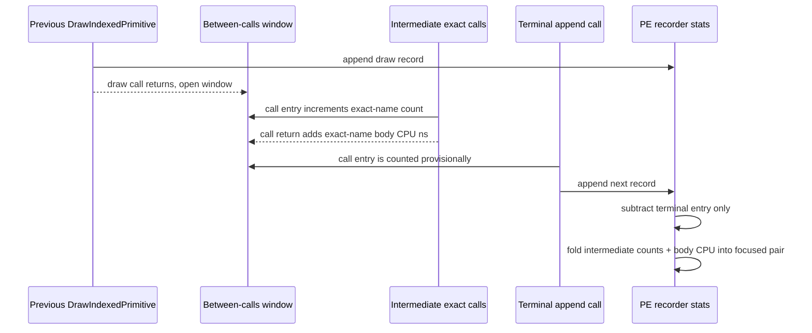

# Present Pacing / PE Between-Call Exact Body-Time Attribution 118

**Question.** H117 names the current PE producer gap with exact call-entry
counts, but the counts alone cannot prove whether `IndexBuffer::GetDesc`,
`Surface::GetDesc`, or repeated shader-constant setters are real body CPU
owners or only high-frequency markers inside the draw-return-to-next-append
window. Can the PE recorder close that ambiguity in the next no-gputrace scout?

**Answer.** Yes. `DXMT9_PE_RECORDER_STATS=1` now records exact-call body CPU
time for known call-name buckets observed inside the focused between-calls
windows. The existing entry counts remain unchanged; the terminal
append-producing call is still excluded from the between-calls table. New
summary columns expose CPU total, CPU ms/present, and max CPU ms for each top
exact call name.

This is instrumentation only. It does not change default rendering and it is not
a performance win until a later run proves the new rows identify a target that
moves P4 or serial PE/replay/encode rows while passing the `v0.0.3` visual gate.

## Implementation

`PeRecorderStats` now carries two additional focused arrays:

| Field | Meaning |
|---|---|
| `chunkInterAppendFocusBetweenCallNameCpuNsTotal` | body CPU time accumulated for each focused pair / exact call-name bucket |
| `chunkInterAppendFocusBetweenCallNameCpuNsMax` | max body CPU time seen for the same bucket |

The per-window recorder keeps matching scratch arrays while
`peRecorderBetweenCallsActive_` is true. `recordPeBetweenCallsEntry()` still
counts call entries. `logPeCallReturnAfterPresent()` now records body time before
the old first-8-call return log limit, so the body-time attribution covers the
same high-frequency windows as the entry counters.



The terminal append-producing call has not returned when the next record is
appended, so it contributes an entry count but not body CPU time. Finalization
therefore decrements only the terminal entry count and leaves the CPU totals
intact. This preserves intermediate calls that share the same exact call name as
the terminal call.

## Report Surface

`3dmark05-perf-summary.md` now extends **Focused Between-Calls Entry Names**:

| Existing columns | New columns |
|---|---|
| call name, entries, entries/window, entries/present | CPU ms, CPU ms/present, CPU max ms |

`compare_3dmark05_perf_counters.py` promotes the new raw keys into:

| Derived key | Meaning |
|---|---|
| `pe_recorder_gap_<pair>_between_topN_call_name_cpu_ms` | total body CPU for that exact call bucket |
| `pe_recorder_gap_<pair>_between_topN_call_name_cpu_ms_per_present` | normalized body CPU |
| `pe_recorder_gap_<pair>_between_topN_call_name_cpu_max_ms` | max single body duration |

The A/B report's **Focused Between-Calls Entry Names** table now compares both
entries/present and CPU ms/present.

## Next Probe

Run the same foreground PE-recorder scout as H117 after rebuilding/staging:

```sh
bash scripts/tools/run_3dmark05_perf_probe.sh \
  --suffix h206-pe-between-call-body-time-r1 \
  --no-gputrace \
  --no-encoder-breakdown \
  --frame-sampling \
  --timeout 120 \
  --keep-frontmost \
  --wait-unlocked-sec 1 \
  --wait-unlocked-interval-sec 1 \
  --pe-recorder-stats
```

Interpretation:

| Result shape | Decision |
|---|---|
| high entries and low CPU ms/present for `IndexBuffer::GetDesc` / `Surface::GetDesc` | keep desc getters demoted; they are cadence markers after the accepted PE desc cache |
| high entries and high CPU ms/present for a known exact call | investigate that exact PE body or its deferred flush path |
| high CPU in no exact-name bucket while entries are distributed | shift back to broader producer cadence / overlap carrier design |
| local CPU movement without `completion_wait_with_enqueue` or no-enqueue improvement | do not promote as FPS work |

Any candidate that follows from this instrumentation still needs a no-gputrace
P4/locality proof and the `v0.0.3` visual gate before another `.gputrace` spend.
