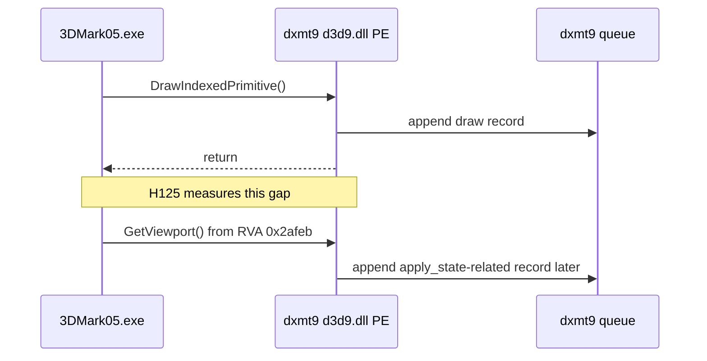
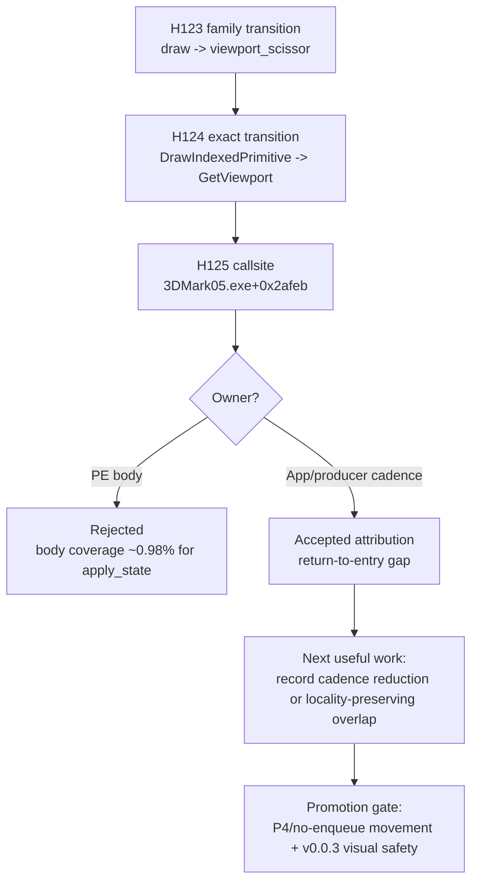

# Present Pacing / PE Between-Call Return-To-Entry Callsite Attribution 125

**Question.** Is H124's `DrawIndexedPrimitive -> GetViewport` marker tied to a
stable app callsite, a dxmt9 wrapper path, or missing caller-PC coverage?

**Answer.** It is tied to a stable 3DMark05 app callsite. In
`pe-callsite-transition-current-r1`, the dominant `draw_indexed -> apply_state`
return-to-entry row remains `DrawIndexedPrimitive -> GetViewport`, now resolved
to `3DMark05.exe+0x2afeb`. It accounts for `3,659.409ms` total,
`2.904ms/present`, and `43.03%` of that between-calls window. This confirms the
H124 interpretation: the interval is app/producer cadence between a draw return
and the next D3D9 getter entry, not `GetViewport` body CPU.

## Implementation Delta

H125 keeps the H123/H124 timing model and adds caller-PC aggregation for exact
return-to-entry transitions:

- records the next PE call's caller PC when a between-calls transition gap is
  observed;
- aggregates the focused exact transitions by `{focus pair, prev call, next
  call, caller PC}`;
- resolves caller module and RVA at log time;
- adds a separate `pe_recorder_gap_callsite_stats` event and summary/compare
  tables named **Focused Between-Calls Exact Return-To-Entry Call Sites**.

This is diagnostic-only and active only under `DXMT9_PE_RECORDER_STATS=1`.

## Run

```sh
bash scripts/tools/run_3dmark05_perf_probe.sh \
  --suffix pe-callsite-transition-current-r1 \
  --no-gputrace \
  --no-encoder-breakdown \
  --pe-recorder-stats \
  --frame-sampling \
  --keep-frontmost \
  --timeout 120 \
  --wait-unlocked-sec 60
```

The run completed with `status=pass`, `present_encoded=1,260`, and a normal
timeout-supervised no-gputrace flow.

## P4 Shape

| Metric | Value |
|---|---:|
| `completion_wait_ms_per_present` | `27.725` |
| `completion_wait_with_enqueue_ms_per_present` | `0.000` |
| `completion_wait_without_enqueue_ms_per_present` | `27.725` |
| `commit_chunk_replay_cpu_ms_per_present` | `7.926` |
| `encode_chunk_cpu_ms_per_present` | `10.887` |
| `commit_chunk_queue_draw_submission_cpu_ms_per_present` | `3.750` |
| `sampled_avg_fps` | `11.541` |

The run is still fully no-enqueue. H125 is attribution, not a performance win.

## Callsite Rows

| Focus pair | Rank | Exact transition | Caller | ms/present | share of between-calls |
|---|---:|---|---|---:|---:|
| `draw_indexed -> apply_state` | `1` | `DrawIndexedPrimitive -> GetViewport` | `3DMark05.exe+0x2afeb` | `2.904` | `43.03%` |
| `draw_indexed -> apply_state` | `2` | `DrawIndexedPrimitive -> CubeTexture::GetCubeMapSurface` | `3DMark05.exe+0xd37b3` | `0.624` | `9.25%` |
| `draw_indexed -> set_vs_const_f` | `1` | `SetVertexShaderConstantF -> SetVertexShaderConstantF` | `3DMark05.exe+0x155f41` | `2.714` | `13.57%` |
| `draw_indexed -> set_vs_const_f` | `2` | `DrawIndexedPrimitive -> SetVertexShaderConstantF` | `3DMark05.exe+0x155f41` | `1.630` | `8.15%` |
| `draw_indexed -> draw_indexed` | `1` | `DrawIndexedPrimitive -> SetVertexShaderConstantF` | `3DMark05.exe+0x155f41` | `0.570` | `12.14%` |
| `draw_indexed -> draw_indexed` | `2` | `IndexBuffer::GetDesc -> IndexBuffer::Lock` | `d3d9.dll+0x5fee1` | `0.264` | `5.62%` |
| `draw_indexed -> set_ps_const_f` | `1` | `SetPixelShaderConstantF -> SetPixelShaderConstantF` | `3DMark05.exe+0x155c44` | `0.286` | `7.56%` |
| `draw_indexed -> set_ps_const_f` | `2` | `DrawIndexedPrimitive -> SetVertexShaderConstantF` | `3DMark05.exe+0x155f41` | `0.265` | `6.99%` |





## Decision

Do not optimize `GetViewport` or viewport/scissor PE body code as the
average-FPS fix. The dominant row is a stable app re-entry point after draw
return. That makes it useful for disassembly/source-oracle correlation, but the
fps-facing work still needs to reduce producer/record cadence, replay/snapshot
work, or create a render-pass-safe overlap carrier that moves no-enqueue/P4
rows.

No `.gputrace` spend is justified by H125 alone. Any mutating candidate still
needs no-gputrace P4/locality movement and the `v0.0.3` GT1 visual-safe gate
before FPS promotion.
