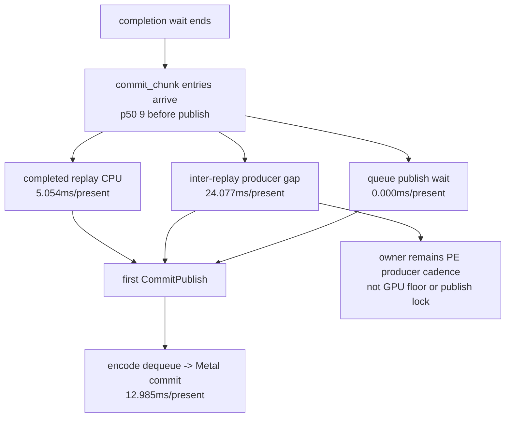

# Present Pacing 72 - Current PE Between-Call Attribution After Uniform ABI-Prefix Fix

## Question

After restoring compact-uniform ABI-prefix correctness and refreshing the
current low-overhead baseline, does the older H71/H72 PE producer-cadence
attribution still hold?

## Verdict

Yes. The current run remains `under-pipelined-no-enqueue`, and the exposed
`commit entry -> publish` row is still explained by PE inter-replay producer
gaps rather than queue publish wait, active replay, or GPU execution. This
keeps the next average-FPS work on constant/record cadence or a
locality-preserving run-ahead design, not on another `.gputrace` GPU spend.

The current run is actually more stark than the earlier H71 sample:
`completion_wait_with_enqueue_ms_per_present=0.000`, and
`commit entry -> publish=29.079ms/present`. Of that row,
`24.077ms/present` (`82.798%`) is inter-replay producer gap, while completed
replay explains `5.054ms/present` and publish wait is `0`.

## Run

```sh
DXMT9_PE_RECORDER_STATS=1 \
DXMT_LOG_LEVEL=info \
DXMT_3DMARK05_FOCUS_KEEPALIVE_SEC=140 \
bash scripts/tools/run_3dmark05_perf_probe.sh \
  --suffix noenqueue-pe-between-call-current-r1-20260618 \
  --no-gputrace \
  --no-encoder-breakdown \
  --frame-sampling \
  --timeout 120 \
  --capture-delay-sec 45 \
  --wait-unlocked-sec 1 \
  --wait-unlocked-interval-sec 1 \
  --min-free-mb 256
```

The wrapper produced complete artifacts with `status=pass`, `timed_out=true`,
and `returncode=143`. This is a valid perf sample for GT1 because the positive
timeout finalized the known final-frame hang after summary and screenshot
artifacts were written.

## P4 Shape

| Metric | Value |
|---|---:|
| `present_encoded` | `1,440` |
| `completion_wait_ms_per_present` | `28.311` |
| `completion_wait_with_enqueue_ms_per_present` | `0.000` |
| `completion_wait_without_enqueue_ms_per_present` | `28.311` |
| `commit_chunk_replay_cpu_ms_per_present` | `8.116` |
| `commit_chunk_queue_draw_submission_cpu_ms_per_present` | `3.769` |
| `d3d9_snapshot_cache_lookup_cpu_ms_per_present` | `2.440` |
| `encode_chunk_cpu_ms_per_present` | `11.109` |
| `encode_draw_cpu_ms_per_present` | `8.541` |

No-enqueue stage rows:

| Stage | total ms/present | p50 ms | p95 ms |
|---|---:|---:|---:|
| wait -> commit chunk entry | `5.064` | `0.986` | `2.429` |
| commit entry -> publish | `29.079` | `18.462` | `48.451` |
| publish -> encode dequeue | `0.263` | `0.245` | `0.471` |
| encode dequeue -> command buffer commit | `12.985` | `13.151` | `23.538` |
| wait -> next enqueue | `47.408` | `31.766` | `73.370` |

Before the first publish after a no-enqueue wait, the recorder has already
processed many chunks:

| Event | total | per publish sample | p50 | p95 |
|---|---:|---:|---:|---:|
| commit entries | `24,253` | `16.854` | `9` | `25` |
| replay starts | `24,263` | `16.861` | `9` | `25` |
| replay ends | `23,019` | `15.997` | `8` | `24` |

The scanned chunks are draw/const-heavy rather than empty:

| Record metric | total | per publish sample | per scanned chunk |
|---|---:|---:|---:|
| all records | `1,267,060` | `880.514` | `52.241` |
| draw records | `660,372` | `458.910` | `27.227` |
| const records | `599,639` | `416.705` | `24.723` |
| apply-state records | `3,131` | `2.176` | `0.129` |
| present records | `1,439` | `1.000` | `0.059` |

## Commit Entry -> Publish Attribution

| Metric | total ms/present | p50 ms | p95 ms |
|---|---:|---:|---:|
| commit entry -> publish | `29.079` | `18.462` | `48.451` |
| completed replay CPU before publish | `5.054` | `2.786` | `8.197` |
| active replay CPU before publish | `0.000` | `0.000` | `0.001` |
| inter-replay producer gap before publish | `24.077` | `15.700` | `39.719` |
| commit publish wait before publish | `0.000` | `0.000` | `0.000` |

Derived shares:

| Share | Value |
|---|---:|
| completed replay | `17.379%` |
| active replay | `0.002%` |
| inter-replay producer gap | `82.798%` |
| commit publish wait | `0.000%` |
| completed + active + inter-gap closure | `100.178%` |



## Between-Call Attribution

The exact-name rows match H71 in shape:

| Pair | between-calls ms/present | top call | entries/present | second call | entries/present |
|---|---:|---|---:|---|---:|
| `draw_indexed -> set_vs_const_f` | `15.702` | `SetVertexShaderConstantF` | `3444.356` | `IndexBuffer::GetDesc` | `890.576` |
| `draw_indexed -> apply_state` | `6.846` | `SetRenderTarget` | `2.867` | `Surface::GetDesc` | `2.867` |
| `draw_indexed -> draw_indexed` | `3.799` | `IndexBuffer::GetDesc` | `370.074` | `SetVertexShaderConstantF` | `284.279` |
| `draw_indexed -> set_ps_const_f` | `3.027` | `SetPixelShaderConstantF` | `412.576` | `SetVertexShaderConstantF` | `305.127` |

The desc-getter rows remain visible as app call entries, but H72 already showed
that PE child desc caching is only a cleanup and does not move aggregate
P2/P3/P4. Do not re-promote child getter bodies as the average-FPS owner from
these counts alone.

## CPU Ranking

The replay/snapshot rows remain load-bearing:

| Rank | Counter | ms/present |
|---:|---|---:|
| 1 | `commit_chunk_replay_cpu_ms` | `8.116` |
| 2 | `commit_chunk_replay_draw_record_cpu_ms` | `6.611` |
| 3 | `commit_chunk_queue_draw_submission_cpu_ms` | `3.769` |
| 4 | `commit_chunk_queue_draw_submission_snapshot_cpu_ms` | `3.091` |
| 5 | `d3d9_snapshot_draw_submission_cpu_ms` | `3.028` |
| 6 | `d3d9_snapshot_cache_lookup_cpu_ms` | `2.440` |
| 7 | `d3d9_snapshot_cache_batch_miss_cpu_ms` | `1.733` |

Encode remains sizeable but distributed:

| Rank | Counter | ms/present |
|---:|---|---:|
| 1 | `encode_draw_argbuf_setup_cpu_ms` | `1.843` |
| 2 | `encode_draw_stream_bind_cpu_ms` | `1.258` |
| 3 | `encode_slot_pso_prefetch_cpu_ms` | `1.218` |
| 4 | `encode_draw_binding_packet_cpu_ms` | `1.043` |
| 5 | `encode_draw_argbuf_cbuf_update_cpu_ms` | `0.947` |

## Decision

This refresh confirms the current priority order:

1. Average-FPS work should target constant/record cadence or a run-ahead design
   that overlaps PE/unix replay without increasing command buffers, render
   passes, or tile-preservation traffic.
2. Local replay/snapshot/encode cleanups remain worthwhile only when they also
   reduce `wait -> next enqueue`, `commit entry -> publish`, completion wait, or
   useful overlap.
3. Do not spend another `.gputrace` on this CPU attribution alone. Use Xcode
   next only for a GPU-hot-frame/backend-storage candidate, or after a
   no-gputrace overlap/locality gate passes and needs GPU invariance proof.

**Related.** [[present-pacing-current-lowoverhead.71]] ·
[[present-pacing-pe-between-call-name.66]] ·
[[present-pacing-run-ahead-design.68]].
