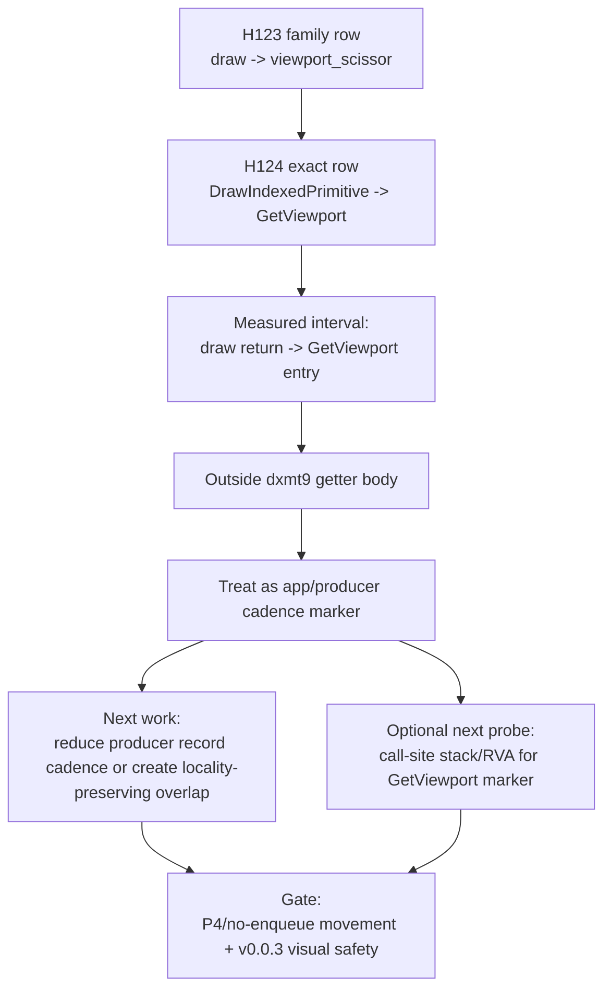

# Present Pacing / PE Between-Call Exact Return-To-Entry Transition Gaps 124

**Question.** What exact PE call owns H123's `draw -> viewport_scissor`
return-to-entry row, and is it a local dxmt9 getter/setter body target?

**Answer.** The exact row is `DrawIndexedPrimitive -> GetViewport`, not
`SetViewport` or `SetScissorRect`. In `pe-name-transition-current-r2` it accounts
for `2.931ms/present`, `3,692.546ms` total, and `43.07%` of the
`draw_indexed -> apply_state` between-calls window. That timing is measured from
the previous draw call's return to the next `GetViewport` entry, so it is a
producer/app-side gap marker, not `GetViewport` body CPU. Optimizing the PE
getter body is therefore not the next average-FPS lever.

## Implementation Delta

H124 extends the H123 transition probe in two ways:

- adds focused exact call-name transition counters alongside the family
  transition counters;
- maps `GetViewport` and `GetScissorRect` as exact `PeInterAppendCallName`
  values and records return timing for those getters.

The new summary table is **Focused Between-Calls Exact Return-To-Entry Gaps**.
It is intentionally separate from the family table so long log lines do not
truncate the PE recorder payload.

## Run

```sh
bash scripts/tools/run_3dmark05_perf_probe.sh \
  --suffix pe-name-transition-current-r2 \
  --no-gputrace \
  --no-encoder-breakdown \
  --pe-recorder-stats \
  --frame-sampling \
  --keep-frontmost \
  --timeout 120 \
  --wait-unlocked-sec 60
```

The run completed with `status=pass`, `present_encoded=1,260`,
`draw_skipped_no_pipeline=0`, and `gpu_command_buffer_errors=0`.

## P4 Shape

| Metric | Value |
|---|---:|
| `completion_wait_ms_per_present` | `27.340` |
| `completion_wait_with_enqueue_ms_per_present` | `0.000` |
| `completion_wait_without_enqueue_ms_per_present` | `27.340` |
| `commit_chunk_replay_cpu_ms_per_present` | `7.950` |
| `encode_chunk_cpu_ms_per_present` | `10.867` |
| `commit_chunk_queue_draw_submission_cpu_ms_per_present` | `3.740` |

The run repeats the current no-enqueue P4 shape. The new counters attribute
where the residual appears; they are not a performance win.

## Exact Transition Rows

| Focus pair | Rank | Family transition | Exact transition | ms/present | share of between-calls |
|---|---:|---|---|---:|---:|
| `draw_indexed -> apply_state` | `1` | `draw -> viewport_scissor` | `DrawIndexedPrimitive -> GetViewport` | `2.931` | `43.07%` |
| `draw_indexed -> apply_state` | `2` | `draw -> unknown` | `DrawIndexedPrimitive -> CubeTexture::GetCubeMapSurface` | `0.620` | `9.12%` |
| `draw_indexed -> set_vs_const_f` | `1` | `vs_const -> vs_const` | `SetVertexShaderConstantF -> SetVertexShaderConstantF` | `2.726` | `13.71%` |
| `draw_indexed -> set_vs_const_f` | `2` | `draw -> vs_const` | `DrawIndexedPrimitive -> SetVertexShaderConstantF` | `1.650` | `8.30%` |
| `draw_indexed -> draw_indexed` | `1` | `draw -> vs_const` | `DrawIndexedPrimitive -> SetVertexShaderConstantF` | `0.581` | `12.56%` |
| `draw_indexed -> draw_indexed` | `2` | `unknown -> unknown` | `IndexBuffer::GetDesc -> IndexBuffer::Lock` | `0.263` | `5.68%` |
| `draw_indexed -> set_ps_const_f` | `1` | `ps_const -> ps_const` | `SetPixelShaderConstantF -> SetPixelShaderConstantF` | `0.290` | `7.69%` |
| `draw_indexed -> set_ps_const_f` | `2` | `draw -> vs_const` | `DrawIndexedPrimitive -> SetVertexShaderConstantF` | `0.273` | `7.24%` |



## Decision

Do not target `GetViewport` body CPU as an average-FPS fix. The top H124 row
is the time until the app re-enters dxmt9, not time spent inside dxmt9. It is
useful because it identifies the next D3D9 call after a large draw-side gap,
but it does not make viewport/scissor state application the owner.

The current FPS-facing candidates remain:

| Candidate | H124 status |
|---|---|
| direct `GetViewport`/`GetScissorRect` body optimization | rejected as owner |
| direct PE setter/getter body cleanup | still demoted by H121-H124 |
| exact call-site/RVA probe for `GetViewport` marker | useful attribution if the app-side producer gap needs owner localization |
| record-cadence reduction | still open if it moves no-enqueue/P4 rows |
| locality-preserving overlap / render-pass carry | still open if it moves P4 without CB/pass/tile/load regressions |

Any mutating candidate still needs the `v0.0.3` GT1 visual-safe gate before FPS
promotion or Xcode/gputrace spend.
