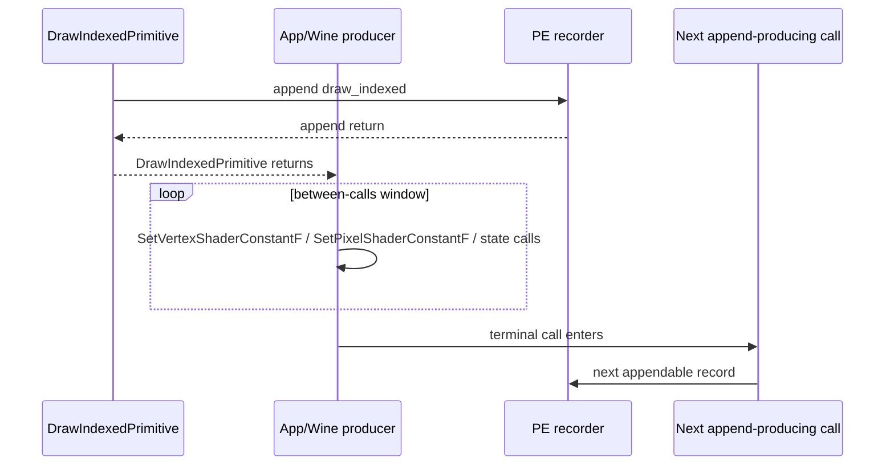
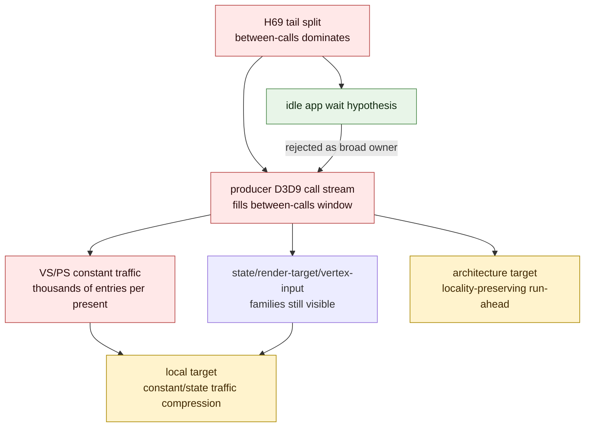

# Present Pacing 65 - Between-Calls Family Split Shows Producer Work, Not Idle Wait

> **Outdated — every artifact this leaf cites in `source:` is gone from disk.** The numbers below cannot be re-derived or re-checked. Kept as history; do not cite it as current evidence.

## Question

[present-pacing-pe-gap-tail-split.64](present-pacing-pe-gap-tail-split.64.md) proved that the focused pre-call gap is
mostly between D3D9 calls:

- previous `DrawIndexedPrimitive` append return -> previous draw-call return is
  tiny
- previous draw-call return -> next D3D9 call entry dominates

That left one important ambiguity. The between-calls span could have been an
empty app/Wine wait, or it could have been real D3D9 producer work before the
next append-producing call. This probe counts PE D3D9 call-entry families inside
that between-calls window.

## Verdict

Accepted as an attribution refinement. The between-calls gap is not empty idle
time. It is populated by D3D9 call entries, especially shader-constant traffic:

- `draw_indexed -> set_vs_const_f`: `14.597ms/present` between-calls, led by
  `vs_const` with `3,429.576` entries/present
- `draw_indexed -> apply_state`: `6.661ms/present` between-calls, led by
  currently `unknown` entries plus `render_target`
- `draw_indexed -> draw_indexed`: `3.611ms/present` between-calls, led by
  currently `unknown` plus `vertex_input`
- `draw_indexed -> set_ps_const_f`: `2.818ms/present` between-calls, led by
  `ps_const` and `vs_const`

This demotes the broad "app thread is idle waiting for completion/present"
interpretation. The current owner is producer/materialization cadence in the PE
D3D9 call stream. Useful next work should either compress/avoid this constant
and state traffic, or overlap replay/encode with it while preserving the H57
command-buffer, render-pass, and tile-preservation gates.

## Run

```sh
DXMT9_PE_RECORDER_STATS=1 DXMT_LOG_LEVEL=info \
bash scripts/tools/run_3dmark05_perf_probe.sh \
  --suffix noenqueue-pe-between-call-family-r1-20260616 \
  --no-gputrace \
  --no-encoder-breakdown \
  --frame-sampling \
  --timeout 120 \
  --capture-delay-sec 45 \
  --wait-unlocked-sec 1 \
  --wait-unlocked-interval-sec 1 \
  --min-free-mb 256
```

The supervised no-gputrace scout finalized normal artifacts despite the wrapper
timeout: `status=pass`, `timed_out=True`, `returncode=143`,
`capture_error=None`, and `present_encoded=1,500`. Logs were compressed after
summarization because disk space was constrained.

## Results

| Metric | Value |
|---|---:|
| `present_encoded` | `1,500` |
| `gpu_command_buffer_time_ms_per_present` | `3.060` |
| `completion_wait_without_enqueue_ms_per_present` | `27.077` |
| `commit_chunk_replay_cpu_ms_per_present` | `7.886` |
| `encode_chunk_cpu_ms_per_present` | `11.027` |

Focused tail split stayed consistent with H69:

| Pair | Samples | Prev-call-tail ms/present | Between-calls ms/present | Between share |
|---|---:|---:|---:|---:|
| `draw_indexed -> set_vs_const_f` | `664,905` | `0.151` | `14.597` | `98.97%` |
| `draw_indexed -> apply_state` | `4,299` | `0.001` | `6.661` | `99.99%` |
| `draw_indexed -> draw_indexed` | `276,500` | `0.058` | `3.611` | `98.43%` |
| `draw_indexed -> set_ps_const_f` | `120,571` | `0.018` | `2.818` | `99.36%` |

Focused between-calls entry families:

| Pair | Rank | Call family | Entries | Entries/window | Entries/present |
|---|---:|---|---:|---:|---:|
| `draw_indexed -> set_vs_const_f` | `1` | `vs_const` | `5,144,364` | `7.737` | `3429.576` |
| `draw_indexed -> set_vs_const_f` | `2` | `unknown` | `1,998,165` | `3.005` | `1332.110` |
| `draw_indexed -> apply_state` | `1` | `unknown` | `8,598` | `2.000` | `5.732` |
| `draw_indexed -> apply_state` | `2` | `render_target` | `7,036` | `1.637` | `4.691` |
| `draw_indexed -> draw_indexed` | `1` | `unknown` | `832,481` | `3.011` | `554.987` |
| `draw_indexed -> draw_indexed` | `2` | `vertex_input` | `530,940` | `1.920` | `353.960` |
| `draw_indexed -> set_ps_const_f` | `1` | `ps_const` | `617,097` | `5.118` | `411.398` |
| `draw_indexed -> set_ps_const_f` | `2` | `vs_const` | `456,330` | `3.785` | `304.220` |

## Interpretation





## Decision

| Candidate | Updated priority |
|---|---|
| Empty app/Wine wait as the broad between-calls owner | low; PE call entries fill the window |
| Next-call family naming | medium; `unknown` still needs finer call-name/stack classification |
| VS/PS constant setter compression or dirty-span coalescing | high; `vs_const` dominates the largest row |
| Render-target / vertex-input state traffic compression | medium; visible but smaller than constants |
| Locality-preserving run-ahead | high; still the architecture lever for turning producer work into overlap |

This probe does not prove a new FPS win by itself. It changes the next question:
instead of asking why the producer is absent, ask how much of this D3D9
producer stream can be compressed or overlapped without fragmenting Metal
command buffers or render passes.
