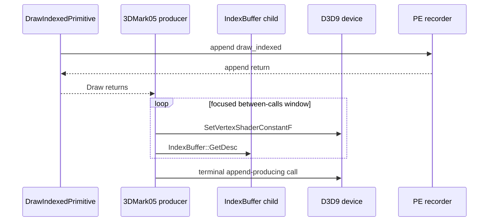
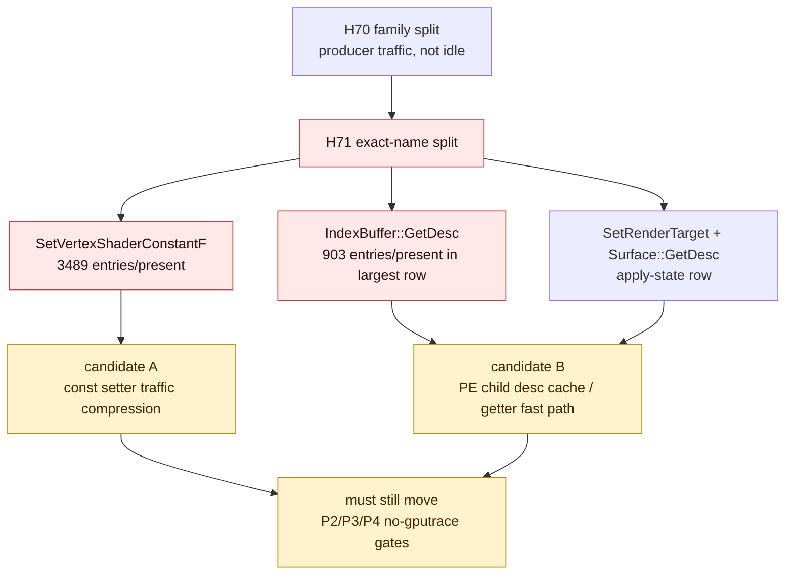

# Present Pacing 66 - Between-Calls Name Split Identifies VS Const Setters And IB Desc Getters

## Question

[present-pacing-pe-between-call-family.65](present-pacing-pe-between-call-family.65.md) proved that H69's between-calls
gap is populated by D3D9 producer calls, but the second-largest family remained
`unknown` because child COM calls were only grouped as `other_child`.

This probe adds fixed exact-name buckets for the hot device and child calls so
the between-calls window can separate constant setter traffic from child getter
traffic.

## Verdict

Accepted as an attribution refinement. The focused between-calls producer work
is now named:

- `draw_indexed -> set_vs_const_f`: `15.912ms/present` between-calls, led by
  `SetVertexShaderConstantF` at `3,489.217` entries/present and
  `IndexBuffer::GetDesc` at `902.976` entries/present.
- `draw_indexed -> apply_state`: `6.839ms/present` between-calls, split between
  `SetRenderTarget` and the nested `Surface::GetDesc`, both `2.903`
  entries/present.
- `draw_indexed -> draw_indexed`: `3.873ms/present` between-calls, led by
  `IndexBuffer::GetDesc` at `374.757` entries/present and
  `SetVertexShaderConstantF` at `288.035` entries/present.
- `draw_indexed -> set_ps_const_f`: `3.075ms/present` between-calls, led by
  `SetPixelShaderConstantF` at `417.358` entries/present and
  `SetVertexShaderConstantF` at `308.651` entries/present.

The new candidate is not a broad app idle/wait path. It is repeated D3D9
producer traffic, with a surprisingly large PE child getter component:
`IndexBuffer::GetDesc` appears twice per many focused windows. That getter is a
strong local follow-up candidate because buffer descriptions are immutable after
creation and should not need repeated synchronous backend queries on the PE hot
path.

## Run

```sh
DXMT9_PE_RECORDER_STATS=1 DXMT_LOG_LEVEL=info \
bash scripts/tools/run_3dmark05_perf_probe.sh \
  --suffix noenqueue-pe-between-call-name-child-r1-20260616 \
  --no-gputrace \
  --no-encoder-breakdown \
  --frame-sampling \
  --timeout 120 \
  --capture-delay-sec 45 \
  --wait-unlocked-sec 1 \
  --wait-unlocked-interval-sec 1 \
  --min-free-mb 256
```

The no-gputrace scout finalized normal artifacts:
`status=pass`, `timed_out=True`, `returncode=143`, `capture_error=None`, and
`present_encoded=1,440`. Raw logs were compressed after summary generation.

## Results

| Metric | Value |
|---|---:|
| `present_encoded` | `1,440` |
| `gpu_command_buffer_time_ms_per_present` | `3.043` |
| `completion_wait_without_enqueue_ms_per_present` | `27.326` |
| `commit_chunk_replay_cpu_ms_per_present` | `7.887` |
| `encode_chunk_cpu_ms_per_present` | `10.959` |

Focused between-calls family rows:

| Pair | Between-calls ms/present | Top family | Entries/window | Entries/present | Second family | Second entries/present |
|---|---:|---|---:|---:|---|---:|
| `draw_indexed -> set_vs_const_f` | `15.912` | `vs_const` | `7.728` | `3489.217` | `unknown` | `1356.803` |
| `draw_indexed -> apply_state` | `6.839` | `unknown` | `2.000` | `5.806` | `render_target` | `4.758` |
| `draw_indexed -> draw_indexed` | `3.873` | `unknown` | `3.011` | `564.156` | `vertex_input` | `359.828` |
| `draw_indexed -> set_ps_const_f` | `3.075` | `ps_const` | `5.118` | `417.358` | `vs_const` | `308.651` |

Focused between-calls exact-name rows:

| Pair | Top call name | Entries/window | Entries/present | Second call name | Second entries/present |
|---|---|---:|---:|---|---:|
| `draw_indexed -> set_vs_const_f` | `SetVertexShaderConstantF` | `7.728` | `3489.217` | `IndexBuffer::GetDesc` | `902.976` |
| `draw_indexed -> apply_state` | `SetRenderTarget` | `1.000` | `2.903` | `Surface::GetDesc` | `2.903` |
| `draw_indexed -> draw_indexed` | `IndexBuffer::GetDesc` | `2.000` | `374.757` | `SetVertexShaderConstantF` | `288.035` |
| `draw_indexed -> set_ps_const_f` | `SetPixelShaderConstantF` | `5.118` | `417.358` | `SetVertexShaderConstantF` | `308.651` |

## Interpretation





## Decision

| Candidate | Updated priority |
|---|---|
| Empty app/Wine wait | rejected as broad owner |
| Broad setter-body CPU cleanup | secondary; setter calls are numerous, but prior setter-body CPU was too small to explain all wall time |
| VS/PS constant traffic compression | high; exact names confirm float const setters dominate the largest rows |
| `IndexBuffer::GetDesc` PE-side caching | high; repeated immutable desc getter calls are now directly visible |
| `Surface::GetDesc` PE-side caching | medium; visible in the apply-state row, likely useful but smaller |
| Locality-preserving run-ahead | still high; any local fix must prove P2/P3/P4 movement, not only fewer call entries |

The immediate follow-up should inspect child buffer/surface `GetDesc` ownership.
If descriptions can be cached at PE wrapper creation or first query without
crossing the unix boundary, the next no-gputrace A/B should require lower
between-call child getter counts or getter CPU, lower pre-publish stage time,
and no visual/counter regressions.
