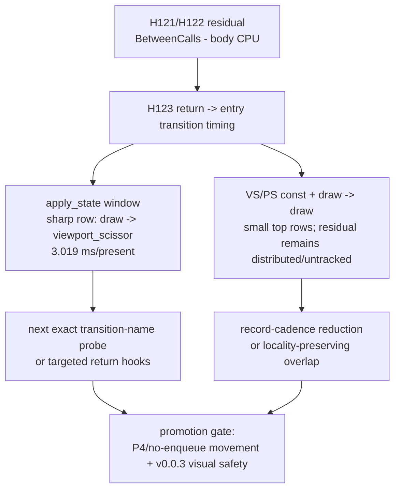

# Present Pacing / PE Between-Call Return-To-Entry Transition Gaps 123

**Question.** Does family-level return-to-next-entry transition timing explain
the H121/H122 PE body residual, and does it name one local owner?

**Answer.** Partly. The new transition rows name one sharp local signal:
`draw -> viewport_scissor` accounts for `3.019ms/present` and `43.34%` of the
`draw_indexed -> apply_state` between-calls window. But the larger VS/PS const
and draw-to-draw windows remain mostly distributed or untracked by the current
family-level return hooks. This keeps direct PE body cleanup demoted and shifts
the next local probe toward exact transition names or broader return-hook
coverage, not a blind mutation.

The visual-safety anchor for any follow-up mutation is `v0.0.3`. Older
`v0.0.1` captures are useful historical triage only, not the current
correctness gate.

## Run

```sh
bash scripts/tools/run_3dmark05_perf_probe.sh \
  --suffix pe-transition-current-r1 \
  --no-gputrace \
  --no-encoder-breakdown \
  --pe-recorder-stats \
  --frame-sampling \
  --keep-frontmost \
  --timeout 120 \
  --wait-unlocked-sec 60
```

The run completed with `status=pass`, `present_encoded=1,320`,
`draw_skipped_no_pipeline=0`, and `gpu_command_buffer_errors=0`.

## P4 Shape

| Metric | Value |
|---|---:|
| `completion_wait_ms_per_present` | `27.573` |
| `completion_wait_with_enqueue_ms_per_present` | `0.000` |
| `completion_wait_without_enqueue_ms_per_present` | `27.573` |
| `commit_chunk_replay_cpu_ms_per_present` | `7.955` |
| `encode_chunk_cpu_ms_per_present` | `10.792` |
| `commit_chunk_queue_draw_submission_cpu_ms_per_present` | `3.751` |
| sampled frame FPS average | `14.174` |
| sampled frame FPS p50 | `14.027` |
| sampled GPU command-buffer time p50 | `1.060ms` |

This is still the current no-enqueue P4 shape: completion wait is not hiding
queued encode work.

## Body Residual Repeat

| Pair | pair ms/present | between-calls ms/present | body CPU ms/present | body coverage | residual ms/present | residual share |
|---|---:|---:|---:|---:|---:|---:|
| `draw_indexed -> set_vs_const_f` | `22.953` | `19.570` | `3.124` | `15.96%` | `16.446` | `84.04%` |
| `draw_indexed -> apply_state` | `6.979` | `6.966` | `0.068` | `0.98%` | `6.898` | `99.02%` |
| `draw_indexed -> draw_indexed` | `6.137` | `4.504` | `0.443` | `9.85%` | `4.061` | `90.15%` |
| `draw_indexed -> set_ps_const_f` | `4.380` | `3.730` | `0.595` | `15.95%` | `3.135` | `84.05%` |

The H121/H122 body-residual conclusion still holds. Direct PE call bodies do
not explain most of the focused windows.

## Return-To-Entry Transitions

| Focus pair | Transition | samples | ms/present | share of between-calls | max ms |
|---|---|---:|---:|---:|---:|
| `draw_indexed -> set_vs_const_f` | `vs_const -> vs_const` | `4,063,284` | `2.756` | `14.08%` | `0.308` |
| `draw_indexed -> set_vs_const_f` | `draw -> vs_const` | `594,621` | `1.187` | `6.06%` | `7.636` |
| `draw_indexed -> apply_state` | `draw -> viewport_scissor` | `2,488` | `3.019` | `43.34%` | `6.657` |
| `draw_indexed -> apply_state` | `draw -> unknown` | `1,382` | `0.637` | `9.15%` | `1.842` |
| `draw_indexed -> draw_indexed` | `draw -> vs_const` | `248,110` | `0.400` | `8.87%` | `2.670` |
| `draw_indexed -> draw_indexed` | `unknown -> unknown` | `501,656` | `0.268` | `5.95%` | `0.267` |
| `draw_indexed -> set_ps_const_f` | `ps_const -> ps_const` | `446,895` | `0.292` | `7.82%` | `0.220` |
| `draw_indexed -> set_ps_const_f` | `vs_const -> vs_const` | `303,533` | `0.234` | `6.27%` | `0.366` |

Only `draw_indexed -> apply_state` has a dominant observed return-to-entry
transition. Even there, the top row is a family bucket, not an exact call-name
owner. The VS/PS const windows have large residuals after their top two
transition rows, so a constant-setter body or one getter fast path is still not
the right average-FPS target.



## Decision

Keep direct PE body cleanup demoted as an average-FPS lever. The best new local
attribution target is the `draw -> viewport_scissor` transition inside
`draw_indexed -> apply_state`, but it needs exact transition-name proof or
broader tracked return coverage before mutation.

Follow-up H124 provides that exact-name proof: the row resolves primarily to
`DrawIndexedPrimitive -> GetViewport`, which is a draw-return to getter-entry
producer gap marker rather than `GetViewport` body CPU.

Do not spend `.gputrace` from H123 alone. This is CPU-cadence evidence; Xcode
budget should wait for a no-gputrace candidate that moves P4/locality or for a
separate GPU/pass-locality question.

Future P4 candidates should still compare:

| Gate | Requirement |
|---|---|
| no-enqueue P4 | reduce `completion_wait_without_enqueue_ms_per_present` or create real `completion_wait_with_enqueue_ms` overlap |
| PE residual | reduce focused `BetweenCallsMs - BetweenCallBodyCpuMs` residual when claiming record-cadence improvement |
| locality | do not increase command buffers, render passes, tile preservation, final same-key reopens, or load/store sidecar rows |
| correctness | pass the `v0.0.3` GT1 visual-safe gate before FPS promotion |
