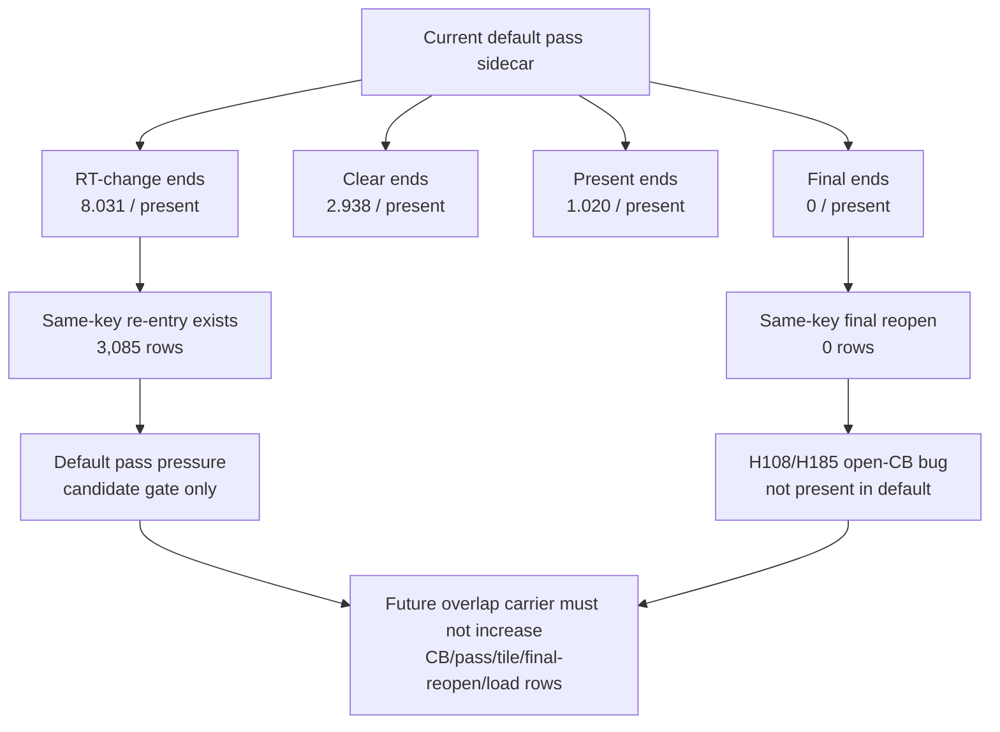

# Present Pacing / PE Body Coverage With Encoder Sidecar 122

**Question.** Does the H121 PE-body residual remain true when the current run
also emits real encoder/pass sidecars, and does the default pass shape already
show the H108/H185 chunk-final same-key reopen failure?

**Answer.** Yes for the PE-body residual, no for the default same-key reopen
failure. `pe-body-sidecar-current-r1` records `16,546` encoder rows and
`2,900` render-pass re-entry rows while keeping the same current P4 shape:
`completion_wait_with_enqueue_ms=0`, `completion_wait_without_enqueue_ms=
26.462ms/present`, replay `8.034ms/present`, and encode
`12.697ms/present`. The encode row is inflated by all-frame encoder breakdown,
so this is a sidecar attribution run rather than a low-overhead FPS baseline.

The aggregate PE call-body coverage repeats H121: all intermediate PE call
bodies cover only `0.97%-17.64%` of the focused between-calls windows. Direct
PE setter/getter bodies are therefore still not the next average-FPS lever.

## Run

```sh
bash scripts/tools/run_3dmark05_perf_probe.sh \
  --suffix pe-body-sidecar-current-r1 \
  --no-gputrace \
  --timeout 120 \
  --keep-frontmost \
  --wait-unlocked-sec 1 \
  --wait-unlocked-interval-sec 1 \
  --min-free-mb 256 \
  --pe-recorder-stats \
  --render-pass-reentry-top 20
```

The run completed with `status=pass`, `present_encoded=1,380`,
`draw_skipped_no_pipeline=0`, and `gpu_command_buffer_errors=0`.

## PE Coverage Repeat

| Pair | between-calls ms/present | all body CPU ms/present | all body coverage |
|---|---:|---:|---:|
| `draw_indexed -> set_vs_const_f` | `17.808` | `3.142` | `17.64%` |
| `draw_indexed -> apply_state` | `6.922` | `0.067` | `0.97%` |
| `draw_indexed -> draw_indexed` | `4.127` | `0.451` | `10.93%` |
| `draw_indexed -> set_ps_const_f` | `3.433` | `0.596` | `17.37%` |

## Encoder / Pass Shape

| Metric | Value |
|---|---:|
| `encoder_sidecar_rows_per_present` | `11.990` |
| `encoder_sidecar_rt_change_end_reason_per_present` | `8.031` |
| `encoder_sidecar_clear_end_reason_per_present` | `2.938` |
| `encoder_sidecar_present_end_reason_per_present` | `1.020` |
| `encoder_sidecar_final_end_reason_per_present` | `0.000` |
| `encoder_sidecar_final_same_key_reopen_per_present` | `0.000` |
| `encoder_sidecar_color_load_mib_per_present` | `6.316` |
| `encoder_sidecar_depth_load_mib_per_present` | `14.872` |
| `encoder_sidecar_color_store_mib_per_present` | `44.573` |
| `encoder_sidecar_depth_store_mib_per_present` | `56.879` |
| `render_pass_same_key_reentry` | `3,085` |
| `render_pass_same_key_reentry_distance_1` | `2,795` |
| `render_pass_same_key_reentry_distance_5_8` | `290` |
| `render_pass_same_key_reentry_preservation_bytes` | `69,134,712,832` |

The default path has real render-pass preservation pressure, but it does not
have the open-CB prototype's `final -> same-key reopen` pathology. Distance-1
re-entry is dominated by RT/depth-changing A/B/A role pairs, not by a
chunk-final closure of a still-continuing pass.



## Decision

Do not spend `.gputrace` on direct PE call-body microfixes or another H108-style
threshold sweep. The next promotable candidate must first move no-gputrace P4
and locality gates:

| Candidate family | Status after H122 |
|---|---|
| PE setter/getter body cleanup | rejected as current average-FPS lever |
| Default render-pass re-entry | real pressure, but not a P4 proof by itself |
| H108/H185 open-CB threshold sweep | still rejected; default has `0` final same-key reopens |
| Record/producer cadence reduction | still open if it moves `wait -> next enqueue` / no-enqueue rows |
| Render-pass/encoder carry overlap | still open only with non-increasing CB/pass/tile/load/final-reopen rows |

Any mutating candidate still needs the `v0.0.3` visual-safe gate before FPS or
Xcode/gputrace promotion.

For record/producer-cadence candidates, compare with
`--require-pe-focused-between-call-gap-residual-decrease` in addition to the
P4/no-enqueue gates. This ensures the candidate reduces the aggregate focused
`BetweenCallsMs - BetweenCallBodyCpuMs` residual rather than only moving direct
PE call-body CPU. Do not combine this H121/H122 pair with
`--require-encoder-final-same-key-reopen-not-increase`: H121 has no encoder
sidecar rows, so that strict gate correctly fails on missing baseline evidence
(`n/a -> 0`) instead of inferring a zero-reopen baseline.
