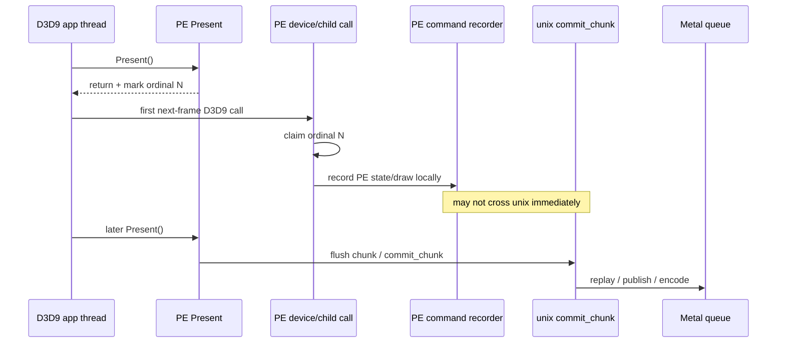
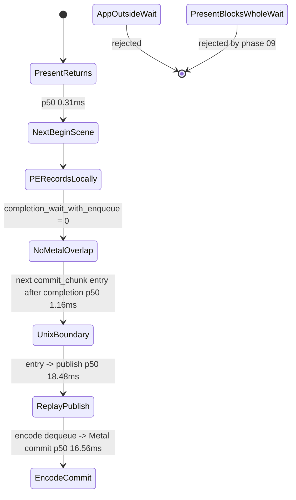

# Present-Pacing 10 - PE Call Cadence After Present

## Question

[present-pacing-pe-present-timing.09](present-pacing-pe-present-timing.09.md) rejected the idea that PE
`IDirect3DDevice9::Present()` itself blocks for the whole
`completion_wait_ms` bucket. The remaining ambiguity was whether the app/Wine
loop waits outside dxmt9 and only calls D3D9 after completion, or whether the
app starts recording the next frame in PE quickly but that work does not reach
Metal/unix submission soon enough to overlap the completion wait.

## Implementation

When `DXMT9_PE_RECORDER_STATS=1` is enabled, each successful PE `Present`
records a monotonic ordinal and return timestamp. The next PE D3D9 call claims
that pending ordinal with an atomic compare-exchange and logs exactly one
`pe_present_next_call` row:

- `call`: first observed D3D9 call class after `Present` returns.
- `entry_delta_ms`: first-call entry timestamp minus PE `Present` return.
- `observed_delta_ms`: log timestamp minus PE `Present` return.
- `observed_wait_ms`: log timestamp minus first-call entry timestamp.

Device-level render/state calls are covered, and child wrappers report
`Lock`/`LockRect`/`LockBox`, query `GetData`, and swap-chain `GetBackBuffer`
through `D3D9PeRecorderFlush::NotifyPeFirstCallAfterPresentForChild()`.



## Run

```sh
DXMT9_PE_RECORDER_STATS=1 DXMT_LOG_LEVEL=info \
  scripts/tools/run_3dmark05_perf_probe.sh \
    --suffix present-pe-cadence-r1-20260614 \
    --frame 60 \
    --no-gputrace \
    --no-encoder-breakdown \
    --frame-sampling \
    --timeout 120
```

Status: pass. The run produced `1,680` presents and `1,703`
`pe_present_next_call` rows in `3dmark05-direct.log`. The one-row difference
against PE present timing rows is the expected tail/end-of-run shape.

## Result

| Metric | Value |
|---|---:|
| `pe_present_next_call` rows | `1,703` |
| PE `Present` timing rows | `1,704` |
| first-call `entry_delta_ms` p50 / p95 / p99 / max | `0.310 / 0.436 / 1.811 / 50.665ms` |
| first-call `observed_wait_ms` p50 / p95 / p99 / max | `0.001 / 0.001 / 0.002 / 0.030ms` |
| first-call rows over `1ms` / `5ms` / `16.7ms` | `25 / 6 / 4` |
| first-call class distribution | `BeginScene=1,702`, `Surface::LockRect=1` |
| PE `Present total_ms` p50 / p95 / max | `2.659 / 5.282 / 24.138ms` |
| PE `Present flush_ms` p50 / p95 / max | `2.658 / 5.280 / 24.136ms` |
| `completion_wait_ms` p50 / p95 / max | `29.679 / 39.565 / 53.395ms` |
| `completion_wait_with_enqueue_ms` | `0.000` |
| `completion_no_enqueue_wait_to_commit_chunk_entry` p50 / p95 | `1.155 / 3.276ms` |
| `completion_no_enqueue_stage_commit_entry_to_publish` p50 / p95 | `18.475 / 38.320ms` |
| `completion_no_enqueue_stage_encode_dequeue_to_command_buffer_commit` p50 / p95 | `16.564 / 23.861ms` |

## Interpretation

The app is not waiting outside dxmt9 before starting the next frame's PE D3D9
work. In nearly every sampled frame, the first call after `Present` is
`BeginScene`, and it arrives about `0.3ms` after PE `Present` returns.
`Lock`/`GetData` are not the steady-state first-call owner in this workload.

This refines the earlier no-enqueue conclusion:

- **Rejected:** "the app/Wine loop does not call D3D9 until Metal completion."
- **Accepted:** the app starts next-frame PE work quickly, but that work does
  not become a later Metal enqueue during the previous completion wait.
- **Implication:** the missing overlap is not at the app API-call cadence. It
  is at the PE-recorder/unix submission boundary or later: chunk flush cadence,
  `commit_chunk` replay/publish, draw submission snapshotting, or backend encode.



The next optimization lane should therefore stay on CPU submission shape:

1. Reduce pre-publish replay/submit/snapshot cost, including the still-open
   replay/snapshot state materialization paths that still show up in counters.
2. Reduce backend encode cost that follows publish.
3. Only after those shrink, consider a larger architecture change that can
   flush or publish next-frame chunks earlier without violating D3D9 ordering
   and resource lifetime.
