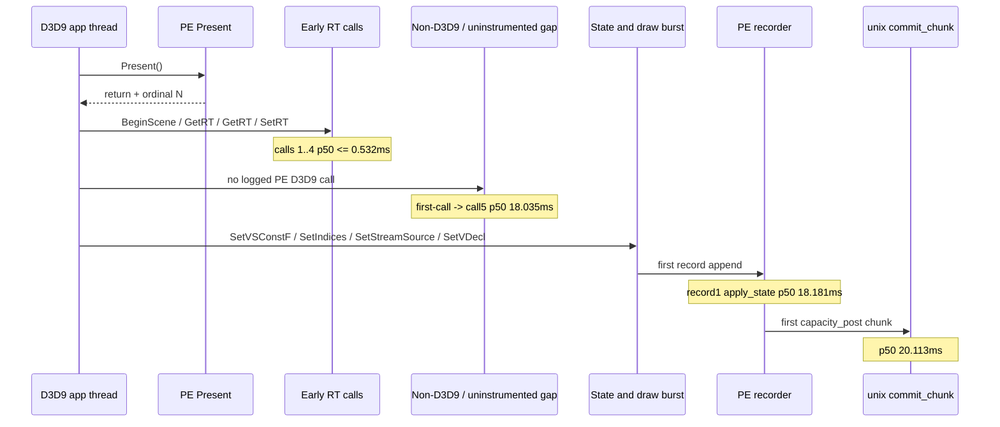
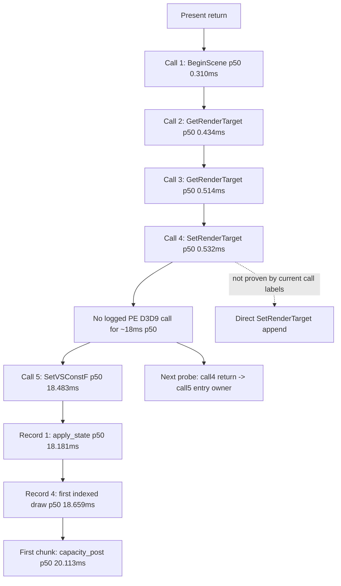

# Present-Pacing 14 - PE Call Sequence After Present

## Question

[[present-pacing-pe-record-milestones.13]] showed that `BeginScene` arrives
quickly after `Present`, but the first record append is delayed until about
`18ms`. The remaining ambiguity was whether one of the first D3D9 calls
(`GetRenderTarget`, `SetRenderTarget`, `GetBackBuffer`, `Query::GetData`, or
`Lock`) is the hidden dependency, or whether the app enters a non-D3D9 gap
after early render-target setup and before the first state/draw burst.

## Implementation

With `DXMT9_PE_RECORDER_STATS=1`, the PE device now logs
`pe_present_call_milestone` for call counts `1`, `2`, `3`, `4`, `5`, `6`,
`7`, `8`, `16`, `32`, and `64` after each successful `Present` return.
Record milestones still log the first appendable record counts
`1`, `4`, `8`, `16`, `32`, and `64`.

The record milestone `call` field is diagnostic context only. It is a
thread-local last observed PE call name, so it can be stale when the actual
record append happens through a later flush/helper path. Use it to choose the
next instrumentation site, not as direct proof that the named call appended the
record.



## Run

```sh
DXMT9_PE_RECORDER_STATS=1 DXMT_LOG_LEVEL=info \
  scripts/tools/run_3dmark05_perf_probe.sh \
    --suffix present-pe-call-sequence-r1-20260614 \
    --frame 60 \
    --no-gputrace \
    --no-encoder-breakdown \
    --frame-sampling \
    --timeout 120
```

Status: pass with complete artifacts. The wrapper timeout-finalized the app
(`timed_out=True`, `returncode=143`, elapsed about `191s`), so wallclock is not
a fps proof. The log and perf counters are valid for cadence attribution.

## Result

Steady-state rows exclude ordinals `<= 10`.

| Metric | Value |
|---|---:|
| first-call rows | `1,726`, all `BeginScene` |
| first-call `entry_delta_ms` p50 / p95 / p99 | `0.398 / 0.484 / 0.945ms` |
| call 1 / 2 / 3 / 4 p50 | `BeginScene 0.310ms`, `GetRenderTarget 0.434ms`, `GetRenderTarget 0.514ms`, `SetRenderTarget 0.532ms` |
| call 5 / 6 / 7 / 8 p50 | `SetVertexShaderConstantF 18.483ms`, `SetIndices 18.514ms`, `SetStreamSource 18.532ms`, `SetVertexDeclaration 18.557ms` |
| call 16 p50 | `SetRenderState 18.580ms` |
| call 32 top classes / p50 | `IndexBuffer::Lock=1,179`, `DrawIndexedPrimitive=379`, `SetVertexShaderConstantF=168`; p50 `18.771ms` |
| call 64 top classes / p50 | `SetVertexShaderConstantF=813`, `IndexBuffer::Lock=375`, `DrawIndexedPrimitive=273`; p50 `18.962ms` |
| record 1 p50 / type | `18.181ms`, `apply_state=1,726 / 1,726` |
| record 4 p50 / type | `18.659ms`, `draw_indexed=1,726 / 1,726` |
| record 64 p50 | `20.090ms` |
| first chunk p50 / p95 / reason | `20.113 / 34.356ms`, `capacity_post=1,726 / 1,726` |
| first-call -> call 5 p50 / p95 | `18.035 / 30.310ms` |
| first-call -> record 1 p50 / p95 | `17.726 / 30.049ms` |
| first-call -> record 64 p50 / p95 | `19.644 / 33.875ms` |
| `completion_wait_with_enqueue_ms` | `0.000` |
| `completion_no_enqueue_wait_to_commit_chunk_entry_p50_ms` | `1.065ms` |
| `completion_no_enqueue_stage_commit_entry_to_publish_p50_ms` | `25.678ms` |
| `completion_no_enqueue_stage_encode_dequeue_to_command_buffer_commit_p50_ms` | `18.803ms` |
| `commit_chunk_replay_cpu_ms` / `encode_chunk_cpu_ms` | `17,381.862ms` / `19,164.155ms` |

## Interpretation

This narrows H18 but is superseded by
[[present-pacing-pe-clear-gate.15]], because this run did not include `Clear`
and `EndScene` in the call milestone sequence. The front gap is not a
first-command
drawable/swapchain/query/lock dependency:

- Calls `1..4` after `Present` are normal early frame setup and arrive within
  about `0.5ms` p50.
- The long p50 gap appears between call `4` (`SetRenderTarget`) and call `5`
  (`SetVertexShaderConstantF`).
- The first record append (`apply_state`) lands at nearly the same time as
  call `5`, and the first indexed draw is already present by record `4`.
- The first capacity-post chunk follows about `1.9ms` after record `1`.

So "N+1 depends on N completion" remains a useful high-level observation, but
the current evidence does not place that dependency at `BeginScene`,
`GetRenderTarget`, `SetRenderTarget`, `GetBackBuffer`, `Query::GetData`, or
the first lock. The visible sequence is:



The next useful probe is therefore not another chunk-size A/B. It is a focused
owner for the `SetRenderTarget` return -> `SetVertexShaderConstantF` entry gap:
Wine/macdrv event processing, app-side timer/message cadence, an uninstrumented
PE helper, or a child/flush/hazard path that should stamp a source-specific
record append label.

Follow-up [[present-pacing-pe-clear-gate.15]] adds the missing `Clear` coverage
and shows that the steady gap is actually `SetRenderTarget` return -> `Clear`
entry, with the first `APPLY_STATE` record appended inside `Clear`.
