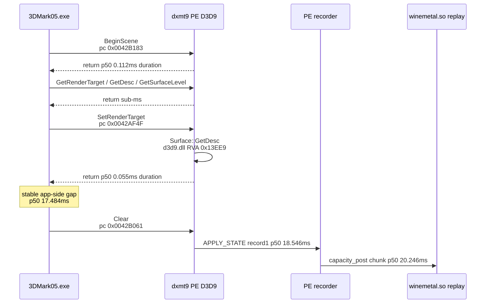
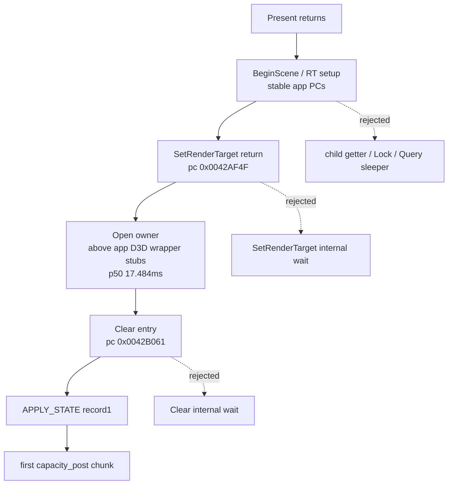

# Present-Pacing 19 - PE Caller PC for the Clear Front Gate

## Question

[[present-pacing-pe-wide-call-coverage.17]] left a steady gap after the last
logged RT setup / child getter returns and before `Clear` enters. The remaining
question is whether that gap is hidden inside dxmt9's D3D9 wrapper, a
Wine/macdrv sleep, or a stable application callsite that simply does not call
`Clear` until later.

## Implementation

The PE cadence diagnostic now records a caller return address on selected
post-`Present` milestones. The follow-up also resolves the PE module base and
RVA for that return address with `VirtualQuery` / `GetModuleFileNameA`. This is
gated by the existing `DXMT9_PE_RECORDER_STATS=1` path; no new runtime env knob
was added.

Covered paths:

- device early-frame calls: `BeginScene`, `GetRenderTarget`,
  `SetRenderTarget`, `Clear`, `EndScene`, `GetBackBuffer`;
- child descriptor/subresource and lock calls that were relevant to the
  pre-`Clear` sequence;
- query and swap-chain child calls that remained candidate hidden wait owners.

The value is a PE-side return address sampled at the COM entry callsite. For
the 32-bit 3DMark05 process it is usually a PE image address, not a host Rosetta
JIT PC. It is therefore a caller-site classifier, not a full stack.

## Run

```sh
DXMT9_PE_RECORDER_STATS=1 DXMT_LOG_LEVEL=info \
  scripts/tools/run_3dmark05_perf_probe.sh \
    --suffix present-pe-caller-pc-r1-20260614 \
    --frame 60 \
    --no-gputrace \
    --no-encoder-breakdown \
    --timeout 120
```

Status: `pass`. The run produced `1,500` presents, all immediate
(`present_schedule_immediate=1500`), with
`completion_wait_with_enqueue_ms=0.0`.

Module-resolution follow-up:

```sh
DXMT9_PE_RECORDER_STATS=1 DXMT_LOG_LEVEL=info \
  scripts/tools/run_3dmark05_perf_probe.sh \
    --suffix present-pe-caller-module-r1-20260614 \
    --frame 60 \
    --no-gputrace \
    --no-encoder-breakdown \
    --timeout 120
```

Status: `pass`. This run produced `1,680` immediate presents,
`present_schedule_after_minimum_duration=0`, `present_boundary_wait_ms=0.0`,
and `completion_wait_with_enqueue_ms=0.0`.

## Result

The steady post-`Present` sequence is completely stable. The first run saw
`1,725 / 1,725` matching ordinals; the module-resolution follow-up saw
`1,716 / 1,716` matching ordinals:

| Milestone | Call | Caller PC | Interpretation |
|---:|---|---:|---|
| 1 | `BeginScene` | `0x0042B183` | 3DMark05.exe image, RVA `0x2B183` |
| 2 | `GetRenderTarget` | `0x0042CC12` | 3DMark05.exe image, RVA `0x2CC12` |
| 3 | `Surface::GetDesc` | `0x0047F71B` | 3DMark05.exe image, RVA `0x7F71B` |
| 4 | `Texture::GetSurfaceLevel` | `0x004673C1` | 3DMark05.exe image, RVA `0x673C1` |
| 5 | `GetRenderTarget` | `0x0042CC12` | same app callsite as milestone 2 |
| 6 | `SetRenderTarget` | `0x0042AF4F` | 3DMark05.exe image, RVA `0x2AF4F` |
| 7 | `Surface::GetDesc` | `0x79F03EE9` | `d3d9.dll`, base `0x79EF0000`, RVA `0x13EE9` |
| 8 | `Clear` | `0x0042B061` | 3DMark05.exe image, RVA `0x2B061` |

3DMark05.exe confirms `ImageBase=0x00400000` and
`SizeOfImage=0x002f9000`, so the `0x0042...` / `0x0047...` /
`0x0046...` caller PCs are inside the application image. The `0x79F...`
child getter address is inside dxmt9's relocated `d3d9.dll`, but it is short
and returns before the long `Clear` gate.

The timing remains the same as the previous no-caller-PC probes. The
module-resolution follow-up reports:

| Metric | p50 | p95 | p99 | Max |
|---|---:|---:|---:|---:|
| first post-`Present` call, `BeginScene` entry | `0.305ms` | `0.387ms` | `0.510ms` | `78.329ms` |
| `SetRenderTarget` return | `0.730ms` | `1.108ms` | `2.287ms` | `78.777ms` |
| `Clear` entry | `18.373ms` | `30.773ms` | `36.126ms` | `95.605ms` |
| `Clear` duration | `0.252ms` | `0.304ms` | `0.340ms` | `1.315ms` |
| `SetRenderTarget` return -> `Clear` entry | `17.484ms` | `29.950ms` | `34.914ms` | `67.206ms` |

Selected return durations remain short:

| Call | Caller PC | Count | p50 duration | p95 duration |
|---|---:|---:|---:|---:|
| `GetRenderTarget` | `0x0042CC12` | `3,432` | `0.017ms` | `0.030ms` |
| `BeginScene` | `0x0042B183` | `1,716` | `0.124ms` | `0.184ms` |
| `Clear` | `0x0042B061` | `1,716` | `0.252ms` | `0.304ms` |
| `SetRenderTarget` | `0x0042AF4F` | `1,716` | `0.052ms` | `0.080ms` |
| `Surface::GetDesc` | `0x0047F71B` | `1,716` | `0.019ms` | `0.038ms` |
| `Surface::GetDesc` | `d3d9.dll!0x13EE9` | `1,716` | `0.020ms` | `0.035ms` |
| `Texture::GetSurfaceLevel` | `0x004673C1` | `1,716` | `0.055ms` | `0.258ms` |

The first useful record still appears inside `Clear`, and the first chunk
still follows the record burst:

| Event | Count | p50 | p95 |
|---|---:|---:|---:|
| record 1, `apply_state` | `1,716` | `18.546ms` | `31.033ms` |
| record 64 | `1,716` | `20.225ms` | `34.956ms` |
| first `capacity_post` chunk | `1,716` | `20.246ms` | `34.975ms` |



## Interpretation

This lowers the broad "hidden D3D9 call" and "dxmt9 API call blocks until
completion" hypotheses. The app reaches the same early wrapper callsites
immediately after `Present` (`BeginScene` p50 `0.305ms`), returns from them
quickly, then later reaches the same `Clear` wrapper in 3DMark05.exe
(`0x0042B061`). `Clear` itself is not slow; it only materializes the first
useful PE record once the app finally calls it.

The remaining front-gap owner is therefore above these stable D3D wrapper
stubs: after the app returns from the `SetRenderTarget` wrapper and before it
enters the `Clear` wrapper. That can still be driven by an app frame/timer
decision or an app-side wait that depends on the preceding completion, but it is
no longer plausibly an unobserved dxmt9 D3D9 wrapper call with a long duration.
The broad Wine/macdrv sleep branch is also weak because the producer
thread-state sample was mostly Running, not asleep.

The caller-stack follow-up [[present-pacing-pe-caller-stack.20]] supersedes the
"between RVAs `0x2AF4F` and `0x2B061`" wording: those are D3D wrapper stubs, not
the higher render-loop site. Descriptor/resource getter probing is no longer
the right axis.


