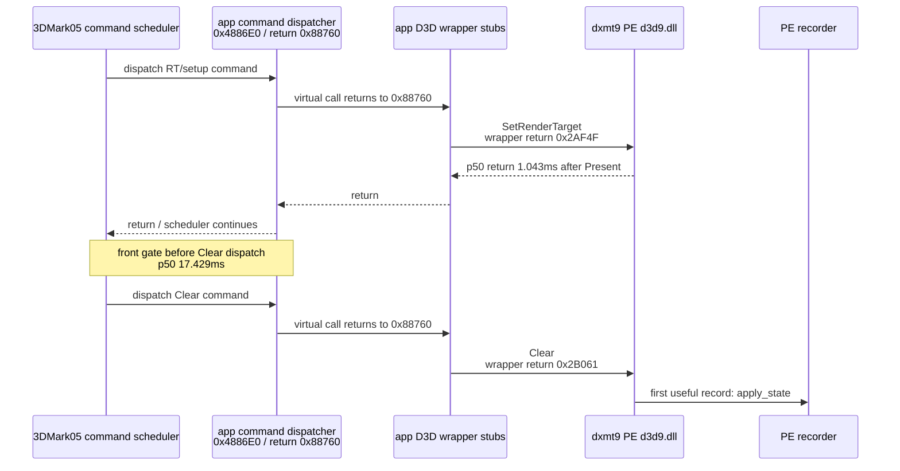
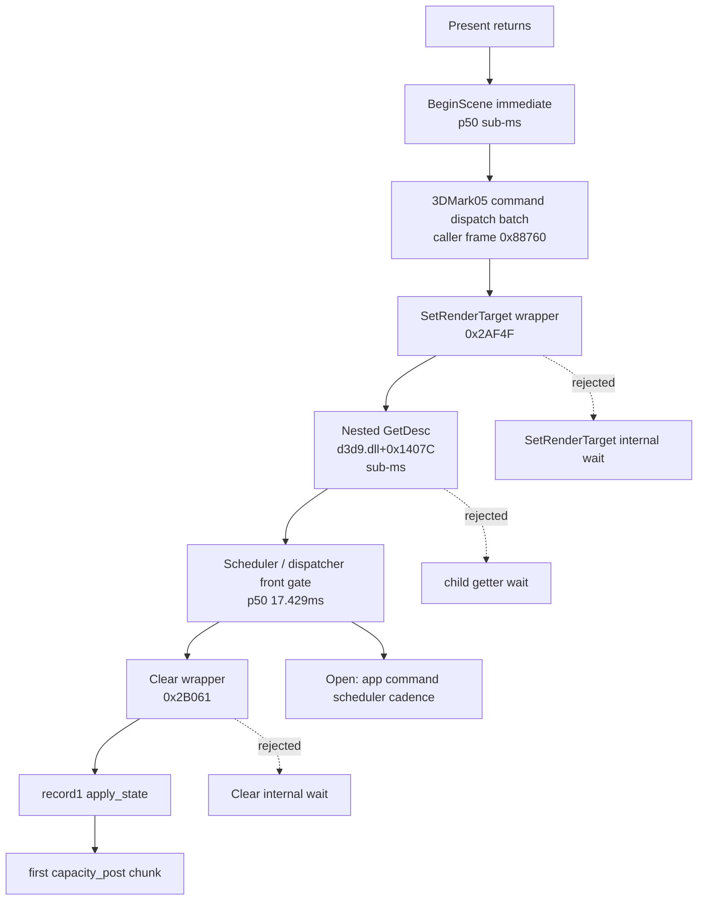

# Present-Pacing 20 - PE Caller Stack for the Clear Front Gate

## Question

[[present-pacing-pe-caller-pc.19]] proved that the `Clear` front gate is not
inside dxmt9's `SetRenderTarget`, `Clear`, child getter, query, lock, or
present-boundary paths. It still over-attributed the owner to the direct caller
PCs `0x0042AF4F` and `0x0042B061`. Disassembly shows those PCs are 3DMark05's
own D3D wrapper stubs, not the higher render-loop site.

This run asks whether the PE stack can identify the stable caller above those
wrapper stubs.

## Implementation

The existing `DXMT9_PE_RECORDER_STATS=1` cadence path now captures a short PE
stack with `RtlCaptureStackBackTrace()` for the first post-`Present` calls and
selected milestones. Logged frames are resolved to PE module leaf name + RVA:

```text
caller_stack=0:d3d9.dll+0x...;1:d3d9.dll+0x...;2:3DMark05.exe+0x...;...
```

The feature is stats-only and adds no runtime knob.

## Run

```sh
DXMT9_PE_RECORDER_STATS=1 DXMT_LOG_LEVEL=info \
  scripts/tools/run_3dmark05_perf_probe.sh \
    --suffix present-pe-caller-stack-r1-20260614 \
    --frame 60 \
    --no-gputrace \
    --no-encoder-breakdown \
    --timeout 120
```

Status: `pass`. The run produced `1,680` immediate presents,
`present_schedule_after_minimum_duration=0`, `present_boundary_wait_ms=0.0`,
and `completion_wait_with_enqueue_ms=0.0`.

## Result

The steady post-`Present` sequence is stable in `1,707 / 1,707` matching
ordinals. Timing stays consistent with the previous runs:

| Metric | Count | p50 | p95 | p99 | Max |
|---|---:|---:|---:|---:|---:|
| `SetRenderTarget` return | `1,707` | `1.043ms` | `1.574ms` | `2.749ms` | `71.923ms` |
| `Clear` entry | `1,707` | `18.584ms` | `31.479ms` | `36.233ms` | `95.858ms` |
| `SetRenderTarget` return -> `Clear` entry | `1,707` | `17.429ms` | `30.069ms` | `34.878ms` | `94.881ms` |
| `Clear` duration | `1,707` | `0.281ms` | `0.341ms` | `0.377ms` | `1.324ms` |

The stack identifies the common app caller above the wrapper stubs:

| Milestone | Call | Direct wrapper PC | Higher app frame |
|---:|---|---:|---:|
| 2 | `GetRenderTarget` | `3DMark05.exe+0x2CC12` | `3DMark05.exe+0x88760` |
| 3 | `Surface::GetDesc` | `3DMark05.exe+0x7F71B` | `3DMark05.exe+0x88760` |
| 4 | `Texture::GetSurfaceLevel` | `3DMark05.exe+0x673C1` | `3DMark05.exe+0x88760` |
| 5 | `GetRenderTarget` | `3DMark05.exe+0x2CC12` | `3DMark05.exe+0x88760` |
| 6 | `SetRenderTarget` | `3DMark05.exe+0x2AF4F` | `3DMark05.exe+0x88760` |
| 7 | nested `Surface::GetDesc` | `d3d9.dll+0x1407C` | `3DMark05.exe+0x2AF4F -> 0x88760` |
| 8 | `Clear` | `3DMark05.exe+0x2B061` | `3DMark05.exe+0x88760` |

`BeginScene` is still immediate but its stack normally unwinds through MFC71
instead of `0x88760`, so it is a different app phase from the command dispatch
batch that owns milestones 2..8.

## Disassembly

The direct caller PCs are wrapper stubs:

- `0x0042AF30..0x0042AF61`: D3D wrapper for `SetRenderTarget`; the COM call
  returns to `0x0042AF4F`.
- `0x0042B030..0x0042B06A`: D3D wrapper for `Clear`; the COM call returns to
  `0x0042B061`.

`0x00488760` is inside a command-object dispatcher, not a final render-loop
function. The relevant shape is:

```text
0x488721  call *0x10(%eax)       ; collect / expose queued command objects
...
0x48875D  call *0x18(%eax)       ; execute one command object
0x488760  return site seen above SetRT/Clear wrapper stubs
```

There are two static xrefs to the dispatcher:

| Caller | Shape |
|---:|---|
| `0x004585CD` | calls `0x4886E0`, then runs follow-up work at `0x488410` / `0x4605C0` |
| `0x0045A254` | calls `0x4886E0`, then issues a follow-up wrapper call at `0x42B350` |

No dxmt9 wait primitive appears in this path. The app is repeatedly entering a
3DMark05 command-dispatch layer; the delay is before that layer dispatches the
`Clear` command object.



## Interpretation

The precise claim is now:

1. N+1 begins immediately after `Present` (`BeginScene` p50 remains sub-ms).
2. The first useful PE record is still gated by `Clear`.
3. The gate is not inside dxmt9's D3D9 API implementations or child getters.
4. The repeated owner is 3DMark05's command-object dispatch cadence around
   `0x4886E0` / return site `0x88760`.

This does not mean dxmt9 cannot improve wallclock. It means the P4 overlap
problem is now constrained by when 3DMark05 emits the record-producing `Clear`
command. The remaining production levers are therefore:

- reduce P2/P3 replay/snapshot/encode cost so the no-overlap path is shorter;
- test earlier PE publish only if it can publish useful dirty-state work before
  `Clear` without violating D3D9 ordering;
- treat app-side command-dispatch cadence as an external pacing dependency
  unless a stronger raw-stack or app-static analysis proves a dxmt9-controlled
  call inside `0x4886E0` is the sleeper.


