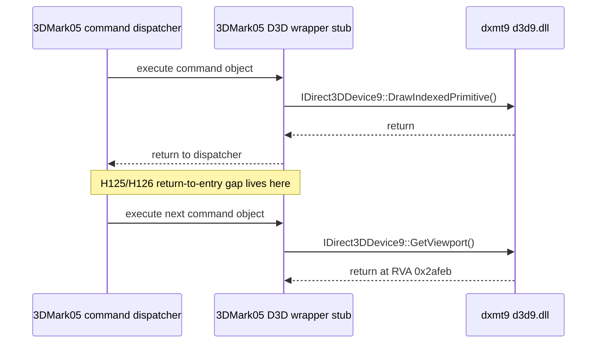
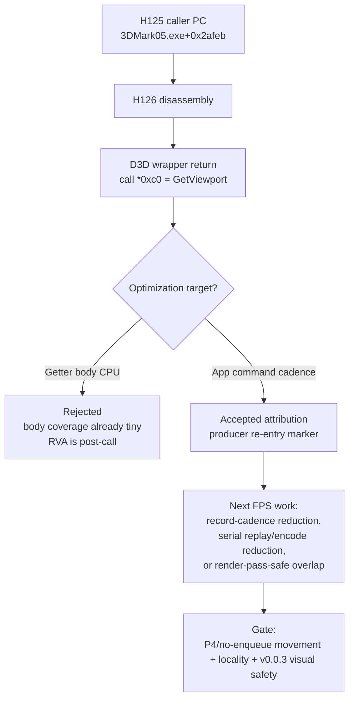

# Present Pacing / PE Callsite RVA Disassembly Correlation 126

**Question.** After H125 resolved the dominant return-to-entry marker to
`3DMark05.exe+0x2afeb`, does the app binary show a dxmt9-controllable wrapper
body, a heavier app function, or a simple D3D wrapper return site?

**Answer.** It is a simple D3D wrapper return site. The PE image has
`ImageBase=0x00400000`, so H125's RVAs map directly to `.text` virtual
addresses. Disassembly of the catalogue binary shows the dominant H125
callsites are immediate D3D vtable wrappers:

| H125 caller RVA | VA | Wrapper shape | D3D9 vtable offset/index | Reading |
|---:|---:|---|---:|---|
| `0x2afeb` | `0x42afeb` | return from `call *0xc0(%ecx)` | `0xc0 / 48` | `IDirect3DDevice9::GetViewport` wrapper |
| `0x2b061` | `0x42b061` | return from `call *0xac(%ecx)` | `0xac / 43` | `IDirect3DDevice9::Clear` wrapper from the same command-stub family |
| `0x155f41` | `0x555f41` | return from `call *0x178(%ecx)` | `0x178 / 94` | `SetVertexShaderConstantF` wrapper |
| `0x155c44` | `0x555c44` | return from `call *0x1b4(%ecx)` | `0x1b4 / 109` | `SetPixelShaderConstantF` wrapper |
| `0xd37b3` | `0x4d37b3` | return from `call *0x48(%eax)` on a texture object | object vtable offset `0x48` | `CubeTexture::GetCubeMapSurface`-class wrapper |

The earlier caller-stack row at `3DMark05.exe+0x88760` also remains consistent
with an app-side command dispatcher: the function at `0x4886e0` calls a command
object through `call *0x18(%eax)`, then immediately calls another object method
at `0x488760`. That is app command sequencing, not a hidden dxmt9 sleep or PE
getter body.

## Commands

```sh
xcrun llvm-objdump -p \
  "experiments/prefixs/app-d3d9-3dmark05/drive_c/Program Files (x86)/Futuremark/3DMark05/3DMark05.exe"

xcrun llvm-objdump -d --no-show-raw-insn \
  --start-address=0x42af80 --stop-address=0x42b0b0 \
  "experiments/prefixs/app-d3d9-3dmark05/drive_c/Program Files (x86)/Futuremark/3DMark05/3DMark05.exe"

xcrun llvm-objdump -d --no-show-raw-insn \
  --start-address=0x555b80 --stop-address=0x556040 \
  "experiments/prefixs/app-d3d9-3dmark05/drive_c/Program Files (x86)/Futuremark/3DMark05/3DMark05.exe"

xcrun llvm-objdump -d --no-show-raw-insn \
  --start-address=0x488680 --stop-address=0x488820 \
  "experiments/prefixs/app-d3d9-3dmark05/drive_c/Program Files (x86)/Futuremark/3DMark05/3DMark05.exe"
```

## Flow





## Decision

Do not spend `.gputrace` or implement a dxmt9 `GetViewport`/`GetScissorRect`
fast path from H125/H126. The sharp row is now tied to an app-side command
wrapper boundary. The useful next work is either:

- reduce record cadence or replay/snapshot/encode CPU enough to move
  `commit entry -> publish`, `wait -> next enqueue`, or no-enqueue P4 rows; or
- build a true overlap carrier that carries render-pass/encoder state instead
  of fragmenting command buffers and forcing final same-key reopens.

Any mutating candidate still needs the `v0.0.3` GT1 visual-safe gate before FPS
or Xcode-counter promotion.
