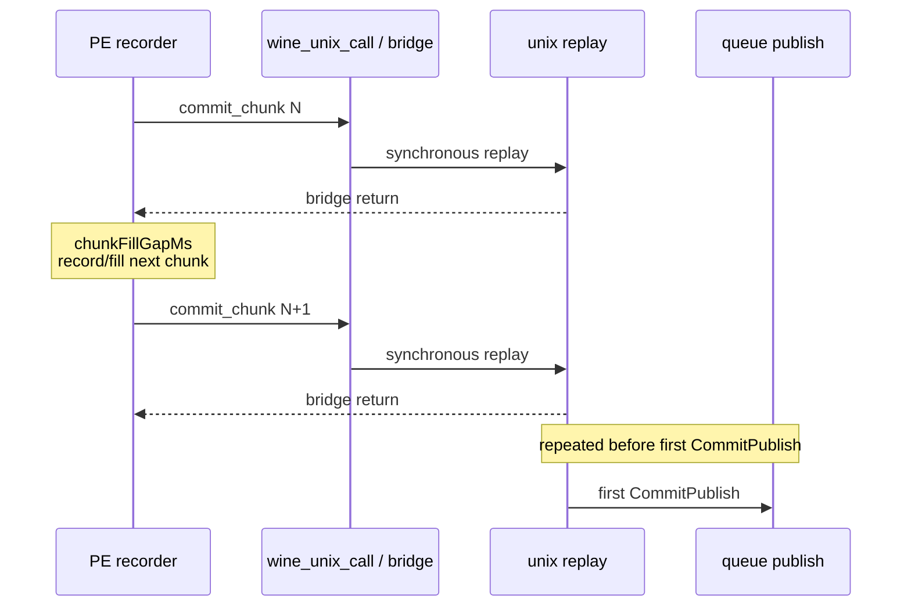

# Present Pacing 56 - PE All-Chunk Cadence Explains Inter-Replay Gap

> **Outdated — every artifact this leaf cites in `source:` is gone from disk.** The numbers below cannot be re-derived or re-checked. Kept as history; do not cite it as current evidence.

## Question

[present-pacing-noenqueue-inter-replay-gap.55](present-pacing-noenqueue-inter-replay-gap.55.md) proved that the residual
before first `CommitPublish` is wall time between completed unix
`commit_chunk` replays and later `commit_chunk` entries. The remaining
question was whether that gap is:

- PE-local chunk fill / app record cadence,
- synchronous bridge/replay duration,
- or a queue publish wait hidden outside the existing counters.

This run adds PE recorder all-chunk counters:

```text
chunkFillGapSamples
chunkFillGapMs
chunkFillGapMaxMs
chunkBridgeSamples
chunkBridgeMs
chunkBridgeMaxMs
```

`chunkFillGapMs` measures time from the previous PE `commit_chunk` bridge
return to the next PE flush entry. `chunkBridgeMs` measures the synchronous
`dxmt9c_device_commit_chunk` call duration.

## Verdict

Accepted as an attribution refinement. The inter-replay producer gap is
consistent with PE chunk-fill cadence, not queue publish wait. The r3 run has
no parsed counter contamination after making `[dxmt9-perf]` emit as one line.

The all-chunk PE fill gap is larger than the before-publish inter-replay gap,
so the producer has enough local fill time to explain H60. The measurement is
not yet a direct per-window join; treat it as a strong attribution proof and a
target selector for the next design.

## Run

```sh
DXMT9_PE_RECORDER_STATS=1 DXMT_LOG_LEVEL=info \
bash scripts/tools/run_3dmark05_perf_probe.sh \
  --suffix noenqueue-pe-chunk-cadence-r3-20260616 \
  --no-gputrace \
  --no-encoder-breakdown \
  --frame-sampling \
  --timeout 120 \
  --capture-delay-sec 45 \
  --wait-unlocked-sec 1 \
  --wait-unlocked-interval-sec 1 \
  --min-free-mb 256
```

The run is a valid no-gputrace attribution scout: `status=pass`,
`capture_error=None`, and `gpu_command_buffer_errors=0`. It encoded `1,680`
presents. Use it for pacing attribution, not as an Xcode/GPU-counter sample.

## Results

| Metric | Value |
|---|---:|
| `present_encoded` | `1,680` |
| `completion_wait_ms_per_present` | `29.055` |
| `completion_wait_with_enqueue_ms_per_present` | `0.056` |
| `completion_wait_without_enqueue_ms_per_present` | `28.998` |
| `commit entry -> publish` | `17.744ms/present` |
| completed replay CPU before publish | `4.076ms/present` |
| inter-replay gap before publish | `13.813ms/present` |
| inter-replay gap p50 | `6.588ms` |
| wait -> first commit entry p50 | `0.963ms` |
| encode chunk CPU | `11.250ms/present` |
| queue draw submission CPU | `3.882ms/present` |

PE recorder all-chunk cadence:

| Metric | Value |
|---|---:|
| `commitCount` | `41,957` |
| commits per present | `24.974` |
| `chunkFillGapSamples` | `41,956` |
| `chunkFillGapMs` | `92,944.963` |
| PE chunk fill gap | `55.324ms/present` |
| average fill gap per chunk | `2.215ms` |
| `chunkFillGapMaxMs` | `4,715.368` |
| `chunkBridgeSamples` | `41,957` |
| `chunkBridgeMs` | `16,365.591` |
| PE bridge/replay duration | `9.741ms/present` |
| `chunkBridgeMaxMs` | `20.851` |

The r2 scout showed the same direction with different run shape:
`chunkFillGapMs=93,129.831`, `chunkBridgeMs=16,267.419`, and
`completion_no_enqueue_commit_chunk_inter_replay_gap_before_publish_ms=15,880.244`.

## Interpretation



The key distinction is that `chunkBridgeMs` includes the synchronous bridge
call and unix replay, while `chunkFillGapMs` excludes it. H60's inter-replay
gap is therefore not hidden replay work; it is time before the next chunk is
even handed to unix replay.

## Decision

The next FPS-facing candidates should target PE chunk production and publish
placement without increasing Metal fragmentation:

| Candidate direction | Gate |
|---|---|
| N-1 draw-state materialization elision before chunk replay | lower `commit_chunk_replay_cpu_ms_per_present`, lower `queue_draw_submission_cpu_ms_per_present`, preserve H57 locality gates |
| PE record/run-ahead design that lets chunks arrive while completion waits | increase `completion_wait_with_enqueue_ms_per_present`, decrease `completion_wait_without_enqueue_ms_per_present`, preserve command buffers/pass count/tile preservation |
| earlier logical publish carrier that does not split render passes | same P4 gates plus H57 locality gates |

Do not use lower PE chunk capacity or draw-count chunk limits as the default
carrier; H54/H56 already showed those create overlap by increasing Metal
command-buffer/render-pass pressure.
