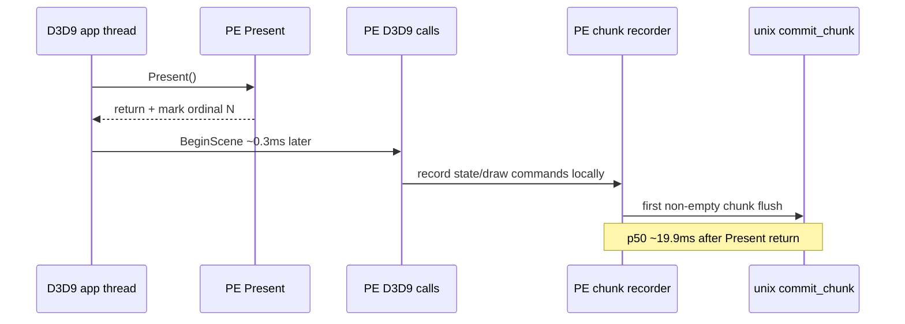
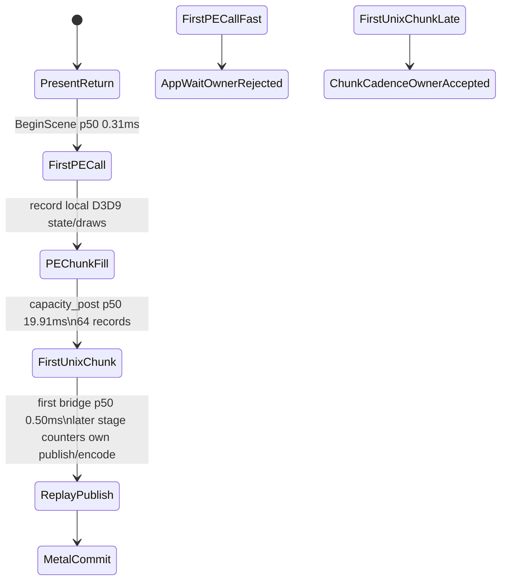

# Present-Pacing 11 - PE Chunk Cadence After Present

> **Outdated — every artifact this leaf cites in `source:` is gone from disk.** The numbers below cannot be re-derived or re-checked. Kept as history; do not cite it as current evidence.

## Question

[present-pacing-pe-call-cadence.10](present-pacing-pe-call-cadence.10.md) shows that the app calls back into PE D3D9
almost immediately after `Present` returns, usually through `BeginScene`. The
next question is where that PE-local next-frame work first crosses into the
unix provider: immediately after the first API call, or only after the PE
recorder has filled enough records to flush a chunk?

## Implementation

The same `DXMT9_PE_RECORDER_STATS=1` diagnostic now also marks the first
non-empty PE command chunk committed after each successful `Present` return.
The log line is `pe_present_next_chunk` and records:

- `reason`: PE recorder flush reason.
- `entry_delta_ms`: first chunk bridge entry minus PE `Present` return.
- `return_delta_ms`: first chunk bridge return minus PE `Present` return.
- `bridge_ms`: synchronous `dxmt9c_device_commit_chunk()` duration for that
  first chunk.
- chunk shape: `recordCount`, `payloadBytes`, `handleCount`, `wireBytes`.



## Run

```sh
DXMT9_PE_RECORDER_STATS=1 DXMT_LOG_LEVEL=info \
  scripts/tools/run_3dmark05_perf_probe.sh \
    --suffix present-pe-chunk-cadence-r1-20260614 \
    --frame 60 \
    --no-gputrace \
    --no-encoder-breakdown \
    --frame-sampling \
    --timeout 120
```

Status: pass. The run produced `1,740` presents and `1,751`
`pe_present_next_chunk` rows in `3dmark05-direct.log`.

## Result

The startup ordinal has one large outlier (`4.779s`), so steady-state chunk
statistics below exclude ordinals `<= 10`.

| Metric | Value |
|---|---:|
| `pe_present_next_call` rows | `1,751` |
| first-call class distribution | `BeginScene=1,750`, `Surface::LockRect=1` |
| first-call `entry_delta_ms` p50 / p95 / p99 / max | `0.308 / 0.427 / 0.694 / 119.277ms` |
| `pe_present_next_chunk` rows | `1,751` |
| first-chunk reason distribution | `capacity_post=1,751` |
| steady first-chunk `entry_delta_ms` p50 / p95 / p99 / max | `19.908 / 34.810 / 38.761 / 138.074ms` |
| steady first-chunk `bridge_ms` p50 / p95 / p99 / max | `0.504 / 0.617 / 1.143 / 3.519ms` |
| steady first-chunk `payloadBytes` p50 / p95 / p99 / max | `190,176 / 215,744 / 221,696 / 226,960` |
| steady first-chunk `recordCount` | `64` for `1,741 / 1,741` rows |
| steady rows with first-chunk `entry_delta_ms > 16.7ms` | `1,368 / 1,741` |
| `completion_wait_ms` p50 / p95 | `28.587 / 39.246ms` |
| `completion_wait_with_enqueue_ms` | `0.000` |
| `completion_no_enqueue_wait_to_commit_chunk_entry` p50 | `0.917ms` |
| `completion_no_enqueue_stage_commit_entry_to_publish` p50 | `3.801ms` |
| `completion_no_enqueue_stage_encode_dequeue_to_command_buffer_commit` p50 | `11.649ms` |

## Interpretation

This separates two different "producer" meanings:

- The app starts the next frame in PE almost immediately after `Present`
  returns (`BeginScene` p50 `0.308ms`).
- The first non-empty PE chunk for that next frame does **not** cross into unix
  immediately. It waits until the recorder reaches the `64`-record
  `capacity_post` threshold, p50 `19.908ms` after `Present` return.

So the statement "N+1 is emitted about 1ms after N completion" is not an app
call-cadence statement. It is a unix/Metal submission observation after a
PE-local chunk fill window has already happened. The first chunk bridge itself
is cheap (`~0.5ms` p50); the exposed time is in filling enough PE records and
then the later replay/publish/encode pipeline.



This does **not** automatically mean smaller PE chunks are a safe fps win:
smaller chunks can increase bridge/replay overhead, split render-pass
coalescing, and worsen resource-retention churn. But it identifies the next
architecture question precisely: can dxmt9 publish useful next-frame work
earlier than the current `64`-record capacity cadence without increasing total
CPU cost or violating D3D9 ordering/resource-lifetime constraints?
