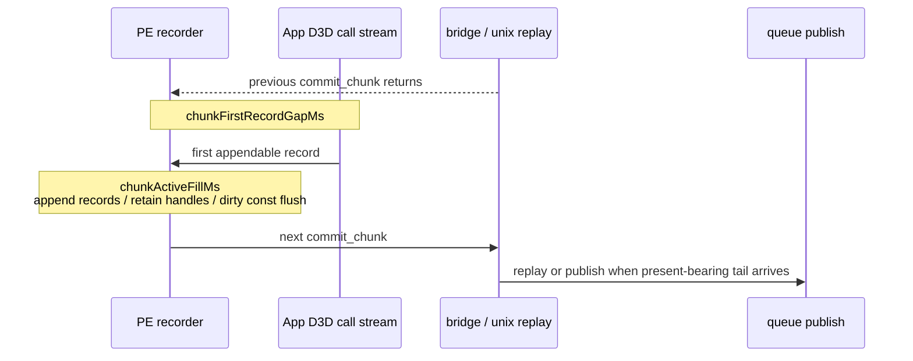

# Present Pacing 57 - PE Chunk Fill Splits Into First-Record Gap And Active Fill

> **Outdated — every artifact this leaf cites in `source:` is gone from disk.** The numbers below cannot be re-derived or re-checked. Kept as history; do not cite it as current evidence.

## Question

[present-pacing-pe-chunk-cadence-all.56](present-pacing-pe-chunk-cadence-all.56.md) showed that PE-local
`chunkFillGapMs` is large enough to explain the no-enqueue inter-replay gap.
The next question was whether that fill gap is mostly:

- front idle time until the next chunk receives its first appendable record, or
- active chunk filling from the first record to the flush entry.

This run adds:

```text
chunkFirstRecordGapSamples
chunkFirstRecordGapMs
chunkFirstRecordGapMaxMs
chunkActiveFillSamples
chunkActiveFillMs
chunkActiveFillMaxMs
```

## Verdict

Accepted. The PE fill gap is not a single-owner bucket. It splits almost
evenly between first-record gap and active chunk fill.

That matters for design selection. A fix that only flushes earlier before the
first record cannot cover the active-fill half, while a record-copy microfix
cannot cover the front first-record half. The next average-FPS candidate needs
either true run-ahead/overlap or a paired reduction of active fill/replay copy
work.

## Run

```sh
DXMT9_PE_RECORDER_STATS=1 DXMT_LOG_LEVEL=info \
bash scripts/tools/run_3dmark05_perf_probe.sh \
  --suffix noenqueue-pe-chunk-fill-split-r1-20260616 \
  --no-gputrace \
  --no-encoder-breakdown \
  --frame-sampling \
  --timeout 120 \
  --capture-delay-sec 45 \
  --wait-unlocked-sec 1 \
  --wait-unlocked-interval-sec 1 \
  --min-free-mb 256
```

The run is a valid no-gputrace attribution scout: `status=pass`,
`capture_error=None`, and parsed counter contamination is `0`. It encoded
`1,680` presents. Use it for pacing attribution only; it is not an
Xcode/GPU-counter sample.

## Results

| Metric | Value |
|---|---:|
| `present_encoded` | `1,680` |
| `completion_wait_ms_per_present` | `27.750` |
| `completion_wait_with_enqueue_ms_per_present` | `0.058` |
| `completion_wait_without_enqueue_ms_per_present` | `27.693` |
| `commit entry -> publish` | `19.066ms/present` |
| completed replay CPU before publish | `4.296ms/present` |
| inter-replay gap before publish | `14.894ms/present` |
| inter-replay gap p50 | `7.389ms` |
| commit chunk replay CPU | `8.001ms/present` |
| encode chunk CPU | `11.217ms/present` |
| queue draw submission CPU | `3.771ms/present` |

PE all-chunk split:

| Metric | Value |
|---|---:|
| `commitCount` | `41,727` |
| `chunkFillGapMs` | `92,956.004` |
| chunk fill gap | `55.331ms/present` |
| average fill gap per chunk | `2.228ms` |
| `chunkFirstRecordGapMs` | `42,571.813` |
| first-record gap | `25.340ms/present` |
| average first-record gap | `1.020ms` |
| first-record share of fill | `45.798%` |
| `chunkActiveFillMs` | `50,384.870` |
| active fill | `29.991ms/present` |
| average active fill | `1.207ms` |
| active-fill share of fill | `54.203%` |
| first + active closure | `100.001%` |
| `chunkBridgeMs` | `16,371.846` |
| bridge/replay duration | `9.745ms/present` |

## Interpretation



The split closes `chunkFillGapMs`, so the H61 all-chunk measurement is not a
timer artifact. It also explains why earlier one-off carriers failed:

| Carrier | Why it is incomplete |
|---|---|
| smaller PE chunk capacity | can reduce some active fill, but does not remove the front first-record cadence and adds commit overhead |
| flush after `Clear` | moves the first chunk earlier but does not solve steady-state active-fill chunks |
| draw-count publish limit | creates overlap but increases Metal command buffers/render passes/tile traffic |
| local append-copy cleanup only | can reduce active fill/replay, but cannot cover the first-record half |

## Decision

The next FPS-facing proof should combine both sides of the split:

| Direction | Required proof |
|---|---|
| producer run-ahead / async publish formation | `completion_wait_with_enqueue_ms_per_present` rises and `completion_wait_without_enqueue_ms_per_present` falls without H57 locality regressions |
| active-fill reduction via state/copy/materialization elision | `chunkActiveFillMs_per_present`, `commit_chunk_replay_cpu_ms_per_present`, or queue submission CPU falls, then P4/no-enqueue rows must also move |
| earlier logical publish carrier | must preserve command buffers per present, render passes per present, and tile preservation bytes |

Do not spend `.gputrace` on this attribution alone. It is a CPU/producer
cadence question; use no-gputrace P4 gates first, then Xcode only after a
candidate changes the frame-local GPU shape or needs a visual/GPU-counter
oracle.
