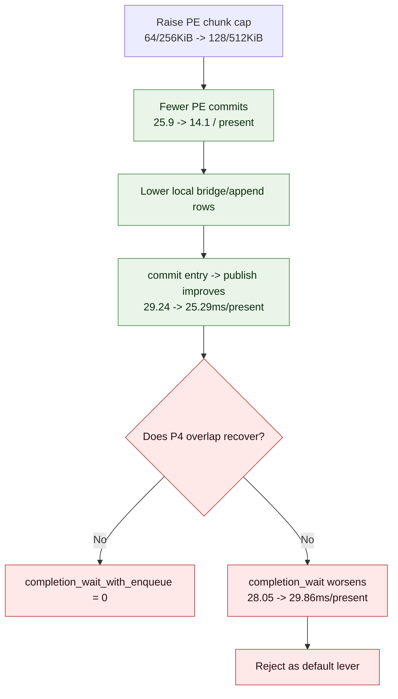

# Present Pacing 91 - Larger PE chunk capacity reduces bridge count but fails P4

## Question

[present-pacing-current-pe-cadence.90](present-pacing-current-pe-cadence.90.md) shows large PE-side
`recordAppendCpuMs`, `constFlushCpuMs`, and `chunkBridgeMs`. H12 lowered the
chunk record cap from `64` to `32` and did not create overlap. This run checks
the opposite direction: can a larger PE chunk (`128` records and `512KiB`) reduce
bridge and append overhead enough to move the current P4 owner?

## Verdict

Rejected as a simple P4/FPS lever. Larger PE chunks reach the recorder and cut
chunk commits nearly in half, so the mechanism is real. But the run still has
`completion_wait_with_enqueue=0`, total completion wait worsens, and frame
sampling regresses. This means bridge-count reduction alone does not recover
the missing producer/encode overlap.

The time-based screenshot is also not a visual-safe proof: `actual.png` is a
HUD-only black frame near the end of GT1 (`FPS: 8`, `Time: 0:59.01`,
`Frame: 492`). Treat that as an inconclusive or failed broad visual smoke
against the `v0.0.3` visual-safe anchor. It blocks promotion even before the P4
gate.

## Run

```sh
DXMT9_PE_RECORDER_STATS=1 \
DXMT9_PE_CHUNK_MAX_RECORDS=128 \
DXMT9_PE_CHUNK_MAX_BYTES=524288 \
DXMT_LOG_LEVEL=info \
bash scripts/tools/run_3dmark05_perf_probe.sh \
  --suffix h172-pe-chunk128-512k-r1 \
  --no-gputrace \
  --no-encoder-breakdown \
  --frame-sampling \
  --timeout 120 \
  --wait-unlocked-sec 1 \
  --wait-unlocked-interval-sec 1 \
  --min-free-mb 256
```

The wrapper produced complete no-gputrace artifacts:
`status=pass`, `capture_error=None`, `present_encoded=1,440`,
`draw_skipped_no_pipeline=0`, and `gpu_command_buffer_errors=0`.

## Result

Compared with H171 default current PE cadence:

| Metric | H171 default | H172 `128/512KiB` | Direction |
|---|---:|---:|---:|
| `recordCountMax` | `64` | `128` | knob reached |
| `payloadBytesMax` | `261,456` | `498,272` | knob reached |
| `commitCount / present` | `25.924` | `14.140` | `-45.45%` |
| `chunkBridgeMs / present` | `10.276` | `9.566` | `-6.92%` |
| `recordAppendCpuMs / present` | `14.179` | `12.840` | `-9.45%` |
| `constFlushCpuMs / present` | `6.069` | `5.535` | `-8.79%` |
| `commit entry -> publish / present` | `29.240` | `25.293` | `-13.50%` |
| inter-replay producer gap / present | `24.279` | `20.927` | `-13.80%` |
| `wait -> next enqueue / present` | `47.847` | `44.789` | `-6.39%` |
| `encode_chunk_cpu_ms / present` | `11.303` | `10.919` | `-3.39%` |
| `completion_wait_with_enqueue / present` | `0.000` | `0.000` | no overlap |
| `completion_wait_ms / present` | `28.047` | `29.863` | `+6.47%` |
| sampled avg FPS | H171 not used as FPS baseline | `13.491` | regression band |



## Interpretation

The run separates two facts:

1. The PE chunk bridge overhead is real and responsive to chunk sizing. Larger
   chunks reduce `commitCount`, `chunkBridgeMs`, `recordAppendCpuMs`, and the
   no-enqueue `commit entry -> publish` row.
2. The current average-FPS problem is not solved by that local reduction. No
   chunk is enqueued while completion waits, and the wall-clock wait row gets
   worse.

This weakens both naive chunk-size directions:

| Knob direction | Evidence | Verdict |
|---|---|---|
| smaller chunks (`64 -> 32`) | H12 creates no enqueue overlap | not enough |
| larger chunks (`64 -> 128`, bytes doubled) | H91 lowers bridge count but worsens completion wait | not enough |

The remaining target is still a structural P4 design: produce CPU-ready work or
coalesced encode backlog without fragmenting command buffers/render passes, and
prove it with `completion_wait_with_enqueue`, `completion_wait_without_enqueue`,
`no_enqueue_before_publish_*`, locality gates, and the `v0.0.3` visual anchor.

Do not spend `.gputrace` on this CPU-only chunk-size knob.
