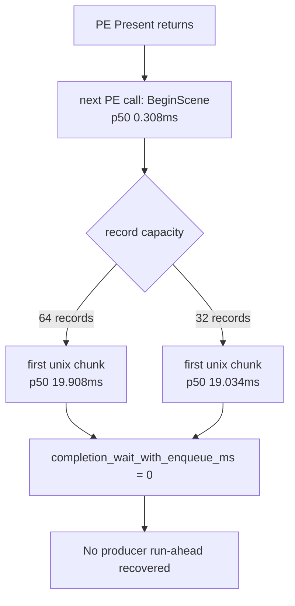

# Present-Pacing 12 - PE Chunk Size A/B

## Question

[present-pacing-pe-chunk-cadence.11](present-pacing-pe-chunk-cadence.11.md) proved that the app starts the next
frame quickly in PE, but the first non-empty chunk only crosses into unix after
the recorder fills to the `64`-record `capacity_post` threshold. The direct
follow-up is whether simply lowering the chunk capacity to `32` records creates
producer run-ahead or materially reduces the exposed completion wait.

## Run

Baseline:

```sh
DXMT9_PE_RECORDER_STATS=1 DXMT_LOG_LEVEL=info \
  scripts/tools/run_3dmark05_perf_probe.sh \
    --suffix present-pe-chunk-cadence-r1-20260614 \
    --frame 60 \
    --no-gputrace \
    --no-encoder-breakdown \
    --frame-sampling \
    --timeout 120
```

Chunk32:

```sh
DXMT9_PE_RECORDER_STATS=1 DXMT_LOG_LEVEL=info DXMT9_PE_CHUNK_MAX_RECORDS=32 \
  scripts/tools/run_3dmark05_perf_probe.sh \
    --suffix present-pe-chunk32-r1-20260614 \
    --frame 60 \
    --no-gputrace \
    --no-encoder-breakdown \
    --frame-sampling \
    --timeout 120
```

The chunk32 run produced valid logs and counters but exited through the wrapper
timeout path (`timed_out=True`, `returncode=143`, elapsed `191.013s`). Treat its
aggregate wallclock as timeout-contaminated; use its cadence counters as an
attribution sample.

## Result

| Metric | Baseline 64 | Chunk32 | Read |
|---|---:|---:|---|
| first PE call p50 | `0.308ms` | `0.308ms` | unchanged |
| first PE call class | `BeginScene=1750`, `Surface::LockRect=1` | `BeginScene=1753`, `Surface::LockRect=1` | not `GetBackBuffer`, query, or lock in steady state |
| first chunk reason | `capacity_post=1751` | `capacity_post=1754` | still capacity-driven |
| steady first chunk records | `64` for `1741 / 1741` | `32` for `1744 / 1744` | knob reached the recorder |
| steady first chunk `entry_delta_ms` p50 / p95 | `19.908 / 34.810ms` | `19.034 / 32.605ms` | small cadence reduction |
| steady first chunk `bridge_ms` p50 / p95 | `0.504 / 0.617ms` | `0.336 / 0.403ms` | smaller bridge payload |
| `completion_wait_with_enqueue_ms` | `0.000` | `0.000` | no run-ahead created |
| no-enqueue wait -> commit entry p50 | `0.917ms` | `0.471ms` | local reduction only |
| `completion_wait_ms` p50 / p95 | `28.587 / 39.246ms` | `27.107 / 36.230ms` | noisy/small; timeout run |
| `commit_chunk_replay_cpu_ms` | `18158.514` | `18359.285` | no replay win |
| `encode_chunk_cpu_ms` | `19881.335` | `19593.645` | flat/noisy |
| `gpu_command_buffer_time_p50_ms` | `10.867` | `9.923` | not a chunk-size proof |
| `present_encoded` | `1740` | `1740` | same sampled workload |

## Interpretation

Lowering the PE chunk capacity from `64` to `32` does not solve the
under-pipelining problem. It proves the first chunk boundary is capacity-driven,
but it does **not** make the producer enqueue work while the completion watcher
is waiting:



The user-facing hypothesis needs a precise subject:

- If "N+1" means the first PE D3D9 API call, then the hypothesis is rejected:
  the app calls `BeginScene` immediately after `Present` returns, and steady
  first-call samples are not `GetBackBuffer`, `Query::GetData`, or lock calls.
- If "N+1" means the first unix/Metal-visible chunk, then the observation is
  valid: that boundary appears only after a PE-local chunk-fill window, usually
  close to the completion-wait release point.

The current evidence therefore lowers these candidates for the steady-state
owner: drawable/swapchain dependency on `GetBackBuffer`, per-frame
`Query::GetData`, and first-lock dependency. They can still matter later inside
a frame, but they are not the first visible producer gate in this sample.

Do not promote a global smaller-chunk default from this result. A useful design
would need a targeted early-publish policy that creates real overlap
(`completion_wait_with_enqueue_ms > 0`) without increasing total bridge/replay
cost, render-pass splits, or resource-lifetime risk. The current average-FPS
lane remains pre-publish replay/snapshot reduction plus backend encode
reduction, with early-publish as an architecture experiment rather than a knob.
