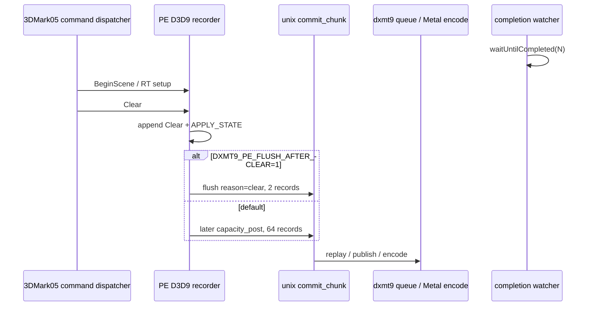
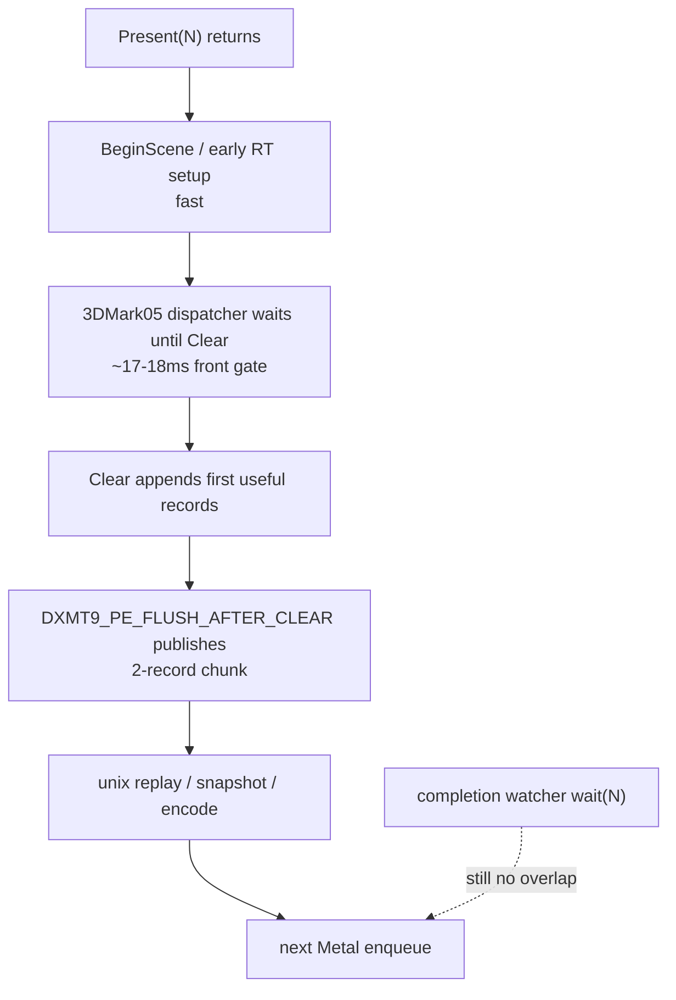

# Present-Pacing 22 - Clear Flush Early Publish Probe

> **Outdated — the knob or code path this experiment measured no longer exists in `src/`.** It cannot be re-run. Kept as history; do not cite it as current evidence.

## Question

[present-pacing-pe-caller-stack.20](present-pacing-pe-caller-stack.20.md) identifies the first record-producing
front gate as the 3DMark05 command dispatcher issuing `Clear`. The normal first
unix-visible chunk after `Present` is a `capacity_post` flush of `64` records
around 20ms after `Present` return.

This probe asks whether publishing immediately after that `Clear` record is
enough to make the producer run ahead while the previous Present-bearing command
buffer is still in `waitUntilCompleted()`.

## Implementation

Added `DXMT9_PE_FLUSH_AFTER_CLEAR`, a default-off PE-recorder diagnostic knob.
When enabled, `IDirect3DDevice9::Clear` appends its normal command record and
then immediately flushes the pending PE chunk with reason `clear`.

The reason is also included in `pe_recorder_stats` so the run can prove that the
new flush path fired.



## Run

```sh
DXMT9_PE_FLUSH_AFTER_CLEAR=1 DXMT9_PE_RECORDER_STATS=1 DXMT_LOG_LEVEL=info \
  scripts/tools/run_3dmark05_perf_probe.sh \
    --suffix present-pe-flush-after-clear-r1-20260614 \
    --frame 60 \
    --no-gputrace \
    --no-encoder-breakdown \
    --timeout 120
```

The run was timeout-finalized at the wrapper tail with complete artifacts:
`status=pass`, `timed_out=true`, `returncode=143`. The output frame was not
black and showed the normal GT1 scene, but the proof here is the cadence
counters rather than visual equality.

Baseline is
`app-d3d9-3dmark05-present-pe-caller-stack-r1-20260614`, which has the same
120s no-gputrace shape and the default PE chunk policy.

## Result

The probe changes the first chunk shape exactly as intended:

| Metric | Baseline | Clear flush |
|---|---:|---:|
| first `pe_present_next_chunk` rows | `1708` | `1692` |
| first chunk reason | `capacity_post` | `clear` |
| first chunk `recordCount` | `64` | `2` |
| first chunk entry p50 / p95 | `20.582 / 35.316ms` | `18.935 / 31.687ms` |
| first chunk bridge p50 / p95 | `0.502 / 0.587ms` | `0.067 / 0.094ms` |

But it does not create producer/encode overlap:

| Metric | Baseline | Clear flush |
|---|---:|---:|
| `present_encoded` | `1680` | `1680` |
| `completion_wait_with_enqueue_ms` | `0.000` | `0.000` |
| `completion_enqueue_while_waiting` | `0` | `0` |
| `completion_no_enqueue_wait_to_next_enqueue_p50_ms` | `23.161` | `21.265` |
| `completion_no_enqueue_stage_commit_entry_to_publish_p50_ms` | `8.664` | `5.608` |
| `completion_no_enqueue_stage_publish_to_encode_dequeue_p50_ms` | `2.519` | `2.492` |
| `completion_no_enqueue_stage_encode_dequeue_to_command_buffer_commit_p50_ms` | `12.127` | `11.859` |
| `gpu_command_buffer_time_ms` | `5082.246` | `5098.313` |
| `completion_wait_ms` | `41504.380` | `44437.351` |
| `encode_chunk_cpu_ms` | `19006.242` | `19163.498` |
| `commit_chunk_replay_cpu_ms` | `17192.889` | `17455.577` |
| `render_pass_begin` | `19737` | `19729` |

Recorder stats show the cost side of the perturbation:

| Metric | Baseline | Clear flush |
|---|---:|---:|
| `commitCount` | `41947` | `45857` |
| `capacityPost` | `34968` | `33004` |
| `clear` flushes | n/a | `6552` |
| `recordCountTotal` | `2348460` | `2324920` |
| `payloadBytesTotal` | `6524428480` | `6464079856` |

## Interpretation

The earlier publish is real, but it is too late and too small a lever to recover
the missing overlap:



This rejects the simple "flush immediately after `Clear`" policy as a producer
run-ahead fix. It does not reject all earlier-publish architectures; it says
the current safe point, after `Clear` has already arrived, still leaves the next
Metal enqueue after completion wait and increases chunk count.

## Decision

Keep `DXMT9_PE_FLUSH_AFTER_CLEAR` as a diagnostic knob only. Do not promote it
to a perf profile or default policy.

Average-FPS work should stay on:

- reducing P2/P3 replay/snapshot/encode cost that is already on the exposed
  post-wait path;
- proving a larger producer-overlap architecture only if it can publish useful
  work before the app's `Clear` dispatch gate or hide a material part of replay
  and encode without breaking D3D9 ordering, resource lifetime, dynamic-buffer
  snapshots, or render-pass coalescing.
