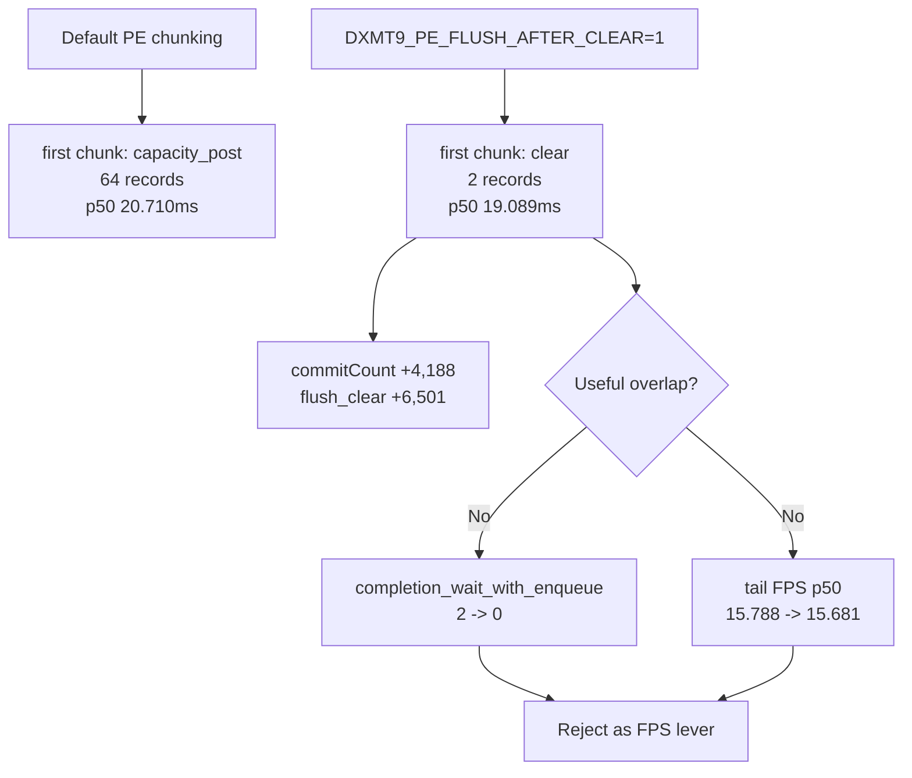

# Present-Pacing 23 - Clear Flush Low-Overhead Refresh

> **Outdated — the knob or code path this experiment measured no longer exists in `src/`.** It cannot be re-run. Kept as history; do not cite it as current evidence.

## Question

[present-pacing-pe-clear-flush.22](present-pacing-pe-clear-flush.22.md) rejected `DXMT9_PE_FLUSH_AFTER_CLEAR=1` as
a simple producer-overlap lever on the earlier instrumented path. After the
latest encode/copy cleanup and [state-churn-encode-encode-phase.68](../state-churn-encode/state-churn-encode-encode-phase.68.md)'s
low-overhead FPS gate, does the same earlier-PE-publish perturbation now create
useful overlap or move sampled FPS?

## Method

Use matching no-gputrace, no-encoder-breakdown, frame-sampling runs with
`DXMT9_PE_RECORDER_STATS=1 DXMT_LOG_LEVEL=info`. The extra PE logging means the
comparison baseline must also carry recorder stats; do not compare this run's
FPS directly against a non-logging low-overhead baseline.

```sh
DXMT9_PE_RECORDER_STATS=1 DXMT_LOG_LEVEL=info \
bash scripts/tools/run_3dmark05_perf_probe.sh \
  --suffix pe-recorder-stats-lowoverhead-r1-20260614 \
  --frame 60 --no-gputrace --no-encoder-breakdown \
  --frame-sampling --timeout 120 --top 5

DXMT9_PE_FLUSH_AFTER_CLEAR=1 DXMT9_PE_RECORDER_STATS=1 DXMT_LOG_LEVEL=info \
bash scripts/tools/run_3dmark05_perf_probe.sh \
  --suffix pe-clear-flush-lowoverhead-r1-20260614 \
  --frame 60 --no-gputrace --no-encoder-breakdown \
  --frame-sampling --timeout 120 --top 5
```

## Result

The mechanism still fires exactly as designed:

| Metric | Stats baseline | Clear flush | Delta |
|---|---:|---:|---:|
| `present_encoded` | `1,680` | `1,680` | `0` |
| first chunk reason | `capacity_post` | `clear` | changed |
| steady first chunk rows | `1,678` | `1,671` | `-7` |
| first chunk `recordCount` p50 / p95 | `64 / 64` | `2 / 2` | earlier tiny chunk |
| first chunk entry p50 / p95 | `20.710 / 35.355ms` | `19.089 / 31.911ms` | `-1.621 / -3.445ms` |
| first chunk bridge p50 / p95 | `0.515 / 0.606ms` | `0.067 / 0.098ms` | `-0.448 / -0.508ms` |
| `commitCount` | `41,429` | `45,617` | `+4,188` |
| `flush_clear` | `0` | `6,501` | `+6,501` |

But the overlap/FPS gate still fails:

| Metric | Stats baseline | Clear flush | Delta |
|---|---:|---:|---:|
| `completion_wait_with_enqueue` | `2` | `0` | `-2` |
| `completion_wait_with_enqueue_ms` | `97.217` | `0.000` | `-97.217` |
| `completion_enqueue_while_waiting` | `2` | `0` | `-2` |
| `completion_wait_ms` | `45,134.306` | `45,329.869` | `+195.563` |
| `completion_wait_p50_ms` | `28.829` | `29.358` | `+0.529` |
| `completion_no_enqueue_wait_to_next_enqueue_p50_ms` | `20.696` | `19.555` | `-1.141` |
| warm FPS p50 / p95 | `16.312 / 24.904` | `16.266 / 24.814` | `-0.046 / -0.090` |
| tail-600 FPS p50 / p95 | `15.788 / 23.697` | `15.681 / 23.365` | `-0.107 / -0.332` |
| warm `encode_draw_cpu_ms` p50 / p95 | `8.888 / 17.034` | `8.833 / 17.021` | `-0.055 / -0.013` |
| tail-600 `encode_draw_cpu_ms` p50 / p95 | `8.994 / 19.426` | `8.919 / 19.325` | `-0.075 / -0.101` |



## Interpretation

This refresh strengthens, rather than weakens, the Phase 22 rejection. The first
unix-visible chunk is earlier and much smaller, but it still arrives after the
app's `Clear` dispatch gate and does not create a meaningful command-buffer
enqueue while the previous Present-bearing command buffer is waiting for
completion. The two baseline overlap samples are noise-level; the perturbation
does not increase them and removes them in this run.

The current clear-flush path is therefore a chunk-shape perturbation, not an
average-FPS mechanism. Its small post-wait next-enqueue improvement is offset
by extra chunk count and unchanged replay/encode work.

## Decision

Keep `DXMT9_PE_FLUSH_AFTER_CLEAR` diagnostic-only. Do not promote it to
`perf`, do not widen it to a default early-publish policy, and do not spend
gputrace/Xcode budget on it.

The next average-FPS work should stay on P2/P3 reduction that lowers the
already-exposed replay/snapshot/encode stages, or on a larger producer-overlap
design that publishes useful work before the `Clear` dispatcher gate while
preserving D3D9 ordering, resource lifetime, dynamic-buffer snapshot
correctness, and render-pass coalescing.
