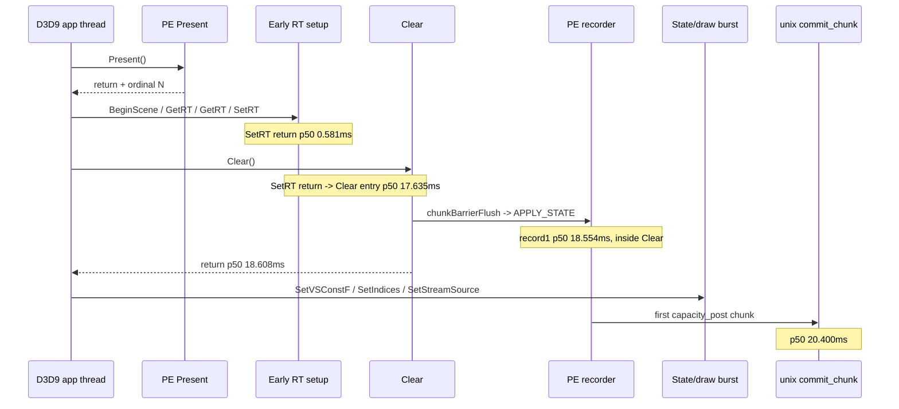
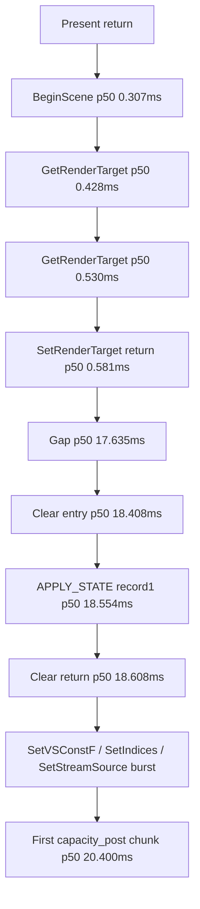

# Present-Pacing 15 - PE Clear Gate After Present

## Question

[present-pacing-pe-call-sequence.14](present-pacing-pe-call-sequence.14.md) showed a long gap after early
render-target setup, but that run did not include `Clear` and `EndScene` in the
call milestone sequence. The follow-up question was whether the gap is really a
non-D3D9/app-side gap before `SetVertexShaderConstantF`, or an omitted D3D9
call that flushes pending state and creates the first record.

## Implementation

`EndScene` and `Clear` now use the same post-`Present` call milestone path as
regular device calls. Selected early calls also emit `pe_present_call_return`
with return delta and call duration for call counts `1..8`.



## Run

```sh
DXMT9_PE_RECORDER_STATS=1 DXMT_LOG_LEVEL=info \
  scripts/tools/run_3dmark05_perf_probe.sh \
    --suffix present-pe-call-return-r2-20260614 \
    --frame 60 \
    --no-gputrace \
    --no-encoder-breakdown \
    --frame-sampling \
    --timeout 120
```

Status: pass with complete artifacts. The wrapper timeout-finalized the app
(`timed_out=True`, `returncode=143`), so wallclock is not a fps proof. The log
is valid for cadence attribution.

## Result

Steady-state rows exclude ordinals `<= 10`.

| Metric | Value |
|---|---:|
| call rows | `1,715` steady ordinals |
| call 1 / 2 / 3 / 4 p50 | `BeginScene 0.307ms`, `GetRenderTarget 0.428ms`, `GetRenderTarget 0.530ms`, `SetRenderTarget 0.565ms` |
| call 4 return p50 / duration p50 | `0.581ms` / `0.015ms` |
| call 5 p50 / return / duration | `Clear 18.408ms` / `18.608ms` / `0.210ms` |
| call 6 / 7 / 8 p50 | `SetVertexShaderConstantF 18.744ms`, `SetIndices 18.791ms`, `SetStreamSource 18.831ms` |
| `SetRenderTarget` return -> `Clear` entry p50 / p95 | `17.635 / 30.489ms` |
| `Clear` entry -> record 1 p50 / p95 | `0.157 / 0.195ms` |
| record 1 p50 / type / call context | `18.554ms`, `apply_state`, `Clear=1,715 / 1,715` |
| record 4 p50 / type | `18.957ms`, `draw_indexed=1,715 / 1,715` |
| first chunk p50 / p95 / reason | `20.400 / 35.249ms`, `capacity_post=1,715 / 1,715` |
| `completion_wait_with_enqueue_ms` | `0.000` |
| no-enqueue wait -> commit entry p50 | `0.893ms` |
| commit entry -> publish p50 | `26.664ms` |
| encode dequeue -> command buffer commit p50 | `16.954ms` |

## Interpretation

This supersedes the call-5 interpretation in
[present-pacing-pe-call-sequence.14](present-pacing-pe-call-sequence.14.md). The missing D3D9 call was `Clear`, not
`SetVertexShaderConstantF`.

Current steady sequence:



Conclusions:

- `SetRenderTarget` itself is not the sleeper; its p50 duration is only
  `0.015ms`.
- The first appendable record is created inside `Clear`, about `0.157ms` after
  `Clear` entry.
- The exposed front gap is before `Clear`, between early RT setup and the first
  clear/state/draw burst.
- `GetBackBuffer`, `Query::GetData`, lock, and early RT setup remain rejected
  as steady first-gate owners for this run.

The next useful probe is outside the first-record append path: identify why the
app/Wine side waits about `17.6ms` p50 between `SetRenderTarget` return and
`Clear` entry. Candidate owners are app-side fixed frame cadence, Wine/macdrv
message/event processing, or a D3D9-adjacent call path that still is not
instrumented.
