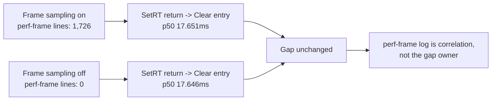
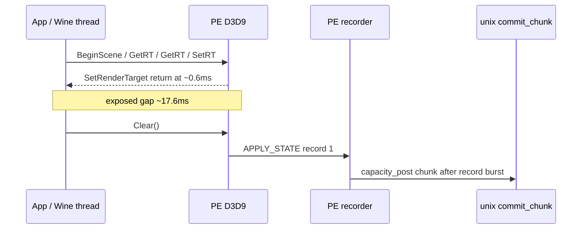

# Present-Pacing 16 - PE Clear Gate Without Frame Sampling

## Question

[present-pacing-pe-clear-gate.15](present-pacing-pe-clear-gate.15.md) found the exposed front gap between
`SetRenderTarget` return and `Clear` entry. In that run, many
`dxmt9-perf-frame` lines appeared textually between the two events. This A/B
asks whether `DXMT9_PERF_FRAME_SAMPLING` created or amplified the gap, or only
made the gap visible in the log stream.

## Run

Baseline with frame sampling:

```sh
DXMT9_PE_RECORDER_STATS=1 DXMT_LOG_LEVEL=info \
  scripts/tools/run_3dmark05_perf_probe.sh \
    --suffix present-pe-call-return-r2-20260614 \
    --frame 60 \
    --no-gputrace \
    --no-encoder-breakdown \
    --frame-sampling \
    --timeout 120
```

Ablation without frame sampling:

```sh
DXMT9_PE_RECORDER_STATS=1 DXMT_LOG_LEVEL=info \
  scripts/tools/run_3dmark05_perf_probe.sh \
    --suffix present-pe-clear-no-frame-sampling-r1-20260614 \
    --frame 60 \
    --no-gputrace \
    --no-encoder-breakdown \
    --timeout 120
```

Both runs are timeout-finalized but have complete artifacts and `status=pass`.
The no-frame-sampling run has `timed_out=True`, `returncode=143`,
`present_encoded=1680`, and no `.gputrace`.

## Result

The parser excludes ordinal `1` as warmup and compares the same steady
post-`Present` sequence in both logs.

| Metric | With frame sampling | Without frame sampling |
|---|---:|---:|
| `dxmt9-perf-frame` lines | `1,726` | `0` |
| steady ordinals with call 4 return + call 5 entry | `1,724` | `1,719` |
| call 1 entry p50 | `BeginScene 0.307ms` | `BeginScene 0.308ms` |
| call 4 return p50 | `SetRenderTarget 0.581ms` | `SetRenderTarget 0.597ms` |
| call 5 entry p50 | `Clear 18.410ms` | `Clear 18.424ms` |
| `SetRenderTarget` return -> `Clear` entry p50 / p95 | `17.651 / 30.501ms` | `17.646 / 30.128ms` |
| `Clear` duration p50 / p95 | `0.210 / 0.264ms` | `0.231 / 0.283ms` |
| `Clear` entry -> record 1 p50 / p95 | `0.157 / 0.195ms` | `0.175 / 0.207ms` |
| record 1 type / call context | `apply_state`, `Clear=1,724 / 1,724` | `apply_state`, `Clear=1,719 / 1,719` |
| first chunk entry p50 / p95 | `20.402 / 35.303ms` | `20.386 / 35.081ms` |
| `completion_wait_with_enqueue_ms` | `0.000` | `0.000` |
| `gpu_command_buffer_time_p50_ms` | `10.713` | `10.994` |
| `completion_wait_p50_ms` | `25.792` | `27.636` |



## Interpretation

`DXMT9_PERF_FRAME_SAMPLING` is not the owner of the `SetRenderTarget` return
-> `Clear` entry gap. Removing frame sampling eliminates all `dxmt9-perf-frame`
lines but leaves the p50 gap unchanged within measurement noise
(`17.651ms -> 17.646ms`).

The textual placement of `dxmt9-perf-frame` between `SetRenderTarget` return
and `Clear` entry is therefore useful as a correlation marker, but it should
not be treated as a causative stall. The current first-gate model remains:



Within the current milestone surface, no `GetBackBuffer`, `Query::GetData`,
buffer/surface lock, or early RT setup call appears as the steady gap owner:
call 5 is `Clear`. The remaining owner is before `Clear` entry and outside the
record append itself: app timer/message cadence, Wine/macdrv processing, or a
D3D9-adjacent path that is still not covered by the PE call milestone surface.
