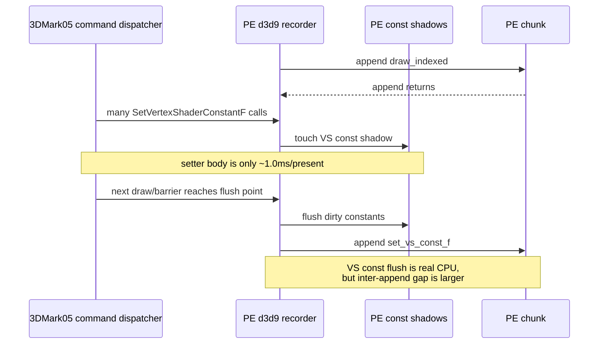
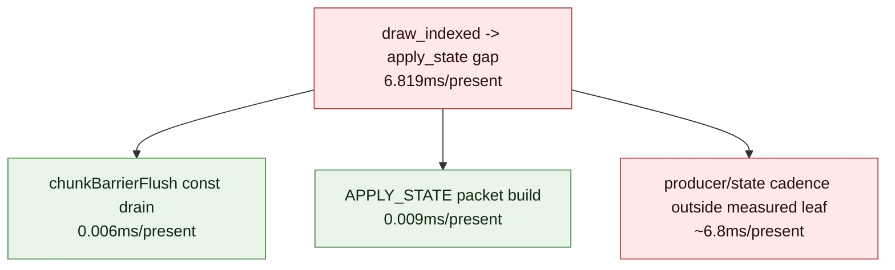

# Present Pacing 60 - Const And Apply-State Leaf Split Lowers The Inter-Append Owner

> **Outdated — every artifact this leaf cites in `source:` is gone from disk.** The numbers below cannot be re-derived or re-checked. Kept as history; do not cite it as current evidence.

## Question

[present-pacing-pe-inter-append-pairs.59](present-pacing-pe-inter-append-pairs.59.md) showed that active PE chunk fill is
dominated by `draw_indexed -> set_vs_const_f` and
`draw_indexed -> apply_state`. This run asks whether those gaps are actually
inside dxmt9's PE setter/flush/build code, or whether they mostly sit outside
the appendable-record leaf work.

The instrumentation extends `DXMT9_PE_RECORDER_STATS=1` with flat counters for:

- VS/PS float constant setter call CPU and register counts.
- Constant flush CPU, record counts, and register counts, split for VS/PS float
  constants.
- `chunkBarrierFlush()` constant-drain CPU.
- APPLY_STATE packet build CPU before the append.

## Verdict

Accepted. The rank-1 and rank-2 inter-append gaps are not primarily explained
by the immediate PE leaf bodies that materialize the next record.

| Pair / leaf | ms/present |
|---|---:|
| `draw_indexed -> set_vs_const_f` inter-append gap | `14.019` |
| `SetVertexShaderConstantF` PE function body | `1.000` |
| VS float const flush CPU, inclusive of appending records | `3.866` |
| `draw_indexed -> set_ps_const_f` inter-append gap | `2.588` |
| `SetPixelShaderConstantF` PE function body | `0.263` |
| PS float const flush CPU, inclusive of appending records | `1.441` |
| `draw_indexed -> apply_state` inter-append gap | `6.819` |
| `chunkBarrierFlush()` const drain | `0.006` |
| APPLY_STATE packet build | `0.009` |

This lowers the earlier "dirty-span/flush materialization" hypothesis. Const
flush itself is still a real local CPU bucket (`5.307ms/present` inclusive),
but the *inter-append gap* is mostly producer cadence and deferred state/const
preparation between appendable records, not the setter function body or
APPLY_STATE packet build.

## Run

```sh
DXMT9_PE_RECORDER_STATS=1 DXMT_LOG_LEVEL=info \
bash scripts/tools/run_3dmark05_perf_probe.sh \
  --suffix noenqueue-pe-const-apply-split-r1-20260616 \
  --no-gputrace \
  --no-encoder-breakdown \
  --frame-sampling \
  --timeout 120 \
  --capture-delay-sec 45 \
  --wait-unlocked-sec 1 \
  --wait-unlocked-interval-sec 1 \
  --min-free-mb 256
```

The run timeout-finalized with complete artifacts: `status=pass`,
`timed_out=True`, `capture_error=None`, and `present_encoded=1,620`. Use it as a
PE no-gputrace attribution scout, not as a GPU-counter or Xcode proof.

## Results

| Metric | Value |
|---|---:|
| `present_encoded` | `1,620` |
| `completion_wait_without_enqueue_ms_per_present` | `27.216` |
| `commit_chunk_replay_cpu_ms_per_present` | `7.915` |
| `encode_chunk_cpu_ms_per_present` | `11.184` |
| `chunkInterAppendGapMs` | `47,719.954` |
| inter-append gap | `29.457ms/present` |
| `recordAppendNoFlushCpuMs` | `4,162.533` |
| no-flush append CPU | `2.569ms/present` |

Top inter-append pairs in the same run:

| Rank | Pair | Total ms | ms/present | Share |
|---:|---|---:|---:|---:|
| 1 | `draw_indexed -> set_vs_const_f` | `22,710.511` | `14.019` | `47.59%` |
| 2 | `draw_indexed -> apply_state` | `11,046.279` | `6.819` | `23.15%` |
| 3 | `draw_indexed -> draw_indexed` | `6,995.132` | `4.318` | `14.66%` |
| 4 | `draw_indexed -> set_ps_const_f` | `4,191.793` | `2.588` | `8.78%` |

Const and state leaf split:

| Counter | Total | Per present |
|---|---:|---:|
| `vsConstFSetterCalls` | `6,785,283` | `4,188.446` |
| `vsConstFSetterRegs` | `19,881,601` | `12,272.593` |
| `vsConstFSetterCpuMs` | `1,619.730` | `1.000ms` |
| `psConstFSetterCalls` | `2,155,681` | `1,330.667` |
| `psConstFSetterRegs` | `2,314,285` | `1,428.571` |
| `psConstFSetterCpuMs` | `425.955` | `0.263ms` |
| `constFlushCalls` | `1,039,473` | `641.650` |
| `constFlushRecords` | `1,039,473` | `641.650` |
| `constFlushRegs` | `23,446,292` | `14,473.020` |
| `constFlushCpuMs` | `8,596.588` | `5.307ms` |
| `vsConstFFlushRecords` | `751,592` | `463.946` |
| `vsConstFFlushRegs` | `22,732,478` | `14,032.394` |
| `vsConstFFlushCpuMs` | `6,262.166` | `3.866ms` |
| `psConstFFlushRecords` | `287,881` | `177.704` |
| `psConstFFlushRegs` | `713,814` | `440.626` |
| `psConstFFlushCpuMs` | `2,334.422` | `1.441ms` |
| `chunkBarrierFlushCalls` | `15,550` | `9.599` |
| `chunkBarrierConstCpuMs` | `10.370` | `0.006ms` |
| `applyStateBuildCalls` | `7,216` | `4.454` |
| `applyStateBuildCpuMs` | `15.220` | `0.009ms` |

## Interpretation





The APPLY_STATE packet path is not the rank-2 owner: `buildDrawPrimitivePacket`
for APPLY_STATE is below `0.01ms/present`. The remaining wall time likely sits
in app command cadence plus earlier state setter work before the barrier becomes
appendable.

For constants, the setter body is too small to explain the rank-1 gap. The
inclusive const flush bucket is larger and should still be cleaned up where it
overlaps append/replay CPU, but it must not be equated with the pre-append gap:
`constFlushCpuMs` includes the append path after the inter-append timer has
already stopped.

## Decision

| Candidate | Updated priority |
|---|---|
| APPLY_STATE packet build optimization | low; measured at `0.009ms/present` |
| `chunkBarrierFlush()` const-drain optimization | low for apply-state gap; measured at `0.006ms/present` |
| Constant setter body optimization | secondary; VS+PS setters total `1.263ms/present` |
| Constant flush/append CPU cleanup | real local bucket (`5.307ms/present` inclusive), but not enough to explain the inter-append wall gap alone |
| Earlier useful publish / producer run-ahead | still high; it can hide or overlap the producer cadence that remains outside the measured leaf bodies |
| State setter/cadence attribution | next no-gputrace target if we want to explain the `apply_state` gap without a larger architecture change |

Next proof should either:

1. split hot-state setter CPU by setter family before `apply_state`, or
2. prototype a run-ahead/early-publish design that turns the post-draw const and
   state producer cadence into overlap while preserving H57 command-buffer,
   render-pass, and tile-preservation gates.

Do not spend another `.gputrace` on this CPU-only split.
