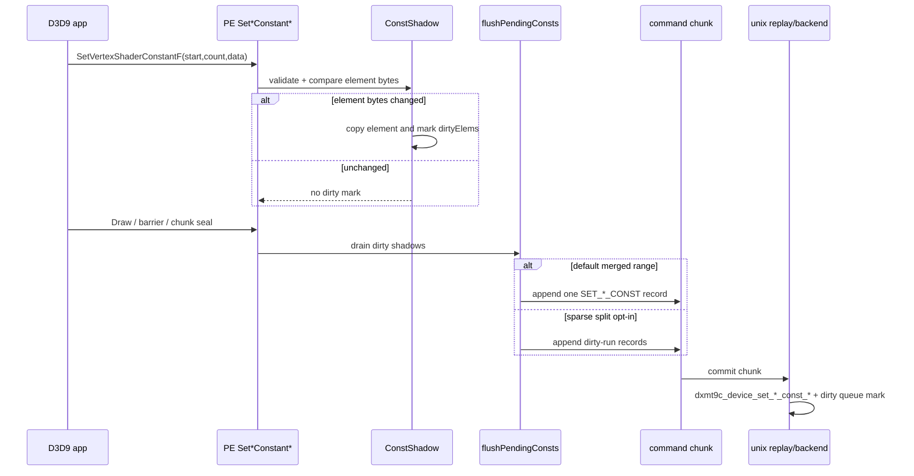

# Present Pacing / PE Const Setter And Flush Source Audit 120

**Question.** H119 shows `SetVertexShaderConstantF` body time is the largest
exact call-name row inside the current focused between-calls windows, and
PE const flush remains a visible local CPU bucket. Is there an obvious safe
constant-setter or constant-flush shortcut to implement before returning to
P4/replay/encode work?

**Answer.** No new safe shortcut is proven by the current evidence. The PE
constant shadow already compares per element and marks only changed registers
dirty. Unchanged setter calls still cost validation, comparison, and PE call
overhead, but they do not create dirty flush records. The historical broad
merged-range flush can be split by `DXMT9_SPLIT_SPARSE_CONST_RECORDS`, and H151
already proved that this makes VS float records exact while failing the current
FPS/P4 gate. Treat constant traffic as bounded local attribution unless a new
candidate moves `completion_wait_without_enqueue`, `completion_wait_with_enqueue`,
or serial replay/encode rows while passing the `v0.0.3` visual-safe gate.

## Source Audit

`touchConstShadow()` owns the PE dirty decision:

| Step | Current behavior |
|---|---|
| capacity | grows `values` and `dirtyElems` to cover the requested range |
| equality | compares each element against the existing shadow bytes |
| changed element | copies only that element, sets `dirtyElems[start + i]`, and widens `dirtyStart/dirtyEnd` |
| unchanged call | returns without marking dirty |

`flushConstShadow()` then emits records only when `shadow.dirty()` is true:

| Mode | Behavior | Status |
|---|---|---|
| default | emit one merged min/max dirty range per stage/type | current default |
| `DXMT9_SPLIT_SPARSE_CONST_RECORDS=1` | collect dirty runs and emit one record per contiguous changed run | diagnostic-only after H151 |

The replay path is normal command-record replay. `D9C_COMMAND_RECORD_SET_*_CONST_*`
records call the corresponding `dxmt9c_device_set_*_const_*()` entry and mark
the backend dirty-constant queue.

## Current Evidence

H119 body-time counters keep child getter fast paths demoted and bound the
setter body:

| Row | CPU / present | Reading |
|---|---:|---|
| `draw_indexed -> set_vs_const_f` / `SetVertexShaderConstantF` | `2.057ms` | measurable local setter body |
| `draw_indexed -> set_vs_const_f` / `IndexBuffer::GetDesc` | `0.213ms` | high-frequency marker, not an owner |
| `draw_indexed -> apply_state` / `Surface::GetDesc` | `0.001ms` | getter body rejected |

The same h206 run still has the current frame owner shape:

| Metric | Value / present |
|---|---:|
| `completion_wait_without_enqueue_ms` | `28.089` |
| `completion_wait_with_enqueue_ms` | `0.000` |
| `commit_chunk_replay_cpu_ms` | `8.032` |
| `encode_chunk_cpu_ms` | `10.975` |

H150/H151 already tested the relevant const-width branch under the corrected
`v0.0.3` visual-safety anchor:

| Evidence | Reading |
|---|---|
| app calls are mostly small, flush records can be wide | PE dirty-span merging is real attribution |
| sparse split makes flush width exact | mechanism proved |
| sparse split raises record count and leaves backend/P4 flat or worse | not a current FPS lever |

## Decision

Do not add a default constant setter no-op guard or another sparse flush
implementation now. The no-op dirty-record guard already exists at the shadow
element level, and the known sparse-width implementation is diagnostic-only.
The next implementation should instead target one of:

| Target | Required promotion proof |
|---|---|
| record-cadence reduction | lower `commit entry -> publish`, replay, or snapshot without visual regression |
| locality-preserving overlap carrier | raise completion wait with enqueue or lower no-enqueue wait without adding command buffers/render-pass/tile traffic |
| larger encode/replay structural cleanup | move wall-clock or P4 rows, not only a local child timer |

Any mutating candidate remains gated by the `v0.0.3` GT1 visual-safe anchor.
