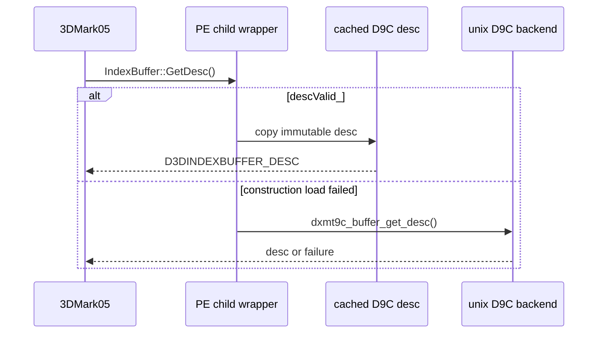
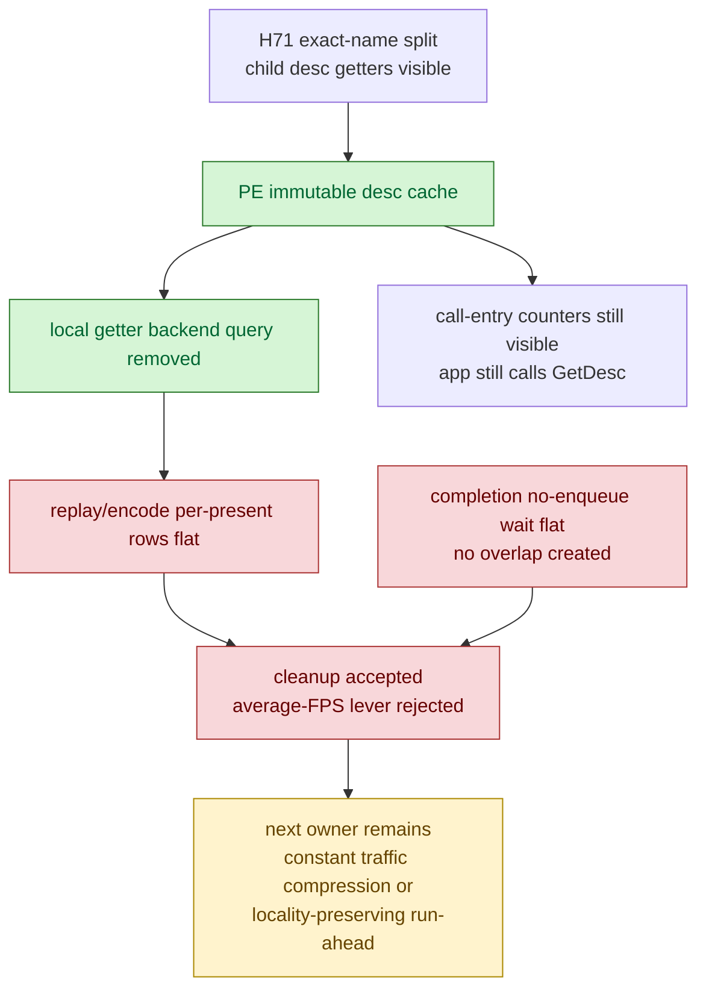

# Present Pacing 67 - PE Child Desc Cache Is A Cleanup, Not The Current FPS Lever

> **Outdated — every artifact this leaf cites in `source:` is gone from disk.** The numbers below cannot be re-derived or re-checked. Kept as history; do not cite it as current evidence.

## Question

[present-pacing-pe-between-call-name.66](present-pacing-pe-between-call-name.66.md) identified repeated child desc
getters inside the focused between-calls windows:

- `IndexBuffer::GetDesc` appears at `902.976` entries/present in
  `draw_indexed -> set_vs_const_f`.
- `IndexBuffer::GetDesc` leads `draw_indexed -> draw_indexed` at `374.757`
  entries/present.
- `Surface::GetDesc` appears with `SetRenderTarget` in
  `draw_indexed -> apply_state`.

Buffer and surface descriptions are immutable after creation, so this test
implements PE wrapper-side desc caching and checks whether removing repeated
backend desc queries moves the serialized P2/P3/P4 rows.

## Implementation

`D3D9VertexBufferImpl`, `D3D9IndexBufferImpl`, and `D3D9SurfaceImpl` now load
their D9C desc once at wrapper construction and reuse it for:

- public `GetDesc()`;
- default-pool tracking;
- `SetPriority()` pool policy;
- lock bounds/default-pool validation;
- user-memory surface `GetDC()` sizing.

The fallback path still queries the backend if the construction-time desc load
failed. The change removes repeated bridge desc queries from normal hot
getters, but it does not change application call-entry counts: the app still
calls `GetDesc()`, and PE recorder stats count those entries.



## Run

```sh
DXMT9_PE_RECORDER_STATS=1 DXMT_LOG_LEVEL=info \
bash scripts/tools/run_3dmark05_perf_probe.sh \
  --suffix noenqueue-pe-desc-cache-r1-20260616 \
  --no-gputrace \
  --no-encoder-breakdown \
  --frame-sampling \
  --timeout 120 \
  --capture-delay-sec 45 \
  --wait-unlocked-sec 1 \
  --wait-unlocked-interval-sec 1 \
  --min-free-mb 256
```

The run completed normally: `status=pass`, `timed_out=false`,
`returncode=0`, `capture_error=None`, `present_encoded=1,472`, and a normal
GT1 frame was captured. Raw logs were compressed after summary generation.

## Results

Same-shape comparison against
`app-d3d9-3dmark05-noenqueue-pe-between-call-name-child-r1-20260616`:

| Metric | H71 baseline | Desc cache | Direction |
|---|---:|---:|---:|
| `present_encoded` | `1,440` | `1,472` | longer run |
| `gpu_command_buffer_time_ms/present` | `3.043` | `3.059` | flat |
| `completion_wait_without_enqueue_ms/present` | `27.326` | `27.472` | flat |
| `commit_chunk_replay_cpu_ms/present` | `7.887` | `7.871` | flat |
| `encode_chunk_cpu_ms/present` | `10.959` | `11.020` | flat |
| `completion_wait_with_enqueue_ms/present` | `0.000` | `0.000` | unchanged |

Focused between-calls rows:

| Pair | H71 ms/present | Desc-cache ms/present | Getter row movement |
|---|---:|---:|---|
| `draw_indexed -> set_vs_const_f` | `15.912` | `15.345` | `IndexBuffer::GetDesc` entries/present `902.976 -> 886.175` |
| `draw_indexed -> draw_indexed` | `3.873` | `3.669` | `IndexBuffer::GetDesc` entries/present `374.757 -> 368.268` |
| `draw_indexed -> apply_state` | `6.839` | `6.772` | `Surface::GetDesc` entries/present `2.903 -> 2.856` |

The local focused rows move slightly in the right direction, but the aggregate
P2/P3/P4 counters do not. The small row movement is not enough to promote this
as an average-FPS lever.

## Interpretation



This result narrows H71 rather than invalidating it. Exact-name attribution was
useful because it found a real cleanup, but desc getter backend work is not the
current average-FPS owner. The remaining large rows are still dominated by
constant/state producer cadence and the under-pipelined no-enqueue path.

## Decision

| Candidate | Decision |
|---|---|
| PE buffer/surface desc cache | keep as correctness-preserving local cleanup |
| Child getter body as average-FPS owner | reject for current GT1 |
| Child getter call-entry counts | do not use as proof of backend query cost after this change |
| Constant traffic compression | remains high-priority |
| Locality-preserving run-ahead / overlap design | remains high-priority |

Do not spend Xcode `.gputrace` on PE desc caching alone. Future no-gputrace
work should target larger P2/P3 rows or prove P4 overlap while preserving
command-buffer, render-pass, and tile-preservation shape.
