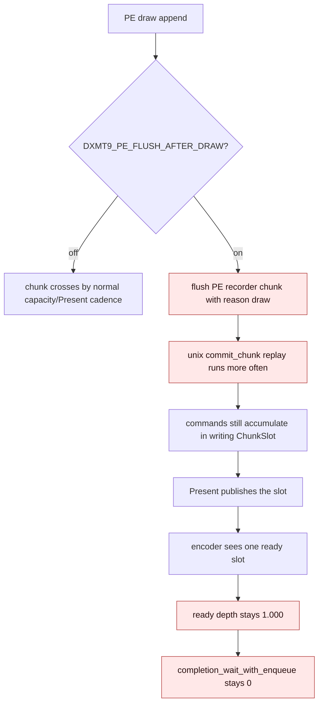

# Present Pacing / PE Flush After Draw Diagnostic 114

**Question.** H113 says most of the exposed pre-publish window is inter-replay
producer gap. If the PE recorder flushes after every draw record, can unix replay
start earlier and create useful completion/encode overlap without touching the
Metal pass carrier?

**Answer.** No. `DXMT9_PE_FLUSH_AFTER_DRAW=1` creates many more PE chunk
crossings and `commit_chunk` replay entries, but it does not create queue-ready
backlog or enqueue work during Metal completion waits. The queue still publishes
one Present-bearing slot per present, `encode_ready_depth_avg` remains `1.000`,
and `completion_wait_with_enqueue` remains `0`.

The apparent per-present completion-wait decrease is not promotable: the
candidate has much lower progress in the same supervised run shape
(`present_encoded` `1140 -> 816`), increases replay/snapshot/encode CPU, and
expands the no-enqueue before-publish closure. Treat this knob as a negative
diagnostic only. It confirms that merely crossing the PE/unix boundary after
draws is not enough; a real P4 fix must either publish/encode with render-pass
locality preserved or reduce the producer/replay cadence directly.

Any future claim from this family still needs the `v0.0.3` visual-safe anchor.
Gross screenshots from these time-based runs are sanity checks, not pixel
oracles.

## Implementation

The diagnostic knob is deliberately off by default:

| Runtime knob | Meaning |
|---|---|
| `DXMT9_PE_FLUSH_AFTER_DRAW=1` | after each successful PE draw record append, flush the PE recorder chunk with reason `draw` |

The draw flush happens after the draw record has been appended. For UP draws, the
UP copy record is appended first, then the diagnostic flush runs. This avoids
reordering the copied data ahead of the draw.

This is not a queue publish reason. The queue-side publish reason remains
`present` because the replayed chunks are still accumulated into the writing
slot until the Present command publishes that slot.

## Run

Control:

```sh
DXMT9_PE_RECORDER_STATS=1 DXMT_LOG_LEVEL=info \
bash scripts/tools/run_3dmark05_perf_probe.sh \
  --suffix h201-pe-drawflush-control-r1 \
  --no-gputrace \
  --no-encoder-breakdown \
  --frame-sampling \
  --timeout 120 \
  --keep-frontmost \
  --wait-unlocked-sec 1 \
  --wait-unlocked-interval-sec 1
```

Candidate:

```sh
DXMT9_PE_RECORDER_STATS=1 DXMT_LOG_LEVEL=info DXMT9_PE_FLUSH_AFTER_DRAW=1 \
bash scripts/tools/run_3dmark05_perf_probe.sh \
  --suffix h201-pe-drawflush-candidate-r1 \
  --no-gputrace \
  --no-encoder-breakdown \
  --frame-sampling \
  --timeout 120 \
  --keep-frontmost \
  --wait-unlocked-sec 1 \
  --wait-unlocked-interval-sec 1
```

Both runs report `status=pass`, `draw_skipped_no_pipeline=0`, and
`gpu_command_buffer_errors=0`.

## Result

| Metric | Control | Draw-flush | Direction |
|---|---:|---:|---|
| `present_encoded` | `1,140` | `816` | much less progress |
| `command_buffers_per_present` | `3.999` | `3.999` | flat |
| `sub_command_buffers_per_present` | `2.997` | `2.996` | flat |
| `encode_ready_depth_avg` | `1.000` | `1.000` | no backlog |
| `completion_wait_with_enqueue_ms_per_present` | `0.000` | `0.000` | no overlap |
| `completion_wait_without_enqueue_ms_per_present` | `25.585` | `21.493` | lower, but not promotable |
| `commit_chunk_replay_cpu_ms_per_present` | `10.231` | `17.323` | worse |
| `d3d9_snapshot_draw_submission_cpu_ms_per_present` | `3.988` | `6.278` | worse |
| `encode_chunk_cpu_ms_per_present` | `13.517` | `16.426` | worse |
| `no_enqueue_stage_commit_entry_to_publish_ms_per_present` | `46.674` | `83.348` | worse |
| `no_enqueue_before_publish_inter_replay_gap_ms_per_present` | `38.796` | `66.438` | worse |
| `no_enqueue_wait_to_next_enqueue_ms_per_present` | `69.836` | `113.103` | worse |
| `completion_wait_commit_chunk_entries_per_present` | `4.284` | `73.489` | PE crossings explode |
| `no_enqueue_before_publish_entries_per_present` | `19.716` | `643.422` | replay fragments explode |
| `chunk_publish_reason_present` | `1,140` | `816` | still Present-published |
| `chunk_publish_reason_flush` | `0` | `0` | no queue flush publish |

The key diagnostic contrast is:



## Decision

Reject `DXMT9_PE_FLUSH_AFTER_DRAW=1` as a P4/FPS lever. It proves that earlier
PE/unix crossings alone do not solve the missed-overlap problem. The missing
piece is not "more chunks"; it is either:

1. a render-pass-safe queue/backend carrier that can make pre-Present work
   encode-visible without fragmenting Metal render passes; or
2. a producer/replay cadence reduction that lowers `commit entry -> publish` and
   `wait -> next enqueue` on the normal Present-published path.

Do not spend `.gputrace` on this diagnostic shape. It fails the no-gputrace P4
promotion gate before any GPU-counter question is relevant.
