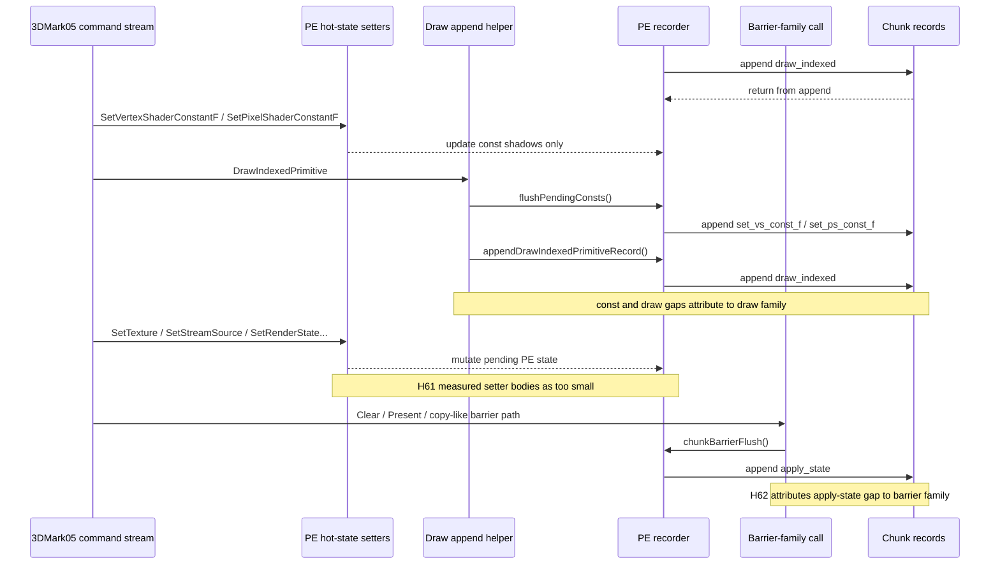
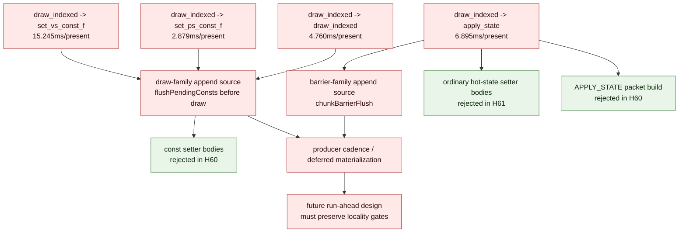

# Present Pacing 62 - Focused Inter-Append Call-Family Attribution Splits Draw Const Flush And Barrier Apply-State

## Question

[present-pacing-pe-hotsetter-split.61](present-pacing-pe-hotsetter-split.61.md) rejected immediate hot-state setter CPU
as the owner of the `draw_indexed -> apply_state` inter-append wall gap. The
next attribution question is which PE D3D9 call family is active when the next
appendable record is emitted for the focused pairs from
[present-pacing-pe-inter-append-pairs.59](present-pacing-pe-inter-append-pairs.59.md):

- `draw_indexed -> set_vs_const_f`
- `draw_indexed -> apply_state`
- `draw_indexed -> draw_indexed`
- `draw_indexed -> set_ps_const_f`

## Verdict

Accepted as an attribution refinement and a tooling fix. The focused
inter-append gaps now split cleanly by internal append source:

- `draw_indexed -> set_vs_const_f = 15.245ms/present`, attributed to the `draw`
  append family
- `draw_indexed -> apply_state = 6.895ms/present`, attributed to the `barrier`
  append family
- `draw_indexed -> draw_indexed = 4.760ms/present`, attributed to the `draw`
  append family
- `draw_indexed -> set_ps_const_f = 2.879ms/present`, mostly attributed to the
  `draw` append family with a small `barrier` tail

This means the VS/PS const rows are not expensive setter calls themselves.
They are deferred const-shadow flushes emitted immediately before later draw
records. The APPLY_STATE row is not an expensive setter or packet build either;
it is pending hot-state materialization when a later barrier path forces state
into the chunk.

The first run exposed a tooling problem: the long `pe_recorder_stats` line
truncated tail fields and the D3D9 entry-call name alone left several rows as
`unknown`. The code now emits a shorter `pe_recorder_gap_call_stats` line and
adds an attribution-only append-family scope around draw and barrier helpers.
The r3 rerun confirms the fix.

## Run

```sh
DXMT9_PE_RECORDER_STATS=1 DXMT_LOG_LEVEL=info \
bash scripts/tools/run_3dmark05_perf_probe.sh \
  --suffix noenqueue-pe-gap-callfamily-r3-20260616 \
  --no-gputrace \
  --no-encoder-breakdown \
  --frame-sampling \
  --timeout 120 \
  --capture-delay-sec 45 \
  --wait-unlocked-sec 1 \
  --wait-unlocked-interval-sec 1 \
  --min-free-mb 256
```

The run timeout-finalized with complete no-gputrace artifacts:
`status=pass`, `timed_out=True`, `capture_error=None`, and
`present_encoded=1,560`.

## Results

| Metric | Value |
|---|---:|
| `present_encoded` | `1,560` |
| `gpu_command_buffer_time_ms_per_present` | `2.993` |
| `completion_wait_without_enqueue_ms_per_present` | `28.754` |
| `commit_chunk_replay_cpu_ms_per_present` | `8.094` |
| `encode_chunk_cpu_ms_per_present` | `11.193` |
| `chunkInterAppendGapMs` | `49,176.133` |
| inter-append gap | `31.523ms/present` |
| wait -> next enqueue | `40.074ms/present` |
| commit entry -> publish | `22.139ms/present` |
| encode dequeue -> command buffer commit | `13.060ms/present` |

Focused inter-append pair attribution from the run:

| Pair | Pair ms/present | Rank | Call family | Samples | Total ms | ms/present | Max ms |
|---|---:|---:|---|---:|---:|---:|---:|
| `draw_indexed -> set_vs_const_f` | `15.245` | `1` | `draw` | `711,501` | `23,782.655` | `15.245` | `57.440` |
| `draw_indexed -> apply_state` | `6.895` | `1` | `barrier` | `4,596` | `10,756.274` | `6.895` | `30.897` |
| `draw_indexed -> draw_indexed` | `4.760` | `1` | `draw` | `296,176` | `7,424.907` | `4.760` | `3.288` |
| `draw_indexed -> set_ps_const_f` | `2.879` | `1` | `draw` | `127,412` | `4,394.600` | `2.817` | `12.022` |
| `draw_indexed -> set_ps_const_f` | `2.879` | `2` | `barrier` | `736` | `95.870` | `0.061` | `0.264` |

## Interpretation





## Tooling Fix

The r1/r2 runs produced useful partial attribution but also showed two holes in
the logger:

1. The single `pe_recorder_stats` line can exceed the practical line length for
   downstream parsing, truncating later call-family fields.
2. Some append-producing methods intentionally bypass
   `notePeDeviceCallAfterPresent()` because that helper also records
   after-Present cadence milestones. Those methods still need a current-call
   name for inter-append attribution.
3. D3D9 entry-call names alone do not tell whether a deferred const record was
   emitted by a draw helper or a barrier helper.

The follow-up code fix keeps the milestone semantics unchanged and only changes
attribution surfaces:

- add an attribution-only `dxmt9PeSetCurrentCallName()` helper
- use it from `Present`, `Reset`, `UpdateSurface`, `UpdateTexture`,
  `GetRenderTargetData`, `StretchRect`, `ColorFill`, `PresentEx`, and `ResetEx`
- classify `PresentEx` and `ResetEx` as `scene_present`
- add an append-family scope around draw helpers and `chunkBarrierFlush()`
- emit a short `pe_recorder_gap_call_stats` line that repeats only focused
  gap call-family fields
- parse both `pe_recorder_stats` and `pe_recorder_gap_call_stats` in
  `run_experiment.py`

The r3 run validates the fix: the top rows are no longer semantically
`unknown`, and the short `pe_recorder_gap_call_stats` line preserves the tail
fields.

## Decision

| Candidate | Updated priority |
|---|---|
| Broad hot-state setter body micro-optimization | low; H61 measured it as too small |
| APPLY_STATE packet build micro-optimization | low; H60 measured it as too small |
| Const setter body micro-optimization | low as FPS owner; H60 measured setter bodies as too small |
| Draw-side const-shadow flush/materialization | high local CPU attribution; owns `set_vs_const_f` / most `set_ps_const_f` inter-append rows |
| Barrier-path pending-state materialization | high local attribution; owns the `apply_state` inter-append row |
| Another `.gputrace` for this CPU-only attribution | low; use no-gputrace first while disk is constrained |
| Run-ahead / earlier useful publish preserving H57 locality gates | high; still the FPS-facing design target |

Do not spend Xcode budget on this attribution by itself. The next code-facing
candidate should either reduce draw-side const flush/materialization enough to
move P2/P3/P4 gates, or change run-ahead/publish architecture without increasing
command buffers, render passes, or tile-preservation traffic.
