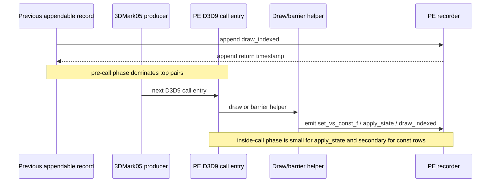
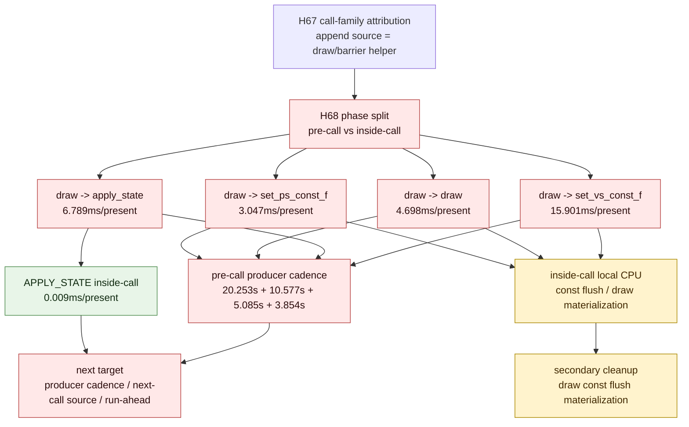

# Present Pacing 63 - Focused Inter-Append Phase Split Moves Top Gaps To Pre-Call Producer Cadence

> **Outdated — every artifact this leaf cites in `source:` is gone from disk.** The numbers below cannot be re-derived or re-checked. Kept as history; do not cite it as current evidence.

## Question

[present-pacing-pe-gap-callfamily.62](present-pacing-pe-gap-callfamily.62.md) proved which append helper emits each
focused inter-append pair, but it still left one important ambiguity: is the
wall time inside the next D3D9 call/helper, or before that call is even entered?

The phase split divides each focused gap at the next PE D3D9 call entry:

- `pre-call`: previous append return -> next PE D3D9 call entry
- `inside-call`: next PE D3D9 call entry -> next append entry

## Verdict

Accepted as an attribution refinement. The top focused gaps are mostly
`pre-call`, not helper body time:

- `draw_indexed -> set_vs_const_f`: `15.901ms/present`, with
  `12.983ms/present` pre-call and `2.918ms/present` inside-call
- `draw_indexed -> apply_state`: `6.789ms/present`, with
  `6.780ms/present` pre-call and only `0.009ms/present` inside-call
- `draw_indexed -> draw_indexed`: `4.698ms/present`, with
  `3.259ms/present` pre-call and `1.439ms/present` inside-call
- `draw_indexed -> set_ps_const_f`: `3.047ms/present`, with
  `2.471ms/present` pre-call and `0.577ms/present` inside-call

This weakens the H62 wording that the owner is primarily draw-side const flush
or barrier-side APPLY_STATE materialization. Those helpers are still the
append source, but most wall time has already elapsed before the app enters the
next PE call that triggers the append. The immediate next target is producer
cadence / next-call formation / run-ahead, with draw const flush as a smaller
secondary local CPU bucket.

## Run

```sh
DXMT9_PE_RECORDER_STATS=1 DXMT_LOG_LEVEL=info \
bash scripts/tools/run_3dmark05_perf_probe.sh \
  --suffix noenqueue-pe-gap-phase-split-r1-20260616 \
  --no-gputrace \
  --no-encoder-breakdown \
  --frame-sampling \
  --timeout 120 \
  --capture-delay-sec 45 \
  --wait-unlocked-sec 1 \
  --wait-unlocked-interval-sec 1 \
  --min-free-mb 256
```

The run timeout-finalized with complete no-gputrace artifacts:
`status=pass`, `capture_error=None`, and `present_encoded=1,560`.

## Results

| Metric | Value |
|---|---:|
| `present_encoded` | `1,560` |
| `sampled_avg_fps` | `14.418` |
| `gpu_command_buffer_time_ms_per_present` | `3.066` |
| `completion_wait_without_enqueue_ms_per_present` | `27.215` |
| `commit_chunk_replay_cpu_ms_per_present` | `7.886` |
| `encode_chunk_cpu_ms_per_present` | `11.112` |
| wait -> next enqueue p50 | `26.717ms` |
| commit entry -> publish p50 | `12.647ms` |
| encode dequeue -> command buffer commit p50 | `12.753ms` |

Focused inter-append call-family attribution:

| Pair | Pair ms/present | Rank | Call family | Samples | Total ms | ms/present | Max ms |
|---|---:|---:|---|---:|---:|---:|---:|
| `draw_indexed -> set_vs_const_f` | `15.901` | `1` | `draw` | `699,973` | `24,805.584` | `15.901` | `56.728` |
| `draw_indexed -> apply_state` | `6.789` | `1` | `barrier` | `4,513` | `10,591.463` | `6.789` | `31.356` |
| `draw_indexed -> draw_indexed` | `4.698` | `1` | `draw` | `291,962` | `7,329.355` | `4.698` | `6.047` |
| `draw_indexed -> set_ps_const_f` | `3.047` | `1` | `draw` | `127,197` | `4,658.596` | `2.986` | `10.787` |
| `draw_indexed -> set_ps_const_f` | `3.047` | `2` | `barrier` | `727` | `95.030` | `0.061` | `0.305` |

Focused phase split:

| Pair | Samples | Pre-call ms/present | Inside-call ms/present | Pre-call share | Inside-call share | Pre max ms | Inside max ms |
|---|---:|---:|---:|---:|---:|---:|---:|
| `draw_indexed -> set_vs_const_f` | `699,973` | `12.983` | `2.918` | `81.65%` | `18.35%` | `56.697` | `2.935` |
| `draw_indexed -> apply_state` | `4,513` | `6.780` | `0.009` | `99.87%` | `0.13%` | `31.349` | `0.029` |
| `draw_indexed -> draw_indexed` | `291,962` | `3.259` | `1.439` | `69.38%` | `30.62%` | `2.355` | `5.983` |
| `draw_indexed -> set_ps_const_f` | `127,924` | `2.471` | `0.577` | `81.08%` | `18.92%` | `10.770` | `0.603` |

## Interpretation





## Decision

| Candidate | Updated priority |
|---|---|
| APPLY_STATE packet build | very low; inside-call is `0.009ms/present` for the focused apply-state row |
| Broad barrier helper optimization | low as a primary owner; H68 shows the apply-state pair is almost entirely pre-call |
| Draw const flush/materialization | medium; `set_vs_const_f` still has `2.918ms/present` inside-call and `set_ps_const_f` has `0.577ms/present`, but this is not the dominant wall gap |
| Producer cadence / next-call source | high; most focused pair wall time is pre-call |
| Run-ahead / earlier useful publish preserving H57 locality gates | high; still the FPS-facing design target |

The next no-gputrace probe should identify why the producer spends the pre-call
phase before the next D3D9 call, or prove an architecture that overlaps that
phase without adding command buffers, render passes, or tile-preservation
traffic.
