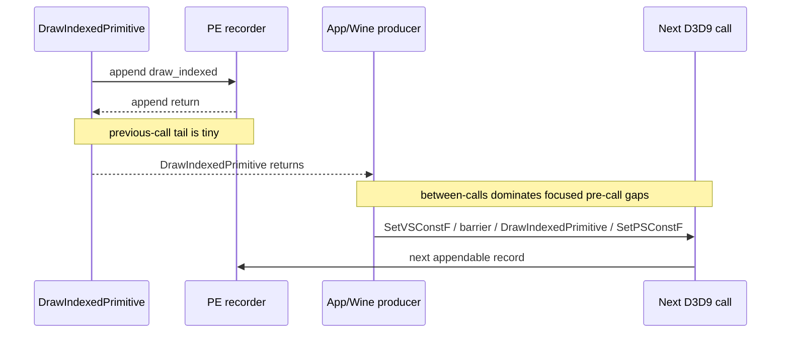
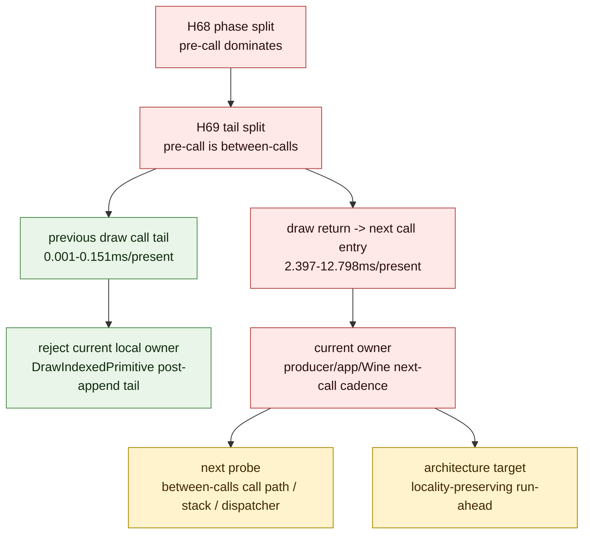

# Present Pacing 64 - Focused Pre-Call Tail Split Proves Gap Is Between D3D9 Calls

## Question

[[present-pacing-pe-gap-phase-split.63]] showed that the focused
inter-append gaps are mostly `pre-call`: time after the previous append returns
and before the next PE D3D9 call enters. That still mixed two different
domains:

- previous call tail: previous append return -> previous draw call return
- between-calls: previous draw call return -> next PE D3D9 call entry

If previous call tail dominated, the next local target would still be
`DrawIndexedPrimitive` cleanup after append. If between-calls dominated, the
owner is producer/app/Wine cadence before the next D3D9 call.

## Verdict

Accepted as an attribution refinement. The pre-call phase is almost entirely
between D3D9 calls, not previous draw-call tail:

- `draw_indexed -> set_vs_const_f`: `12.949ms/present` pre-call splits into
  `0.151ms/present` previous-call tail and `12.798ms/present` between-calls
- `draw_indexed -> apply_state`: `6.790ms/present` pre-call splits into
  `0.001ms/present` previous-call tail and `6.789ms/present` between-calls
- `draw_indexed -> draw_indexed`: `3.285ms/present` pre-call splits into
  `0.055ms/present` previous-call tail and `3.230ms/present` between-calls
- `draw_indexed -> set_ps_const_f`: `2.415ms/present` pre-call splits into
  `0.018ms/present` previous-call tail and `2.397ms/present` between-calls

This rejects `DrawIndexedPrimitive` post-append tail as the current owner. The
remaining owner is now the gap after a draw returns and before the app/Wine
stack enters the next D3D9 call. The next useful probe should identify the
between-calls producer path or prove an overlap/run-ahead design that hides it
without extra command buffers, render passes, or tile preservation.

## Run

```sh
DXMT9_PE_RECORDER_STATS=1 DXMT_LOG_LEVEL=info \
bash scripts/tools/run_3dmark05_perf_probe.sh \
  --suffix noenqueue-pe-gap-tail-split-r1-20260616 \
  --no-gputrace \
  --no-encoder-breakdown \
  --frame-sampling \
  --timeout 120 \
  --capture-delay-sec 45 \
  --wait-unlocked-sec 1 \
  --wait-unlocked-interval-sec 1 \
  --min-free-mb 256
```

The run completed with no-gputrace artifacts:
`status=pass`, `timed_out=False`, `capture_error=None`, and
`present_encoded=1,559`. Logs were compressed after summarization because disk
space was constrained.

## Results

| Metric | Value |
|---|---:|
| `present_encoded` | `1,559` |
| `gpu_command_buffer_time_ms_per_present` | `2.949` |
| `completion_wait_without_enqueue_ms_per_present` | `29.148` |
| `commit_chunk_replay_cpu_ms_per_present` | `8.067` |
| `encode_chunk_cpu_ms_per_present` | `11.210` |

Focused call-family rows stayed consistent with H62/H63:

| Pair | Pair ms/present | Top call family | Samples | Top ms/present |
|---|---:|---|---:|---:|
| `draw_indexed -> set_vs_const_f` | `15.848` | `draw` | `693,331` | `15.848` |
| `draw_indexed -> apply_state` | `6.799` | `barrier` | `4,490` | `6.799` |
| `draw_indexed -> draw_indexed` | `4.716` | `draw` | `288,790` | `4.716` |
| `draw_indexed -> set_ps_const_f` | `2.982` | `draw` | `123,841` | `2.920` |

Focused pre-call tail split:

| Pair | Samples | Pre-call ms/present | Prev-call-tail ms/present | Between-calls ms/present | Tail share | Between share |
|---|---:|---:|---:|---:|---:|---:|
| `draw_indexed -> set_vs_const_f` | `693,331` | `12.949` | `0.151` | `12.798` | `1.17%` | `98.83%` |
| `draw_indexed -> apply_state` | `4,490` | `6.790` | `0.001` | `6.789` | `0.01%` | `99.99%` |
| `draw_indexed -> draw_indexed` | `288,790` | `3.285` | `0.055` | `3.230` | `1.68%` | `98.32%` |
| `draw_indexed -> set_ps_const_f` | `124,557` | `2.415` | `0.018` | `2.397` | `0.74%` | `99.26%` |

## Interpretation





## Decision

| Candidate | Updated priority |
|---|---|
| `DrawIndexedPrimitive` post-append cleanup | low; focused tail shares are only `0.01-1.68%` |
| Draw const flush/materialization | secondary; it remains inside-call CPU but not the dominant pre-call owner |
| Barrier/helper-body optimization | very low; `apply_state` tail and inside-call are both tiny |
| Between-calls producer path | high; this is now the dominant focused owner |
| Locality-preserving run-ahead | high; still the average-FPS architecture target |

The next measurement should attach a stack or caller classification to the
between-calls interval itself. A useful positive result would name the app/Wine
dispatcher path responsible for `draw return -> next call entry`, or show that
dxmt9 can overlap replay/encode while this interval happens without failing the
H57 command-buffer/render-pass/tile-preservation gates.
