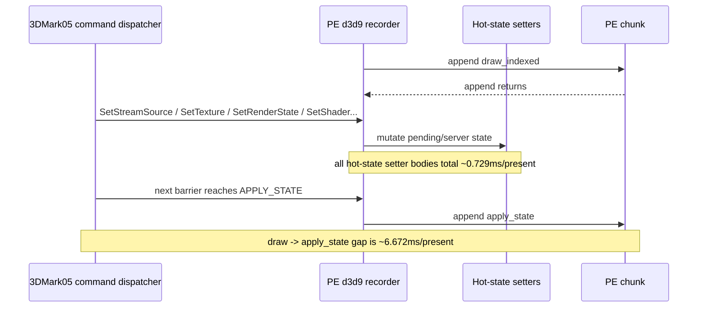
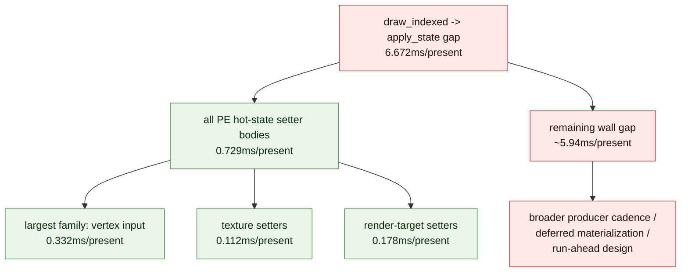

# Present Pacing 61 - Hot-State Setter Family Split Rejects Immediate Setter CPU As Apply-State Gap Owner

> **Outdated — every artifact this leaf cites in `source:` is gone from disk.** The numbers below cannot be re-derived or re-checked. Kept as history; do not cite it as current evidence.

## Question

[present-pacing-pe-const-apply-split.60](present-pacing-pe-const-apply-split.60.md) rejected APPLY_STATE packet build and
`chunkBarrierFlush()` const drain as the direct owner of the
`draw_indexed -> apply_state` inter-append gap. The remaining narrow hypothesis
was that ordinary PE hot-state setters before the barrier were expensive enough
to explain most of that gap.

This run extends `DXMT9_PE_RECORDER_STATS=1` with call, dirty, total CPU, and
max CPU counters for hot-state setter families:

- render target, depth-stencil, viewport/scissor
- transform, material/light/clip, render state
- texture-stage/sampler, texture, vertex input, shader

## Verdict

Accepted as an attribution refinement. Immediate PE hot-state setter bodies do
not explain the `draw_indexed -> apply_state` wall gap.

The run records `draw_indexed -> apply_state = 6.672ms/present`, while all
hot-state setter families combined are only `0.729ms/present`. The largest
single family is vertex input at `0.332ms/present`; render-target setters are
`0.178ms/present`, texture setters are `0.112ms/present`, and shader setters
are `0.046ms/present`.

That makes the current apply-state gap a broader producer cadence / deferred
record materialization / run-ahead problem, not a micro-optimization target in
the direct setter function bodies.

## Run

```sh
DXMT9_PE_RECORDER_STATS=1 DXMT_LOG_LEVEL=info \
bash scripts/tools/run_3dmark05_perf_probe.sh \
  --suffix noenqueue-pe-hotsetter-split-r1-20260616 \
  --no-gputrace \
  --no-encoder-breakdown \
  --frame-sampling \
  --timeout 120 \
  --capture-delay-sec 45 \
  --wait-unlocked-sec 1 \
  --wait-unlocked-interval-sec 1 \
  --min-free-mb 256
```

The run timeout-finalized with complete no-gputrace artifacts:
`status=pass`, `timed_out=True`, `capture_error=None`, and
`present_encoded=1,620`.

## Results

| Metric | Value |
|---|---:|
| `present_encoded` | `1,620` |
| `gpu_command_buffer_time_ms_per_present` | `3.154` |
| `completion_wait_without_enqueue_ms_per_present` | `27.340` |
| `commit_chunk_replay_cpu_ms_per_present` | `7.924` |
| `encode_chunk_cpu_ms_per_present` | `11.117` |
| `chunkInterAppendGapMs` | `48,599.899` |
| inter-append gap | `30.000ms/present` |
| hot-state setter CPU, all families | `1,181.015ms` |
| hot-state setter CPU, all families per present | `0.729ms/present` |

Top inter-append pairs in the same run:

| Rank | Pair | Total ms | ms/present |
|---:|---|---:|---:|
| 1 | `draw_indexed -> set_vs_const_f` | `23,356.542` | `14.418` |
| 2 | `draw_indexed -> apply_state` | `10,808.920` | `6.672` |
| 3 | `draw_indexed -> draw_indexed` | `7,148.953` | `4.413` |
| 4 | `draw_indexed -> set_ps_const_f` | `4,469.750` | `2.759` |

Const/apply leaf counters stayed in the same band as H60:

| Counter | Total ms | ms/present |
|---|---:|---:|
| `vsConstFSetterCpuMs` | `1,620.236` | `1.000` |
| `psConstFSetterCpuMs` | `416.489` | `0.257` |
| `constFlushCpuMs` | `8,338.495` | `5.147` |
| `applyStateBuildCpuMs` | `15.597` | `0.010` |

Hot-state setter family split:

| Family | Calls | Dirty | Dirty ratio | Total ms | ms/present | Max ms |
|---|---:|---:|---:|---:|---:|---:|
| RenderTarget | `27,303` | `27,303` | `1.000` | `288.508` | `0.178` | `1.316` |
| DepthStencil | `15,804` | `15,804` | `1.000` | `26.276` | `0.016` | `0.040` |
| ViewportScissor | `14,835` | `7,184` | `0.484` | `4.396` | `0.003` | `0.009` |
| Transform | `9,774` | `3` | `0.000` | `4.045` | `0.002` | `0.072` |
| MaterialLightClip | `0` | `0` | `0.000` | `0.000` | `0.000` | `0.000` |
| RenderState | `79,914` | `79,914` | `1.000` | `22.170` | `0.014` | `0.046` |
| TssSampler | `204,004` | `204,004` | `1.000` | `41.627` | `0.026` | `0.041` |
| Texture | `979,349` | `979,349` | `1.000` | `181.518` | `0.112` | `0.188` |
| VertexInput | `2,764,203` | `2,561,451` | `0.927` | `537.746` | `0.332` | `0.543` |
| Shader | `376,960` | `376,960` | `1.000` | `74.729` | `0.046` | `0.082` |

## Interpretation





The high dirty ratios are still useful: GT1 really is issuing many state
changes, especially vertex input and texture changes. But their measured PE
function-body CPU is too small to own the frame-rate problem. A future
implementation should not chase broad setter no-op guards or setter body
micro-optimizations as the next average-FPS lever unless new counters show a
different non-zero owner.

## Decision

| Candidate | Updated priority |
|---|---|
| Broad PE hot-state setter body optimization | low for current FPS owner; total is `0.729ms/present` |
| Vertex-input setter micro-optimization | low; largest family but only `0.332ms/present` |
| Texture/render-target setter micro-optimization | low; `0.112` and `0.178ms/present` |
| APPLY_STATE packet build optimization | still low; `0.010ms/present` in this run |
| Const flush cleanup | real local CPU bucket (`5.147ms/present`), but still not the whole inter-append wall gap |
| Producer cadence / record materialization | high; remains the unexplained exposed wall time |
| Earlier useful publish / run-ahead | high; must preserve command-buffer, render-pass, and tile-preservation gates |

Next work should either reduce a measured broader producer/materialization
bucket or prototype a run-ahead mechanism that turns the remaining no-enqueue
wait into overlap without using draw-count splits that fragment Metal pass
locality.

Do not spend another `.gputrace` on this CPU-only setter split.
