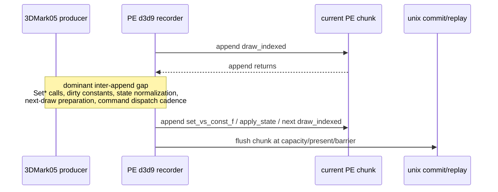

# Present Pacing 59 - Inter-Append Producer Gap Is Dominated By Draw To Const/State Materialization

## Question

[[present-pacing-pe-active-fill-split.58]] showed that active PE chunk fill is
mostly wall time between appendable records. This run asks which record
transitions own that inter-append gap.

The implementation adds fixed PE-local pair accumulators for
`previous record type -> next record type`, then exposes the top four pairs in
the flat `pe_recorder_stats` line:

```text
interAppendTopNPrevType
interAppendTopNPrev
interAppendTopNNextType
interAppendTopNNext
interAppendTopNSamples
interAppendTopNMs
interAppendTopNMaxMs
```

## Verdict

Accepted. The active-fill wall gap is dominated by indexed draw completion
followed by materializing the next draw's vertex constants, state, or next draw
record:

| Rank | Pair | ms/present | Share of inter-append gap |
|---:|---|---:|---:|
| 1 | `draw_indexed -> set_vs_const_f` | `12.340` | `45.70%` |
| 2 | `draw_indexed -> apply_state` | `6.704` | `24.83%` |
| 3 | `draw_indexed -> draw_indexed` | `4.142` | `15.34%` |
| 4 | `draw_indexed -> set_ps_const_f` | `2.301` | `8.52%` |

The top four pairs explain `94.39%` of `chunkInterAppendGapMs`. This confirms
that the large active-fill owner is not raw append copy. It is the producer
path between one indexed draw record and the next draw's const/state/draw
record materialization.

## Run

```sh
DXMT9_PE_RECORDER_STATS=1 DXMT_LOG_LEVEL=info \
bash scripts/tools/run_3dmark05_perf_probe.sh \
  --suffix noenqueue-pe-inter-append-pair-r1-20260616 \
  --no-gputrace \
  --no-encoder-breakdown \
  --frame-sampling \
  --timeout 120 \
  --capture-delay-sec 45 \
  --wait-unlocked-sec 1 \
  --wait-unlocked-interval-sec 1 \
  --min-free-mb 256
```

The run is a valid no-gputrace attribution scout: `status=pass`,
`timed_out=False`, `capture_error=None`, and it encoded `1,718` presents. Use it
for PE producer attribution only; it is not a GPU-counter or wall-clock FPS
promotion sample.

## Results

| Metric | Value |
|---|---:|
| `present_encoded` | `1,718` |
| `completion_wait_ms_per_present` | `27.486` |
| `completion_wait_with_enqueue_ms_per_present` | `0.054` |
| `completion_wait_without_enqueue_ms_per_present` | `27.431` |
| `commit_chunk_replay_cpu_ms_per_present` | `7.897` |
| `commit_chunk_queue_draw_submission_cpu_ms_per_present` | `3.726` |
| `encode_chunk_cpu_ms_per_present` | `11.129` |

PE fill split:

| Metric | Value |
|---|---:|
| `commitCount` | `42,310` |
| `chunkFillGapMs` | `93,470.191` |
| chunk fill gap | `54.406ms/present` |
| `chunkFirstRecordGapMs` | `42,572.099` |
| first-record gap | `24.780ms/present` |
| `chunkActiveFillMs` | `50,900.116` |
| active fill | `29.628ms/present` |
| first + active closure | `100.002%` |
| `chunkInterAppendGapMs` | `46,387.480` |
| inter-append gap | `27.001ms/present` |
| inter-append share of active fill | `91.134%` |
| `recordAppendNoFlushCpuMs` | `4,277.176` |
| no-flush append CPU | `2.490ms/present` |
| no-flush append share of active fill | `8.403%` |
| `chunkBridgeMs` | `15,910.345` |
| bridge/replay duration | `9.261ms/present` |

Top inter-append pairs:

| Rank | Previous | Next | Samples | Total ms | ms/present | Share of inter gap | Max ms |
|---:|---|---|---:|---:|---:|---:|---:|
| 1 | `draw_indexed` | `set_vs_const_f` | `765,792` | `21,199.565` | `12.340` | `45.701%` | `56.945` |
| 2 | `draw_indexed` | `apply_state` | `4,939` | `11,517.693` | `6.704` | `24.829%` | `32.739` |
| 3 | `draw_indexed` | `draw_indexed` | `318,531` | `7,115.487` | `4.142` | `15.339%` | `3.901` |
| 4 | `draw_indexed` | `set_ps_const_f` | `140,908` | `3,952.934` | `2.301` | `8.522%` | `11.668` |

## Interpretation



The top-ranked `draw_indexed -> set_vs_const_f` pair is consistent with the
current chunk recorder model: many D3D9 `SetVertexShaderConstantF` calls are
merged in PE const shadow state and only become appendable records when the next
draw/barrier flushes dirty ranges. The measured gap is therefore the time from
the previous draw record to the next record materialization, not the cost of
writing the `set_vs_const_f` record itself.

The small-sample but large-time `draw_indexed -> apply_state` pair is a
separate state/barrier materialization lane. It is not frequent, but each event
is expensive enough to be rank 2 by wall time.

## Decision

| Candidate | Updated priority |
|---|---|
| raw append-copy optimization | low for the primary owner; clean no-flush append CPU is only `2.490ms/present` |
| sparse/changed VS constant flush work | high-priority attribution target because `draw_indexed -> set_vs_const_f` owns `45.70%` of inter-append gap |
| state-delta/apply-state materialization | high-priority attribution target because `draw_indexed -> apply_state` owns `24.83%` despite few samples |
| direct draw-to-draw batching/materialization | relevant secondary target at `15.34%` |
| producer run-ahead / async publish formation | still the larger architecture route if it turns these producer gaps into overlap without H57 locality regressions |

Next proof should split the rank-1 and rank-2 producer gaps further: for
`set_vs_const_f`, distinguish D3D9 setter call CPU, dirty-span merge CPU, and
flush-time record materialization; for `apply_state`, distinguish hot-state
packet build, barrier/state flush, and handle-retention work. Do not spend
another `.gputrace` on this CPU attribution alone.
