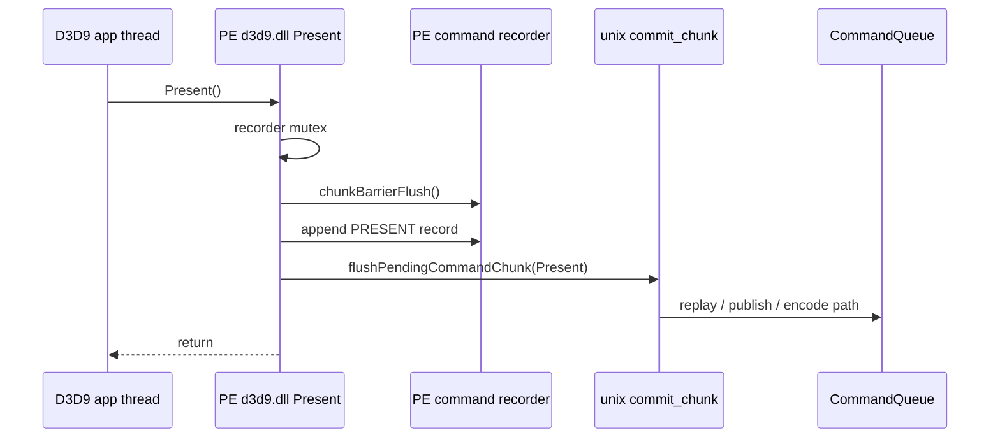
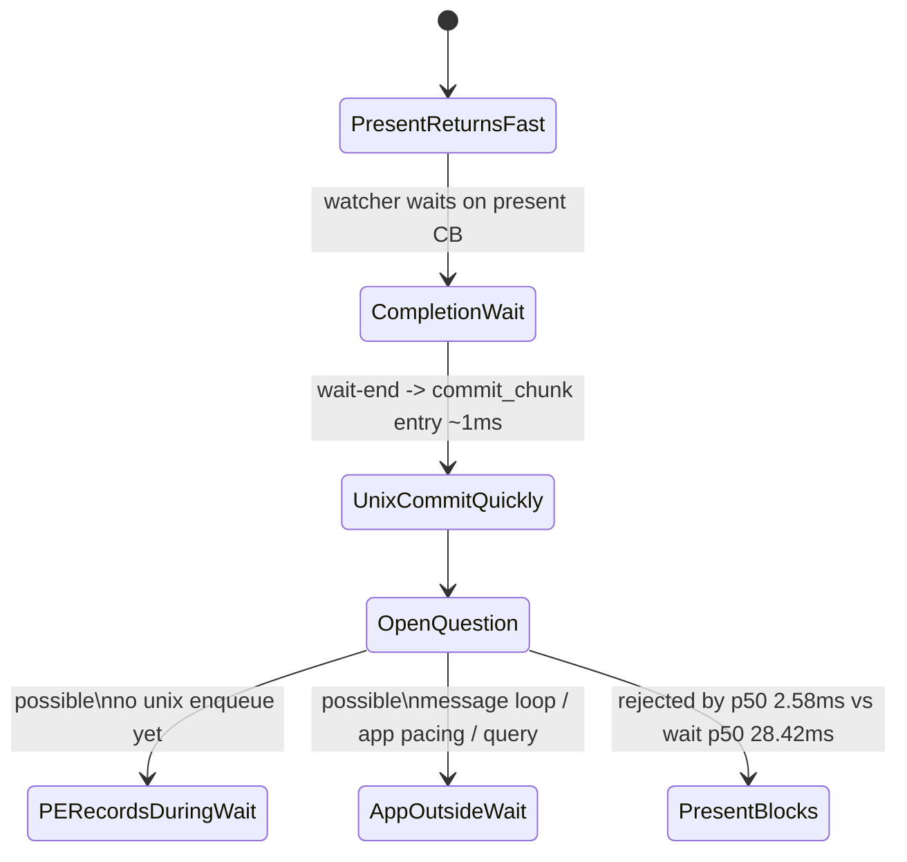

# Present-Pacing 09 - PE Present Timing Probe

## Question

The no-enqueue stage counters show that the next unix `commit_chunk` entry
arrives about 1ms after the previous present-bearing command buffer completes.
That can be read as "the app is blocked until N completes", but the counter is
not a PE API-call timestamp. It only proves when the next chunk crosses into the
unix provider.

This probe checks a narrower candidate: is the app thread blocked inside the
PE `IDirect3DDevice9::Present` wrapper long enough to explain the
`completion_wait_ms` bucket?

## Implementation

When `DXMT9_PE_RECORDER_STATS=1` is enabled, log one `pe_present_timing` line
per PE `Present` call:

- `total_ms`: method entry to return.
- `lock_wait_ms`: time to acquire the PE recorder mutex.
- `barrier_ms`: `chunkBarrierFlush()`.
- `append_ms`: append of the `PRESENT` command record.
- `flush_ms`: `flushPendingCommandChunk(Present)`, including the bridge call
  and unix replay/submit path.

The log is intentionally tied to the existing PE recorder stats diagnostic
instead of a new env knob. Because the perf launcher profile defaults to
`DXMT_LOG_LEVEL=warn`, the probe must also set `DXMT_LOG_LEVEL=info`.



## Run

```sh
DXMT9_PE_RECORDER_STATS=1 DXMT_LOG_LEVEL=info \
  scripts/tools/run_3dmark05_perf_probe.sh \
    --suffix present-pe-timing-info-r1-20260614 \
    --frame 60 \
    --no-gputrace \
    --no-encoder-breakdown \
    --frame-sampling \
    --timeout 120
```

Status: pass. The run produced `1,740` presents and a normal output capture.

## Result

The direct log contains `1,764` PE present timing rows. The same rows are also
mirrored in `dxmt9.log` and `3DMark05_dxmt9.log`; use `3dmark05-direct.log` as
the single source when aggregating.

| Metric | Value |
|---|---:|
| PE `Present total_ms` p50 / p95 / max | `2.580 / 5.077 / 22.659ms` |
| PE `Present flush_ms` p50 / p95 / max | `2.579 / 5.075 / 22.658ms` |
| PE `Present lock_wait_ms` p50 / p95 / max | `0.000 / 0.001 / 0.012ms` |
| PE `Present barrier_ms` p50 / p95 / max | `0.000 / 0.001 / 0.003ms` |
| PE `Present append_ms` p50 / p95 / max | `0.001 / 0.001 / 0.005ms` |
| `completion_wait_ms` p50 / p95 / max | `28.419 / 39.576 / 52.217ms` |
| `completion_wait_with_enqueue_ms` | `0.000` |
| `completion_no_enqueue_wait_to_commit_chunk_entry` p50 / p95 | `0.888 / 3.025ms` |
| `present_boundary_wait_ms` | `0.000` |
| `queue_writer_wait_ms`, `queue_commit_wait_ms`, `queue_sequence_wait_ms` | `0.000` |
| `map_buffer_wait_ms`, `sync_wait_ms` | `0.000` |

## Interpretation

The app is not spending the `~28ms` p50 completion wait inside PE
`Present()`. PE present returns in a few milliseconds, with nearly all of that
local cost inside `flushPendingCommandChunk(Present)`. Recorder mutex,
barrier, and append are effectively zero.

Therefore the earlier "N+1 arrives right after N completes" observation should
be phrased more carefully:

- **Accepted:** the next unix chunk crossing happens right after completion.
- **Rejected:** PE `Present` itself is a hidden wait matching
  `completion_wait_ms`.
- **Still open:** whether the app records PE-side D3D9 calls during the
  completion wait without crossing into unix, or whether the app/Wine loop
  waits outside dxmt9 and only starts the next PE work after completion.



The next decisive probe is PE call-cadence telemetry, not more unix
`commit_chunk` entry timing. It should timestamp PE `Present` return and the
next PE render-path call classes (`BeginScene`, `Clear`, draw, `Lock`,
`GetData`) so the no-enqueue window can be split between "PE recorded locally
but did not flush" and "the app did not call D3D9 yet".
