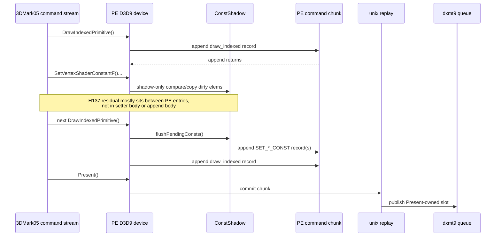

# Present Pacing / PE Producer-Cadence Source Audit 138

## Question

After [[present-pacing-current-pe-cadence-fixed-carry.137]] confirms that the
fixed-uniform cleanup does not move the no-enqueue owner, is there still a
nearby PE recorder leaf change that should be tried before returning to
P4/run-ahead or serial replay/encode work?

## Verdict

No direct PE setter/getter/draw-record leaf is left as a credible average-FPS
lever. The current source layout matches the H137/H121 runtime attribution:

- `SetVertexShaderConstantF()` and `SetPixelShaderConstantF()` are
  shadow-only on the PE side and defer record emission to
  `flushPendingConsts()` before draws.
- `touchConstShadow()` already filters unchanged elements before dirtying the
  constant shadow; unchanged setter calls do not emit constant records.
- `flushConstShadow()` can split sparse dirty runs, but that path is already a
  rejected default FPS lever by H120/H151.
- `DXMT9_PE_FLUSH_AFTER_DRAW=1` already proved that more PE/unix crossings do
  not create useful ready backlog because queue publication is still
  Present-owned.

The remaining H137 wall is therefore not "dxmt9 is slow inside a setter". It
is exposed producer cadence before a Present-owned publish, plus serial replay /
encode work after the producer finally publishes. The next promotable work must
either reduce that record cadence enough to move P4 counters, or create a
correctness-safe run-ahead/overlap carrier that preserves render-pass locality.

## Current Source Shape

| Source path | Current behavior | Reading |
|---|---|---|
| `SetVertexShaderConstantF()` (`d3d9_pe_device.cpp:12458`) | validates, optionally records range diagnostics, then `touchConstShadow()` | setter body can be measured, but it does not cross PE/unix or append a record |
| `SetPixelShaderConstantF()` (`d3d9_pe_device.cpp:12691`) | same shadow-only shape | same conclusion for PS constants |
| `flushPendingConsts()` (`d3d9_pe_device.cpp:9520`) | drains six const shadows before draw/barrier/chunk flush | record emission is ordered and deferred |
| `flushConstShadow()` (`d3d9_pe_device.cpp:9474`) | default merged dirty span, optional sparse dirty-run split | sparse width is diagnostic-only after the runtime gate |
| `appendDrawIndexedPrimitiveRecord()` (`d3d9_pe_device.cpp:9100`) | flushes pending consts, builds the draw packet, appends one draw record | draw record append is the ordering boundary, not the whole preceding gap |
| `appendCommandRecordDirect()` (`d3d9_pe_device.cpp:8985`) | records inter-append gap before the append body, then records append CPU separately | H137's between-call residual is not append CPU |
| `DrawIndexedPrimitive()` (`d3d9_pe_device.cpp:12808`) | normal path appends an indexed draw record, then clears pending hot state | current P4 slot remains Present-tail, not early-published |



## Runtime Cross-Check

H137 is the current fixed-uniform-carry attribution run:

| Signal | Value / reading |
|---|---:|
| `completion_wait_with_enqueue_ms_per_present` | `0.000` |
| `completion_wait_without_enqueue_ms_per_present` | `28.280` |
| first-publish slot pre-Present draw items | `724.800` |
| `commit entry -> publish` | `40.238ms/present` |
| inter-replay producer gap before publish | `34.571ms/present` |
| inter-replay gap share | `85.916%` |
| `draw_indexed -> set_vs_const_f` body coverage | `15.31%` |
| `draw_indexed -> apply_state` body coverage | `0.98%` |

This aligns with H121: direct PE call bodies cover only a minority of the
focused windows. It also aligns with H114: forcing a PE flush after each draw
explodes replay fragmentation without creating enqueue overlap.

## Decision Matrix

| Candidate family | Status | Why |
|---|---|---|
| PE constant setter microfix | demoted | shadow-only and body coverage is too small |
| Getter/viewport/body shortcut | demoted | caller/RVA rows are app cadence markers, not getter body owners |
| Sparse constant record split | rejected default | exact-width mechanism exists, but runtime P4/FPS gate failed |
| Flush after draw / more PE crossings | rejected diagnostic | earlier unix replay does not publish queue-ready work |
| Open-CB carry retry as-is | rejected until redesigned | H134/H135 failed the visual/no-tail gate |
| N-1 state materialization elision | valid local CPU cleanup | can reduce serial replay/queue-submit width, but must not be sold as the P4 fix by itself |
| New logical run-ahead / CPU-ready carrier | open P4 path | must produce useful enqueue overlap while preserving CB/pass/tile locality and the visual gate |

## Next Gate

The next experiment should pick one of two branches:

1. **Low-risk serial cleanup:** implement or finish N-1 materialization elision /
   append-width reduction, then judge it by replay, queue-submit, snapshot, and
   no-enqueue rows. This is worthwhile only if the exposed serial stage moves.
2. **P4 overlap redesign:** build a non-blocking logical run-ahead carrier that
   does not hold the only visible frame work and does not fragment Metal render
   passes. This branch needs a no-gputrace visual-safe gate first; only then
   should it spend `.gputrace`/Xcode budget.

Do not classify the current state as a hardware wall. The current wall is an
under-pipelined producer/queue shape with known rejected carrier attempts and
remaining source-level cleanup candidates.

## Verification

Source audit only. No runtime was launched for this document.

Validation commands for this documentation update:

```sh
meson test -C build-arm64-nowine dxmt9-perf-docs-source-audit --print-errorlogs
git diff --check
```

**Related.** [[present-pacing-current-pe-cadence-fixed-carry.137]] ·
[[present-pacing-current-visual-p4.136]] ·
[[present-pacing-pe-between-call-body-coverage.121]] ·
[[present-pacing-pe-const-flush-source-audit.120]] ·
[[present-pacing-pe-draw-flush.114]].
