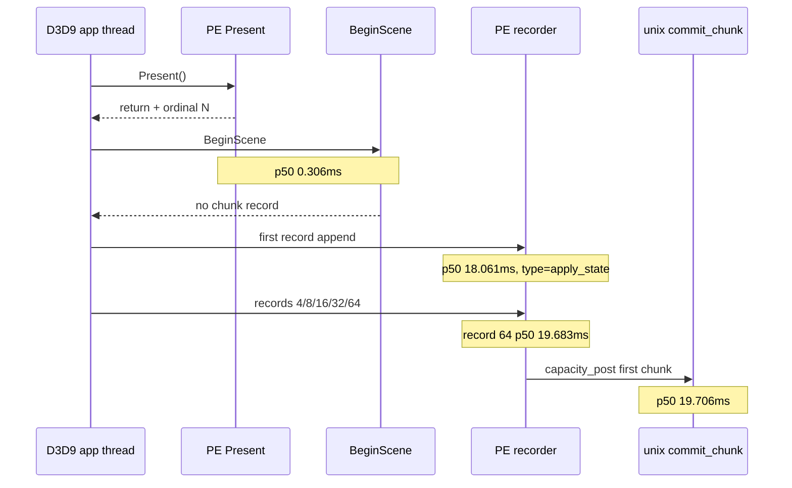
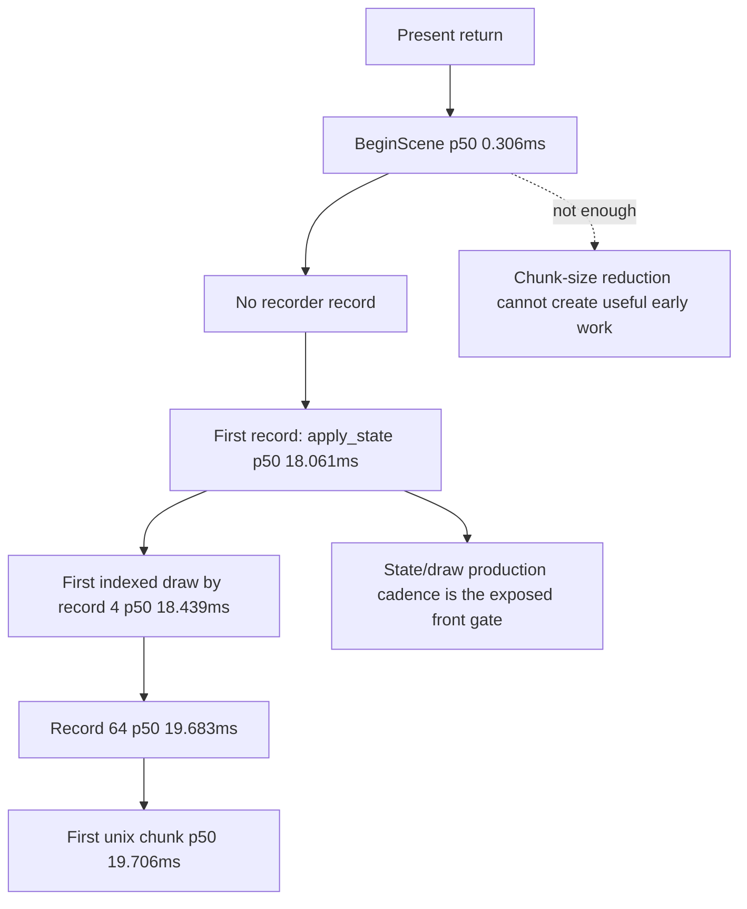

# Present-Pacing 13 - PE Record Milestones After Present

> **Outdated — every artifact this leaf cites in `source:` is gone from disk.** The numbers below cannot be re-derived or re-checked. Kept as history; do not cite it as current evidence.

## Question

[present-pacing-pe-chunk-cadence.11](present-pacing-pe-chunk-cadence.11.md) showed that the first PE call after
`Present` is fast but the first unix-visible chunk is late. [present-pacing-pe-chunk-size-ab.12](present-pacing-pe-chunk-size-ab.12.md)
then showed that lowering chunk capacity from `64` to `32` does not recover
overlap. The remaining ambiguity was whether the delay is caused by filling the
chunk, or by the app/PE path not producing recordable commands until late in
the frame.

## Implementation

With `DXMT9_PE_RECORDER_STATS=1`, `appendCommandRecordDirect()` now logs
`pe_present_record_milestone` once per Present ordinal when the current chunk
reaches record counts `1`, `4`, `8`, `16`, `32`, and `64`. The timestamp is
taken at append entry, before capacity-post flush work, so the `32`/`64`
milestones do not include bridge time.

The log records the milestone record type, record count, payload bytes, and
delta from the preceding PE `Present` return.



## Run

```sh
DXMT9_PE_RECORDER_STATS=1 DXMT_LOG_LEVEL=info \
  scripts/tools/run_3dmark05_perf_probe.sh \
    --suffix present-pe-record-milestones-r1-20260614 \
    --frame 60 \
    --no-gputrace \
    --no-encoder-breakdown \
    --frame-sampling \
    --timeout 120
```

Status: pass with complete artifacts. The wrapper timeout-finalized the app
(`timed_out=True`, `returncode=143`, elapsed `191.297s`), so wallclock is not a
fps proof. The log and counter artifacts are valid for cadence attribution.

## Result

Steady-state rows exclude ordinals `<= 10`.

| Metric | Value |
|---|---:|
| `pe_present_next_call` rows | `1,801` |
| first-call class distribution | `BeginScene=1,800`, `Surface::LockRect=1` |
| first-call `entry_delta_ms` p50 / p95 / p99 | `0.306 / 0.392 / 0.608ms` |
| `pe_present_next_chunk` rows | `1,801` |
| first-chunk reason distribution | `capacity_post=1,801` |
| steady first-chunk `entry_delta_ms` p50 / p95 / p99 | `19.706 / 33.699 / 37.836ms` |
| milestone rows | `10,806` |
| record 1 p50 / p95 / type | `18.061 / 30.162ms`, `apply_state=1,791 / 1,791` |
| record 4 p50 / p95 / type | `18.439 / 30.540ms`, `draw_indexed=1,791 / 1,791` |
| record 8 p50 / p95 top types | `18.584 / 30.709ms`, `draw_indexed=1,290`, `set_vs_const_f=501` |
| record 16 p50 / p95 top types | `18.721 / 30.901ms`, `draw_indexed=1,109`, `set_vs_const_f=682` |
| record 32 p50 / p95 top types | `19.083 / 32.166ms`, `draw_indexed=1,021`, `set_vs_const_f=703` |
| record 64 p50 / p95 top types | `19.683 / 33.680ms`, `draw_indexed=952`, `set_vs_const_f=833` |
| first PE call -> record 1 p50 / p95 | `17.721 / 29.736ms` |
| first PE call -> record 64 p50 / p95 | `19.354 / 33.234ms` |
| first PE call -> first chunk p50 / p95 | `19.375 / 33.253ms` |
| `completion_wait_with_enqueue_ms` | `0.000` |
| no-enqueue wait -> commit entry p50 | `0.839ms` |
| `commit_chunk_replay_cpu_ms` | `18,348.494ms` |
| `commit_chunk_queue_draw_submission_cpu_ms` | `6,953.463ms` |
| `d3d9_snapshot_draw_submission_cpu_ms` | `5,870.153ms` |
| `encode_chunk_cpu_ms` | `20,033.306ms` |

## Interpretation

This refines the previous chunk-cadence conclusion. The first unix-visible
chunk is late mostly because **the first record append is late**, not because
the recorder spends a long time filling records after the first append:

- `BeginScene` arrives almost immediately after `Present`, but it produces no
  chunk record.
- The first appendable record is an `apply_state` barrier at p50 `18.061ms`.
- Record `4` is already the first indexed draw in every steady sample.
- Records `1 -> 64` are produced in about `1.622ms` p50
  (`18.061 -> 19.683ms`), and the first chunk follows immediately
  (`19.706ms`).



So the simple statement "the app waits until completion before N+1" is still too
broad. A precise version is:

- the app re-enters PE D3D9 immediately through `BeginScene`;
- the first **record-producing** PE command is delayed by ~18ms p50;
- after that point, recorder fill is fast and threshold-limited chunk flush
follows almost immediately.

This lowers the value of another global chunk-size reduction. It also narrows a
possible early-publish architecture: publishing empty/no-op `BeginScene` is
useless, and publishing before the first draw can only help if it can safely
move dirty state application/replay ahead of the draw without increasing total
bridge/replay cost. The larger measured CPU owners remain the post-record
stages: replay/snapshot before publish and backend encode after dequeue.
