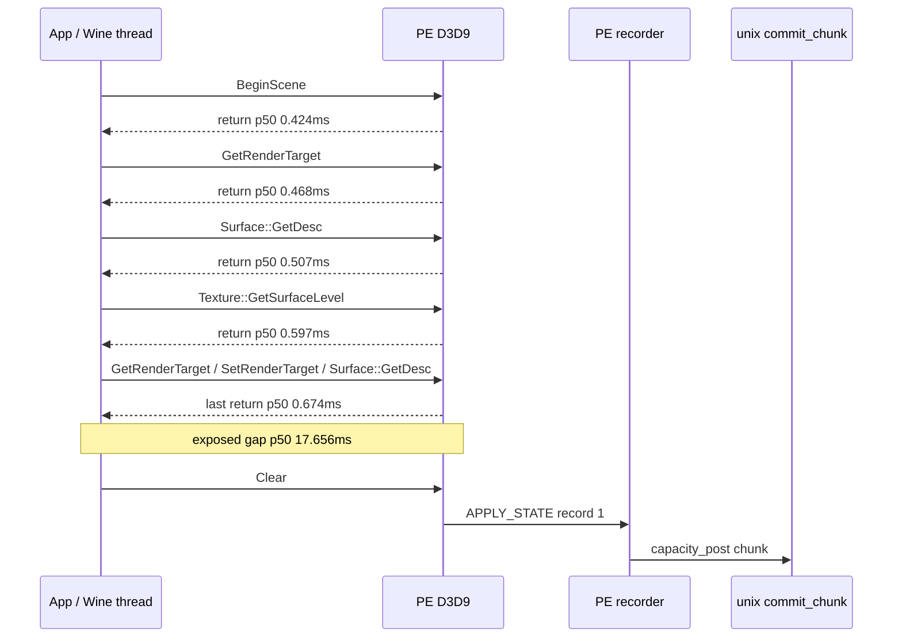
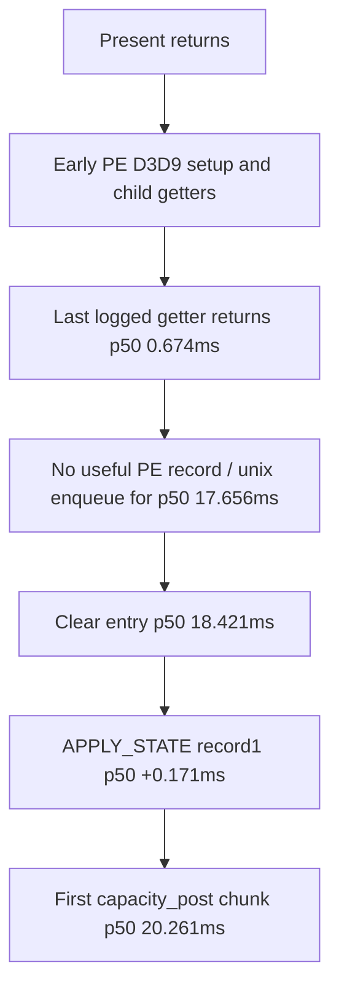

# Present-Pacing 17 - PE Wide Call Coverage Before Clear

> **Outdated — every artifact this leaf cites in `source:` is gone from disk.** The numbers below cannot be re-derived or re-checked. Kept as history; do not cite it as current evidence.

## Question

[present-pacing-pe-clear-gate.15](present-pacing-pe-clear-gate.15.md) identified the first record-producing call
as `Clear`, but its call milestone surface did not cover many D3D9 getters and
child-resource methods. This could hide a drawable/swapchain/resource query
between early RT setup and `Clear`.

The follow-up widens PE-local call coverage and then adds return timestamps for
the child descriptor/subresource getters that appeared before `Clear`.

## Implementation

The diagnostic surface now includes:

- device getter/stateblock/shader/stream/query/status calls via
  `notePeDeviceCallAfterPresent()`;
- child buffer/surface/texture/cube/volume descriptor and subresource getters
  via `NotifyPeFirstCallAfterPresentForChild()`;
- child return timestamps for descriptor/subresource getters through
  `D3D9PePresentCallToken` and `NotifyPeCallReturnAfterPresentForChild()`.

This is PE-local instrumentation only. It does not change the C bridge schema or
Metal/unix ownership.

## Runs

Wide entry coverage:

```sh
DXMT9_PE_RECORDER_STATS=1 DXMT_LOG_LEVEL=info \
  scripts/tools/run_3dmark05_perf_probe.sh \
    --suffix present-pe-wide-call-coverage-r1-20260614 \
    --frame 60 \
    --no-gputrace \
    --no-encoder-breakdown \
    --timeout 120
```

Child return coverage:

```sh
DXMT9_PE_RECORDER_STATS=1 DXMT_LOG_LEVEL=info \
  scripts/tools/run_3dmark05_perf_probe.sh \
    --suffix present-pe-child-return-r1-20260614 \
    --frame 60 \
    --no-gputrace \
    --no-encoder-breakdown \
    --timeout 120
```

Both runs are `status=pass` with complete timeout-finalized artifacts.

## Result

The wider surface changes the early call sequence: some child getter calls were
previously invisible.

| Milestone | Previous narrow surface | Wide return surface |
|---:|---|---|
| 1 | `BeginScene 0.308ms` | `BeginScene 0.309ms`, return `0.424ms` |
| 2 | `GetRenderTarget 0.450ms` | `GetRenderTarget 0.451ms`, return `0.468ms` |
| 3 | `GetRenderTarget 0.546ms` | `Surface::GetDesc 0.489ms`, return `0.507ms` |
| 4 | `SetRenderTarget 0.581ms` | `Texture::GetSurfaceLevel 0.528ms`, return `0.597ms` |
| 5 | `Clear 18.424ms` | `GetRenderTarget 0.615ms`, return `0.629ms` |
| 6 | `SetVertexShaderConstantF 18.788ms` | `SetRenderTarget 0.646ms`, return `0.689ms` |
| 7 | `SetIndices 18.856ms` | `Surface::GetDesc 0.660ms`, return `0.674ms` |
| 8 | `SetStreamSource 18.884ms` | `Clear 18.421ms`, return `18.644ms` |

Key p50/p95 gaps from `present-pe-child-return-r1`:

| Metric | Value |
|---|---:|
| `Surface::GetDesc` call 7 duration p50 / p95 | `0.013 / 0.019ms` |
| `Texture::GetSurfaceLevel` duration p50 / p95 | `0.054 / 0.311ms` |
| `SetRenderTarget` return -> `Clear` entry p50 / p95 | `17.656 / 30.638ms` |
| last logged return -> `Clear` entry p50 / p95 | `17.656 / 30.638ms` |
| last `Surface::GetDesc` return -> `Clear` entry p50 / p95 | `17.670 / 30.666ms` |
| `Clear` entry -> record 1 p50 / p95 | `0.171 / 0.203ms` |
| first chunk p50 / p95 | `20.261 / 35.180ms` |
| `completion_wait_with_enqueue_ms` | `0.000` |



## Interpretation

The hidden-call concern was valid: the narrow surface skipped
`Surface::GetDesc` and `Texture::GetSurfaceLevel`. However, those calls are not
the sleeper. They return at sub-millisecond cadence, and the same `17.6ms` p50
gap remains after the last logged child getter return.

The current model is therefore:



This rejects `GetBackBuffer`, `Query::GetData`, lock, `SetRenderTarget`, and
the newly visible descriptor/subresource getters as the steady direct sleeper.
The remaining owner is outside the widened meaningful PE D3D9 surface: app
timer/message cadence, Wine/macdrv event processing, or uninteresting COM
housekeeping that does not produce records. A future lower-level probe should
look below D3D9 entry points, not spend another run on descriptor/getter
coverage.
