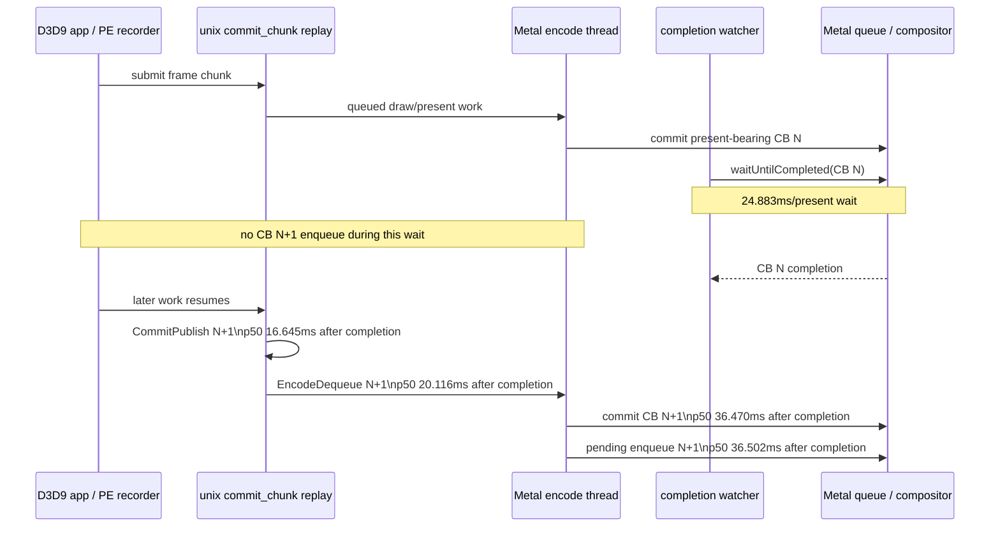
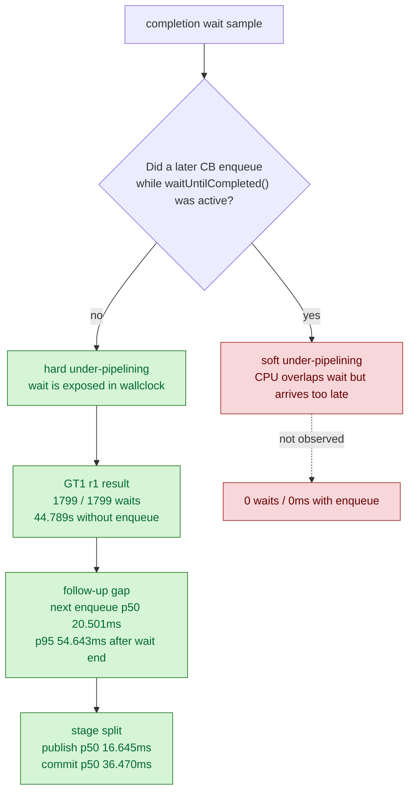

# Completion wait is not overlapped by next command-buffer enqueue

> **Outdated — every artifact this leaf cites in `source:` is gone from disk.** The numbers below cannot be re-derived or re-checked. Kept as history; do not cite it as current evidence.

**Question / hypothesis.** [present-pacing-current-fps-owner.04](present-pacing-current-fps-owner.04.md) showed
`completion_present_wait_ms` around `25ms/present` while average GPU command
buffer time was only about `3ms/present`. The open question was whether that
wait is merely a display/compositor cost, or whether dxmt9 is under-pipelined:
the completion watcher waits on a just-committed present-bearing command buffer
while no next command buffer is being enqueued.

**Method.** Add low-overhead completion-overlap counters around
`QueueLifecycleController::processOnePendingCompletion()`:

- `completion_wait_with_enqueue[_ms]`: waits during which at least one later
  command buffer was enqueued.
- `completion_wait_without_enqueue[_ms]`: waits during which no later command
  buffer was enqueued.
- `completion_enqueue_while_waiting`: enqueue events observed while the
  completion watcher was inside `waitUntilCompleted()`.
- `completion_enqueue_pending_depth_max`: pending-completion depth after
  enqueue, complementing the existing post-pop `completion_pending_depth_max`.
- `completion_no_enqueue_wait_to_next_enqueue[_ms]`: the gap from the end of a
  no-enqueue completion wait to the next command-buffer enqueue.
- `completion_no_enqueue_wait_to_commit_publish[_ms]`,
  `completion_no_enqueue_wait_to_encode_dequeue[_ms]`, and
  `completion_no_enqueue_wait_to_command_buffer_commit[_ms]`: stage probes
  inside that post-wait gap.

Run a low-overhead no-`.gputrace` scout with the same timeout policy:

```sh
bash scripts/tools/run_3dmark05_perf_probe.sh \
  --suffix pipeline-overlap-r1-20260613 \
  --frame 60 \
  --no-gputrace \
  --no-encoder-breakdown \
  --frame-sampling \
  --timeout 120
```

The first run is clean (`status=pass`) and uses the normal `1800` present
workload. Follow-up `pipeline-gap-r1-20260613` and
`pipeline-stage-r1-20260613` runs add the wait-end to next-enqueue and
stage-gap counters; both are clean (`status=pass`) and stay in the same
low-overhead FPS envelope.

**Result.**

| Metric | Value | Read |
|---|---:|---|
| `present_encoded` | `1800` | normal fixed workload |
| frame wall p50 / p95 / p99 | `55.157 / 85.046 / 105.395ms` | same current FPS envelope |
| sampled FPS p50 / p95 / last | `18.130 / 26.524 / 25.231` | current low-overhead shape |
| `completion_waits` | `1799` | present-bearing CB wait samples |
| `completion_wait_ms` | `44789.044` | `24.883ms/present` |
| `completion_wait_with_enqueue` | `0` | no wait overlapped by a later enqueue |
| `completion_wait_with_enqueue_ms` | `0.000` | no hidden overlap bucket |
| `completion_wait_without_enqueue` | `1799` | every wait had no later enqueue |
| `completion_wait_without_enqueue_ms` | `44789.044` | all wait time is no-enqueue time |
| `completion_enqueue_samples` | `1799` | one enqueue per waited CB |
| `completion_enqueue_while_waiting` | `0` | producer never enqueues while watcher waits |
| `completion_enqueue_pending_depth_max` | `1` | no enqueue-side backlog |
| `completion_pending_depth_max` | `0` | no post-pop backlog |
| `completion_dequeue_age_p50/p95/p99_ms` | `0.044 / 0.065 / 0.089` | watcher pops almost immediately |
| `completion_dequeue_status_committed/scheduled` | `1798 / 1` | wait starts before GPU completion |
| `gpu_command_buffer_time_ms` | `5382.606` | `2.990ms/present` average GPU work |

The follow-up gap run confirms the shape and adds the missing timeline edge:

| Metric | Value | Read |
|---|---:|---|
| `present_encoded` | `1740` | normal current-shape scout |
| `completion_waits` | `1739` | waited command buffers |
| `completion_wait_with_enqueue_ms` | `0.000` | still no overlap |
| `completion_wait_without_enqueue_ms` | `44153.039` | `25.375ms/present` exposed wait |
| `completion_enqueue_while_waiting` | `0` | no producer enqueue during wait |
| `completion_no_enqueue_wait_to_next_enqueue` | `1738` | every completed wait has a following enqueue sample |
| `completion_no_enqueue_wait_to_next_enqueue_ms` | `63770.649` | producer work after wait, not hidden by it |
| wait-end -> next enqueue p50 / p95 / p99 | `20.501 / 54.643 / 63.634ms` | next CB is not ready at completion |
| `completion_no_enqueue_wait_to_next_present_enqueue_ms` | `63770.649` | all next enqueues are present-bearing |
| frame wall p50 / p95 / p99 | `55.786 / 86.351 / 106.576ms` | same wallclock envelope |

The stage run then splits that post-wait gap:

| Metric | Value | Read |
|---|---:|---|
| `present_encoded` | `1740` | normal current-shape scout |
| `completion_wait_with_enqueue_ms` | `0.000` | still no overlap |
| `completion_wait_without_enqueue_ms` | `43828.952` | all wait time remains exposed |
| wait-end -> `CommitPublish` p50 / p95 / p99 | `16.645 / 30.880 / 36.876ms` | app/PE/replay does not publish next chunk during prior wait |
| wait-end -> `EncodeDequeue` p50 / p95 / p99 | `20.116 / 35.167 / 41.862ms` | encode thread sees work about 3-5ms after publish |
| wait-end -> Metal commit p50 / p95 / p99 | `36.470 / 55.470 / 64.114ms` | encode consumes another 16-22ms before commit |
| wait-end -> pending enqueue p50 / p95 / p99 | `36.502 / 55.508 / 64.146ms` | commit-to-enqueue is negligible |

Derived p50 stage deltas:

| Segment | p50 ms | Read |
|---|---:|---|
| wait end -> `CommitPublish` | `16.645` | upstream producer / PE replay cadence |
| `CommitPublish` -> `EncodeDequeue` | `3.471` | ready-queue wake/dequeue gap |
| `EncodeDequeue` -> Metal commit | `16.354` | backend encode cost on exposed path |
| Metal commit -> pending enqueue | `0.032` | not a load-bearing gap |

CPU-side cadence remains large enough to match the wallclock arithmetic:

| Counter | Total ms | ms / present |
|---|---:|---:|
| `encode_chunk_cpu_ms` | `20101.863` | `11.168` |
| `encode_draw_cpu_ms` | `16506.221` | `9.170` |
| `commit_chunk_replay_cpu_ms` | `19523.277` | `10.846` |
| `commit_chunk_queue_draw_submission_cpu_ms` | `8377.403` | `4.654` |
| `d3d9_snapshot_draw_submission_cpu_ms` | `6827.328` | `3.793` |
| `d3d9_snapshot_cache_lookup_cpu_ms` | `5870.000` | `3.261` |





**Verdict.** Accepted. Current GT1 is **hard under-pipelined** at the
present-completion boundary: the completion watcher spends the whole
`completion_present_wait_ms` bucket waiting on just-committed command buffers,
and the producer/encode path never enqueues the next command buffer during
that wait. The follow-up gap counter shows the next enqueue does not arrive
immediately after completion either: p50/p95 are `20.501/54.643ms` from wait
end to next present-bearing enqueue in the first gap run, and
`36.502/55.508ms` in the stage run. The stage split explains the wider sample:
next chunk publish itself is already late (`16.645/30.880ms` p50/p95), then
backend encode consumes another exposed `16-22ms` before Metal commit.

This refines H9. The P4 bucket is not merely a display/present knob and not
just a consequence of slow GPU execution. It is exposed because the next frame's
producer path is not in flight while the watcher waits, then publish/replay and
encode run after the wait ends. P2/P3 CPU reductions still matter, but the
larger design lever is restoring pipeline depth or moving the completion wait
off the producer cadence so the next frame can be replayed and encoded while
the previous present-bearing command buffer completes.

**Next gate.**

- Add a producer-stage timeline probe before `CommitPublish`: app-side
  `Present()` return, PE chunk close, unix `commit_chunk` entry, and replay
  start. The current stage split names the remaining unknown owner as the
  `16-31ms` wait-end to publish segment.
- Use the exposed `EncodeDequeue` -> Metal commit segment as the acceptance
  gate for encode wins: CPU encode work must either move under the previous
  wait or shrink this `16-22ms` exposed stage.
- Inspect presenter/app-return pacing: `present_boundary_wait_ms=0` proves the
  explicit dxmt9 boundary is not waiting, so the stall may live in app-side
  present semantics, Wine/macdrv event processing, or an implicit producer
  dependency outside the current queue wait counters.
- Keep P2/P3 CPU work active, but evaluate it as a pipeline-depth enabler:
  a CPU win is not complete unless `completion_wait_with_enqueue_ms` grows or
  `completion_wait_without_enqueue_ms` shrinks.
